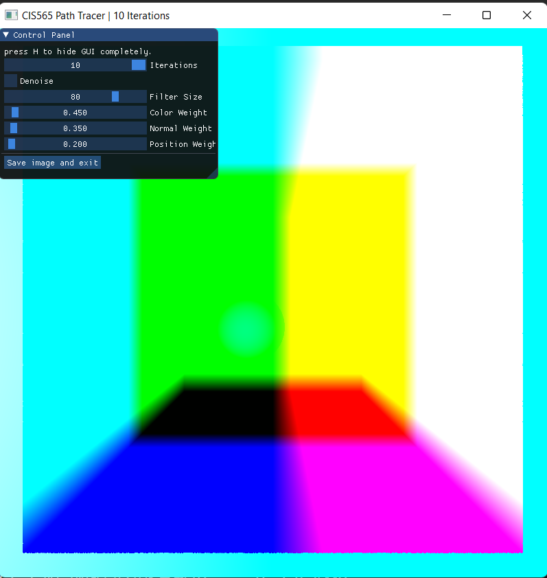
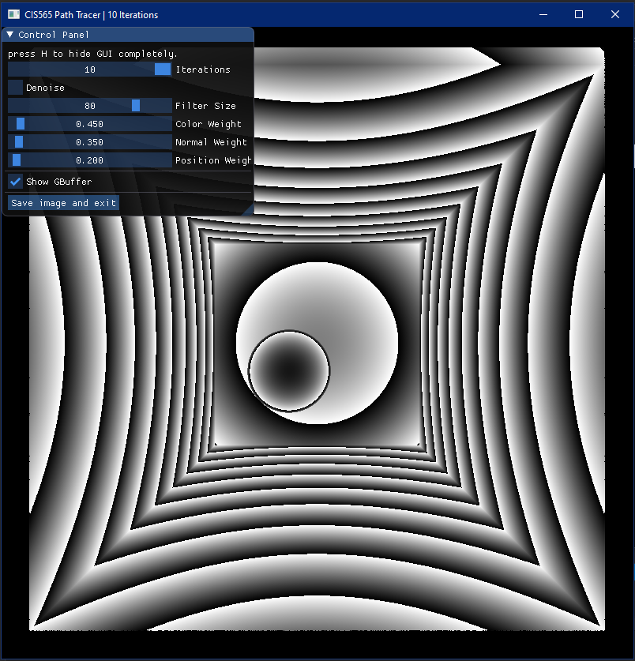

Project 4 CUDA Denoiser - Instructions
=======================================

This is due **Monday October 19th** at 11:59pm EST.

**Summary:**

In this project, you'll implement a pathtracing denoiser that uses geometry buffers (G-buffers) to guide a smoothing filter.

We would like you to base your technique on the paper "Edge-Avoiding A-Trous Wavelet Transform for fast Global Illumination Filtering," by Dammertz, Sewtz, Hanika, and Lensch.
You can find the paper here: https://jo.dreggn.org/home/2010_atrous.pdf

Denoisers can help produce a smoother appearance in a pathtraced image with fewer samples-per-pixel/iterations, although the actual improvement often varies from scene-to-scene.
Smoothing an image can be accomplished by blurring pixels - a simple pixel-by-pixel blur filter may sample the color from a pixel's neighbors in the image, weight them by distance, and write the result back into the pixel.

However, just running a simple blur filter on an image often reduces the amount of detail, smoothing sharp edges. This can get worse as the blur filter gets larger, or with more blurring passes.
Fortunately in a 3D scene, we can use per-pixel metrics to help the filter detect and preserve edges.

| raw pathtraced image | simple blur | blur guided by G-buffers |
|---|---|---|
||||

These per-pixel metrics can include scene geometry information (hence G-buffer), such as per-pixel normals and per-pixel positions, as well as surface color or albedo for preserving detail in mapped or procedural textures. For the purposes of this assignment we will only require per-pixel metrics from the "first bounce."

 per-pixel normals | per-pixel positions (scaled down) | ???! (dummy data, time-of-flight)|
|---|---|---|
||||

## Building on Project 3 CUDA Path Tracer

**We highly recommend that you integrate denoising into your Project 3 CUDA Path Tracers.**

This project's base code is forked from the CUDA Path Tracer basecode in Project 3, and exists so that the
assignment can stand on its own as well as provide some guidance on how to implement some useful tools.
The main changes are that we have added some GUI controls, a *very* simple pathtracer without stream
compaction, and G-buffer with some dummy data in it.

You may choose to use the base code in this project as a reference, playground, or as the base code for your denoiser. Using it as a reference or playground will allow you to understand the changes that you need for integrating the denoiser.
Like Project 3, you may also change any part of the base code as you please. **This is YOUR project.**

## Contents

* `src/` C++/CUDA source files.
* `scenes/` Example scene description files.
* `img/` Renders of example scene description files. (These probably won't match precisely with yours.)
  * note that we have added a `cornell_ceiling_light` scene
  * simple pathtracers often benefit from scenes with very large lights
* `external/` Includes and static libraries for 3rd party libraries.
* `imgui/` Library code from https://github.com/ocornut/imgui

## Running the code

The main function requires a scene description file. Call the program with one as an argument: `cis565_denoiser scenes/cornell_ceiling_light.txt`. (In Visual Studio, `../scenes/cornell_ceiling_light.txt`.)

If you are using Visual Studio, you can set this in the `Debugging > Command Arguments` section in the `Project Properties`. Make sure you get the path right - read the console for errors.

### Controls

* Esc to save an image and exit.
* S to save an image. Watch the console for the output filename.
* Space to re-center the camera at the original scene lookAt point.
* Left mouse button to rotate the camera.
* Right mouse button on the vertical axis to zoom in/out.
* Middle mouse button to move the LOOKAT point in the scene's X/Z plane.

We have also added simple GUI controls that change variables in the code, letting you tune denoising
parameters without having to recompile the project.

Requirements
===

**Ask in piazza for clarifications.**

## Part 1 - Read!

One meta-goal for this project is to help you gain some experience in reading technical papers and implementing their concepts. This is an important skill in graphics software engineering, and will also be helpful for your final projects.

For part one, try to skim the paper, and then read through it in depth a couple times: https://jo.dreggn.org/home/2010_atrous.pdf

Try to look up anything that you don't understand, and feel free to discuss with your fellow students on Piazza. We were also able to locate presentation slides for this paper that may be helpful: https://www.highperformancegraphics.org/previous/www_2010/media/RayTracing_I/HPG2010_RayTracing_I_Dammertz.pdf

This paper is also helpful in that it includes a code sample illustrating some of the math, although not
all the details are given away - for example, parameter tuning in denoising can be very implementation-dependent.

This project will focus on this paper, however, it may be helpful to read some of the references as well as
more recent papers on denoising, such as "Spatiotemporal Variance-Guided Filtering" from NVIDIA, available here: https://research.nvidia.com/publication/2017-07_Spatiotemporal-Variance-Guided-Filtering%3A

## Part 2 - A-trous wavelet filter

Implement the A-trous wavelet filter from the paper. :shrug:

It's always good to break down techniques into steps that you can individually verify.
Such a breakdown for this paper could include:
1. add UI controls to your project - we've done this for you in this base code, but see `Base Code Tour`
1. implement G-Buffers for normals and positions and visualize them to confirm (see `Base Code Tour`)
1. implement the A-trous kernel and its iterations without weighting and compare with a a blur applied from, say, GIMP or Photoshop
1. use the G-Buffers to preserve perceived edges
1. tune parameters to see if they respond in ways that you expect
1. test more advanced scenes

## Base Code Tour

This base code is derivd from Project 3. Some notable differences:

* `src/pathtrace.cu` - we've added functions `showGBuffer` and `showImage` to help you visualize G-Buffer info and your denoised results. There's also a `generateGBuffer` kernel on the first bounce of `pathtrace`.
* `src/sceneStructs.h` - there's a new `GBufferPixel` struct
  * the term G-buffer is more common in the world of rasterizing APIs like OpenGL or WebGL, where many G-buffers may be needed due to limited pixel channels (RGB, RGBA)
  * in CUDA we can pack everything into one G-buffer with comparatively huge pixels.
  * at the moment this just contains some dummy "time-to-intersect" data so you can see how `showGBuffer` works.
* `src/main.h` and `src/main.cpp` - we've added a bunch of `ui_` variables - these connect to the UI sliders in `src/preview.cpp`, and let you toggle between `showGBuffer` and `showImage`, among other things.
* `scenes` - we've added `cornell_ceiling_light.txt`, which uses a much larger light and fewer iterations. This can be a good scene to start denoising with, since even in the first iteration many rays will terminate at the light.
* As usual, be sure to search across the project for `CHECKITOUT` and `TODO`

Note that the image saving functionality isn't hooked up to gbuffers or denoised images yet - you may need to do this yourself, but doing so will be considerably more usable than screenshotting every image.

There's also a couple specific git commits that you can look at for guidance on how to add some of these changes to your own pathtracer, such as `imgui`. You can view these changes on the command line using `git diff [commit hash]`, or on github, for example: https://github.com/CIS565-Fall-2020/Project4-CUDA-Denoiser/commit/0857d1f8f477a39a9ba28a1e0a584b79bd7ec466

* [0857d1f8f477a39a9ba28a1e0a584b79bd7ec466](https://github.com/CIS565-Fall-2020/Project4-CUDA-Denoiser/commit/0857d1f8f477a39a9ba28a1e0a584b79bd7ec466) - visualization code for a gbuffer with dummy data as time-to-intersection
* [1178307347e32da064dce1ef4c217ce0ca6153a8](https://github.com/CIS565-Fall-2020/Project4-CUDA-Denoiser/commit/1178307347e32da064dce1ef4c217ce0ca6153a8) - add iterations slider and save-and-exit button to UI
* [5feb60366e03687bfc245579523402221950c9c5](https://github.com/CIS565-Fall-2020/Project4-CUDA-Denoiser/commit/5feb60366e03687bfc245579523402221950c9c5) - add imgui and set up basic sliders for denoising parameters (all the gory cmake changes)

## Part 3 - Performance Analysis

The point of denoising is to reduce the number of samples-per-pixel/pathtracing iterations needed to achieve an acceptably smooth image.

You should assess how much time denoising adds to your renders, as well as:
* how denoising influences the number of iterations needed to get an "acceptably smooth" result
* how it impacts runtime at different resolutions
* how effective/ineffective it is with different material types

Note that "acceptably smooth" is somewhat subjective - we will leave the means for image comparison up to you, but image diffing tools may be a good place to start, and can help visually convey differences between two images.

Also compare visual results and performance for varying filter sizes.

Be sure to compare across different scenes as well - for example, between `cornell.txt` and `cornell_ceiling_light.txt`. Does one scene produce better denoised results? Why or why not?

Extra Credit
===

The following extra credit items are listed roughly in order of level-of-effort, and are just suggestions - if you have an idea for something else you want to add, just ask on Piazza!

## G-Buffer optimization

When starting out with gbuffers, it's probably easiest to start storing per-pixel positions and normals as glm::vec3s. However, this can be a decent amount of per-pixel data, which must be read from memory.

Implement methods to store positions and normals more compactly. Two places to start include:
* storing Z-depth instead of position, and reconstruct position based on pixel coordinates and an inverted projection matrix
* oct-encoding normals: http://jcgt.org/published/0003/02/01/paper.pdf

Be sure to provide performance comparison numbers between optimized and unoptimized implementations.

## Comparing A-trous and Gaussian filtering

Dammertz-et-al mention in their section 2.2 that A-trous filtering is a means for approximating gaussian fitlering. Implement gaussian filtering and compare with A-trous to see if one method is significantly faster.

## Shared Memory Filtering

Filtering techniques can be somewhat memory-expensive - for each pixel, the technique reads several neighboring pixels to compute a final value. This only gets more expensive with the aditional data in G-Buffers, so these tecniques are likely to benefit from shared memory.

Be sure to provide performance comparison numbers between implementations with and without shared memory.
Also pay attention to how shared memory use impacts the block size for your kernels, and how this may change as the filter width changes.

## Implement Temporal Sampling

High-performance raytracers in dynamic applications (like games, or real-time visualization engines) now often use temporal sampling, borrowing and repositioning samples from previous frames so that each frame effectively only computes 1 sample-per-pixel but can denoise from many frames.

This will require additional buffers, as well as reprojection code to move samples from where they were in a previous frame to the current frame.

Note that our basic pathtracer doesn't do animation, so you will also need to implement some kind of dynamic aspect in your scene - this may be as simple as an automated panning camera, or as complex as translating models.

See https://research.nvidia.com/publication/2017-07_Spatiotemporal-Variance-Guided-Filtering%3A for more details.

Submission
===

If you have modified any of the `CMakeLists.txt` files at all (aside from the
list of `SOURCE_FILES`), mentions it explicity.
Beware of any build issues discussed on the Piazza.

Open a GitHub pull request so that we can see that you have finished.
If you are completing this assignment off of your Project 3 pathtracer, you can open a pull request to Project 3. However, **before you start committing code**, please create a separate branch from the one that you used to submit Project 3. This will help us distinguish the changes you made for this project.

Alternatively, if you decide to use a single branch throughout, please let us know in your Project 3 and Project 4 Pull Requests which commits you would like us to grade from. You can just let us know in the Pull Request comments.

The title should be "Project 4: YOUR NAME".
The template of the comment section of your pull request is attached below, you can do some copy and paste:

* [Repo Link](https://link-to-your-repo)
* (Briefly) Mentions features that you've completed. Especially those bells and whistles you want to highlight
    * Feature 0
    * Feature 1
    * ...
* Feedback on the project itself, if any.

References
===

* [Edge-Avoiding A-Trous Wavelet Transform for fast Global Illumination Filtering](https://jo.dreggn.org/home/2010_atrous.pdf)
* [Spatiotemporal Variance-Guided Filtering](https://research.nvidia.com/publication/2017-07_Spatiotemporal-Variance-Guided-Filtering%3A)
* [A Survey of Efficient Representations for Independent Unit Vectors](http://jcgt.org/published/0003/02/01/paper.pdf)
* ocornut/imgui - https://github.com/ocornut/imgui
