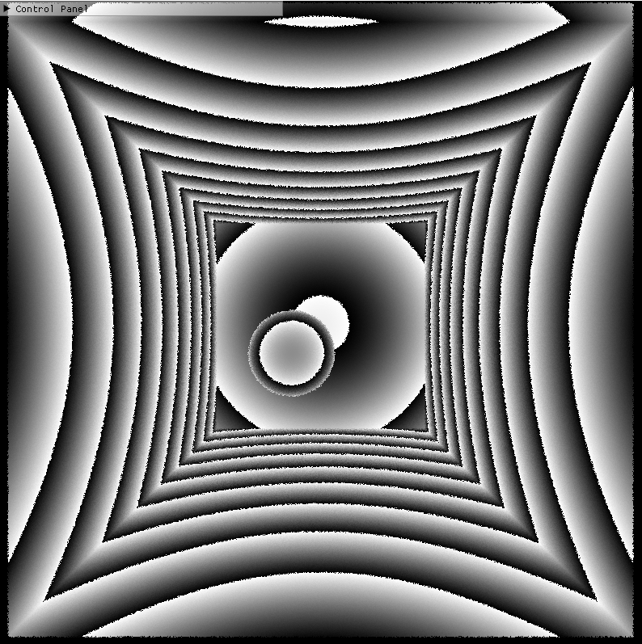
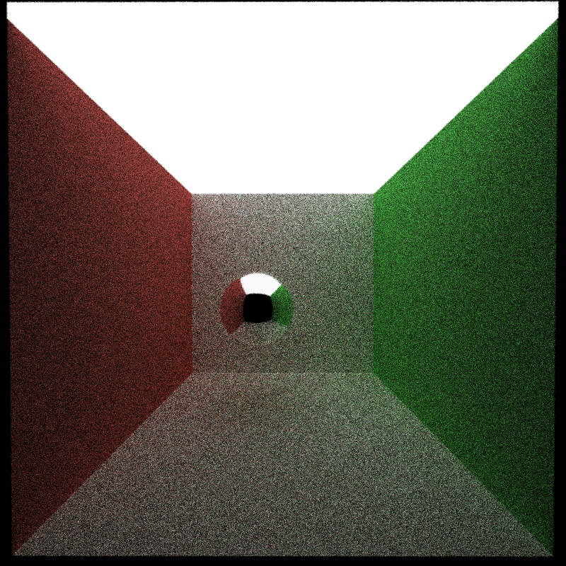
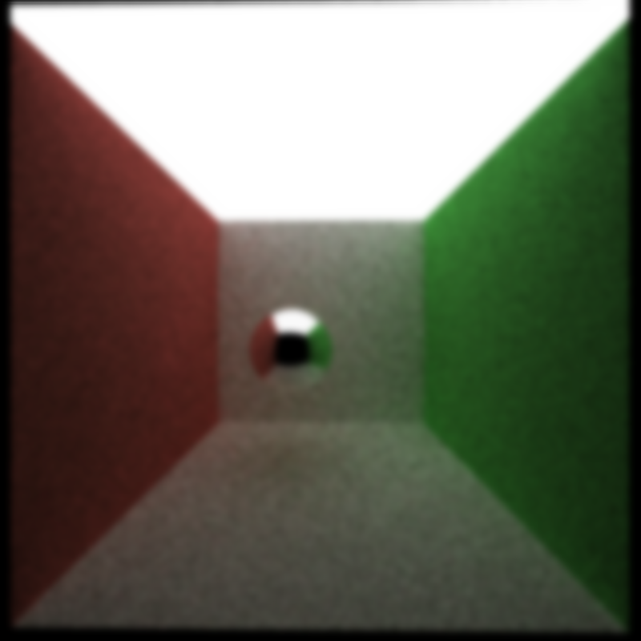
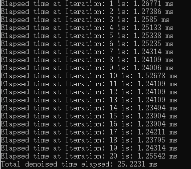

CUDA Denoiser For CUDA Path Tracer
==================================

**University of Pennsylvania, CIS 565: GPU Programming and Architecture, Project 4**

* Shineng Tang
  * [LinkedIn](https://www.linkedin.com/in/shineng-t-224192195/)
* Tested on: Windows 11, i9-10900k @3.7GHz 32GB, RTX 3090 24GB

# Proejct Description
This project is an edge-avoiding A-Trous Wavelet denoiser for the CUDA path tracer. It is an efficient approach for filtering a noisy sample.

## Features

### **G-Buffer visualization**

| Normal | Position | Time of Flight |
|---|---|---|
||||

These images include geometry information of the scene such as normals, intersection positions, and mapped them to RGB values.

### **Denoised Result (10 iterations)** 
| Raw Pathtraced  | Gaussian Blur | Denoised |
|---|---|---|
||||

## Performance Analysis
* how much time denoising adds to your renders
  
  For an 800 x 800 image, the denoiser adds approximately 1.2 ms per iteration to get to a visually acceptable image.
 
  
* how denoising influences the number of iterations needed to get an "acceptably smooth" result

| Raw Pathtraced  | Gaussian Blur | Denoised |
|---|---|---|
||||
* how denoising at different resolutions impacts runtime
* how varying filter sizes affect performance