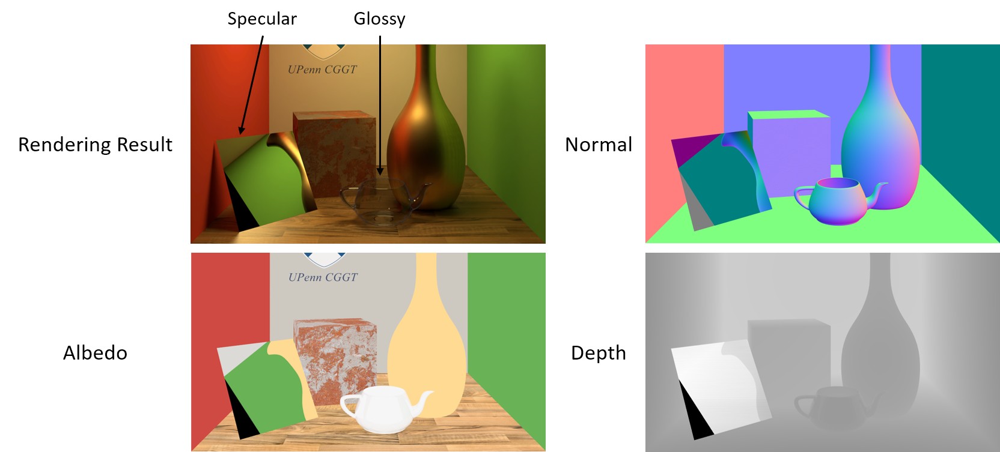
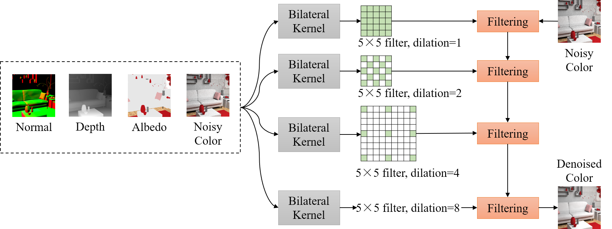
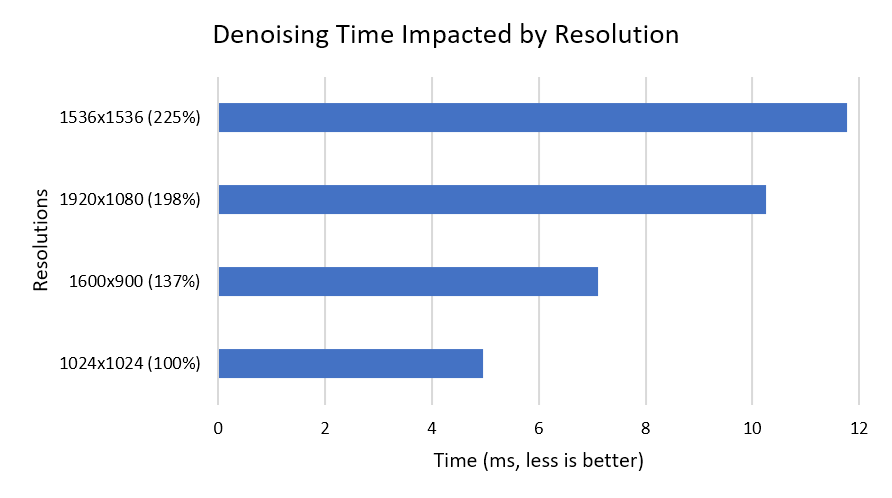
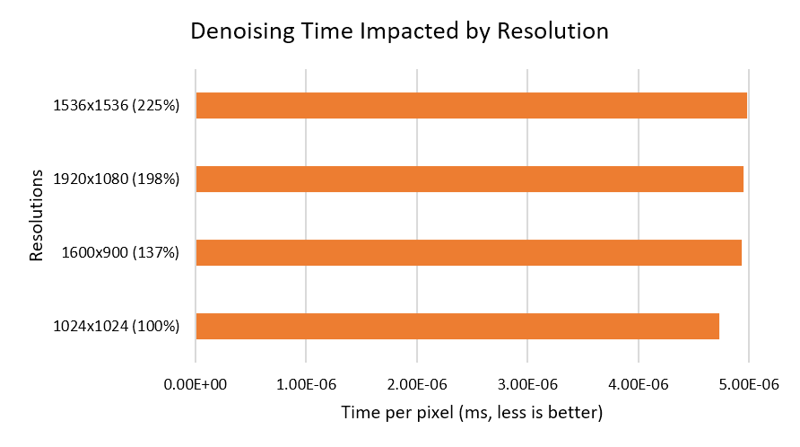
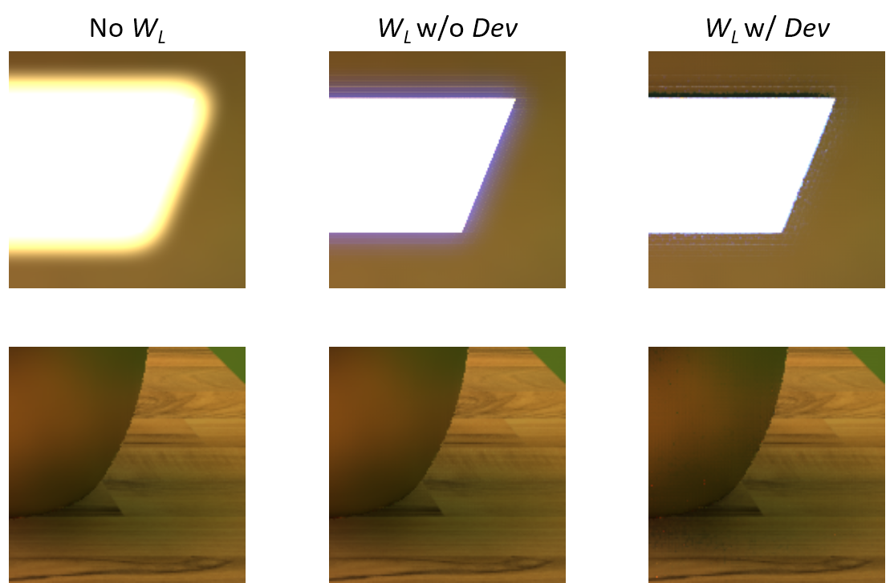
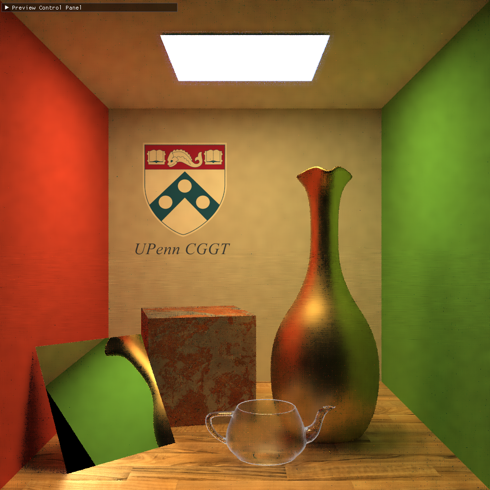

CUDA Denoiser For CUDA Path Tracer
==================================

**University of Pennsylvania, CIS 565: GPU Programming and Architecture, Project 3**

**[Repo link](https://github.com/IwakuraRein/Nagi)**

- Alex Fu
  
  - [LinkedIn](https://www.linkedin.com/in/alex-fu-b47b67238/)
  - [Twitter](https://twitter.com/AlexFu8304)
  - [Personal Website](https://thecger.com/)

Tested on: Windows 10, i7-10750H @ 2.60GHz, 16GB, GTX 3060 6GB

## Feature

A real-time path tracing denoiser. Reference: [*Spatiotemporal variance-guided filtering: real-time reconstruction for path-traced global illumination*](https://dl.acm.org/doi/10.1145/3105762.3105770).

<video src="https://user-images.githubusercontent.com/28486541/196747599-32b3307a-4af8-43af-bf47-4a27321f0234.mp4"></video>

## G-Buffer optimization

In order to better represent the geometries of reflection, I blend the geometries according to material types:

Diffuse material:

* Albedo buffer: store first bounce albedo

* Normal buffer: store first bounce normal

* Depth buffer: store first bounce depth

Glossy Material:

- Albedo buffer: blend the first and second bounce albedo

- Normal buffer: store first bounce normal

- Depth buffer: store first bounce depth

Specular Material:

* Albedo buffer: blend the albedo until hits non-specular material

* Normal buffer: store the first non-specular material's normal

* Dpeth buffer: accumulate the depth until hits non-specular material

This denoiser is based on SVGF so there is another buffer storing the square luma.

The square luma is calculated by:

$SqrLuma = (\{ 0.299, 0.587, 0.114 \} \cdot ( Color \div (Albedo + \epsilon ))^2$

Also notice that the final albedo buffer is the blend of all spp's albedo buffer.

## Denoiser

The denoiser is essentially a bilateral wavelet filter. Its weight can be denoted by:

$W = W_Z \cdot W_N \cdot W_L$

where 

$W_Z = \exp(-\frac{|Z(p) - Z(q)|}{\sigma_Z + \epsilon})$

$W_N = \mathrm{max}(0, N(p) \cdot N(q))^{\sigma_N}$

$W_L = \exp(-\frac{|L(p) - L(q)|}{\sigma_L \cdot Dev + \epsilon})$

Where the luminance $L$ is calculated by

$L = Color \div (Albedo + \epsilon )$

The deviation $Dev$ is calculated by:

$\mathrm{clamp}(g_{3 \times 3}(\sqrt{|SqrLuma(p)-(\{ 0.299, 0.587, 0.114 \}\cdot L(p))^2|}), \epsilon, 1)$

where $g_{3 \times 3}$ is the 3X3 gaussian filter.

In practice, the filter size is 5X5, $\sigma_Z$ is 1, $\sigma_N$ is 64, and $\sigma_L$ is 4. The image will be iteratively denoised 4 times, with the dilation of 1, 2, 4, and 8.

To stabilize the preview, the GUI will blend the last result and the current result.

## Comapre to Gaussian Filter

## Performance Analysis

As shown in the demonstration video, it took 64 iterations for generating a plausible result for an inner scene.

### Performance impacted by resolutions

### Performance impacted by luminance weight

By introducing the luminance weight, the filter will be aware of the edges between light and dark, thus better preserving the edges of shadows and light sources.

Also, introducing the deviation term further improves the edge preservation and can decrease the blurring as the rendering result converges. With more and more samples, the $Dev$ and $W_L$ will become closer to zero.

### Performance impacted by wavelet filter

By adding dilations, wavelet filters can a have larger reception field than normal filters with similar computational costs.

**5x5 wavelet filter, 4 times, 4.96ms**

**9x9 normal filter, 5ms**

At the same time cost, the wavelet filter generates better result.

### Performance impacted by filter size

**9x9 wavelet filter, 4 times, 18.5ms**

**7x7 wavelet filter, 4 times, 10.9ms**

**5x5 wavelet filter, 4 times, 4.96ms**

**3x3 wavelet filter, 4 times, 2ms**

