CUDA Denoiser
================

**University of Pennsylvania, CIS 565: GPU Programming and Architecture, Project 4**

* Chang Liu
  * [LinkedIn](https://www.linkedin.com/in/chang-liu-0451a6208/)
  * [Personal website](https://hummawhite.github.io/)
* Tested on personal laptop:
  - i7-12700 @ 4.90GHz with 16GB RAM
  - RTX 3070 Ti Laptop 8GB

    

        
         
        
Stable denoised result by SVGF

    

Demo videos:

- [*Cornell Box*](https://youtu.be/75MrzV-2qw8)
- [*Sponza*](https://youtu.be/DVkk4yPoPVs)

### Link to the base project: [*Project 3: CUDA Path Tracer*](https://github.com/HummaWhite/Project3-CUDA-Path-Tracer/tree/main), welcome to see!

---

## Features

### Edge-Avoiding A-Trous Wavelet Denoiser (EAW Denoiser)

#### Pipeline Overview

This denoiser is based on project three's path tracer, which supports a variety of surface appearances including texture and glossy reflection. In order to support these features and improve overall denoising quality, inspired by SVGF, the denoiser generates demodulated direct and indirect illumination components separately.

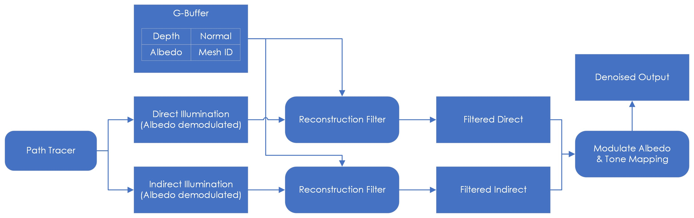

Here, demodulation means dividing path traced color by albedo, which composes of materials' base color and texture color. In actual implementation, we simply set the surface color to 1 to avoid dividing zero if the material's color is black. By demodulation, the input to denoise filter remains only light transportation terms. This can effectively prevent blurring texture details.

<table>
    <tr>
        <th>Path Traced</th>
        <th>Albedo</th>
        <th>Demodulated</th>
    </tr>
    <tr>
        <th>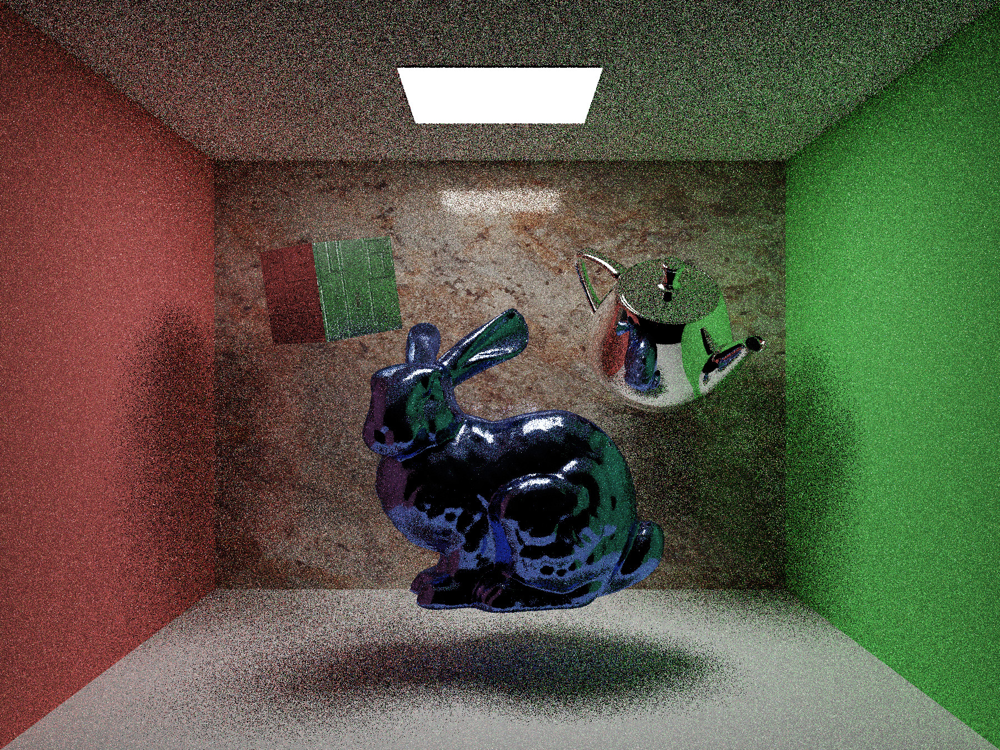</th>
        <th>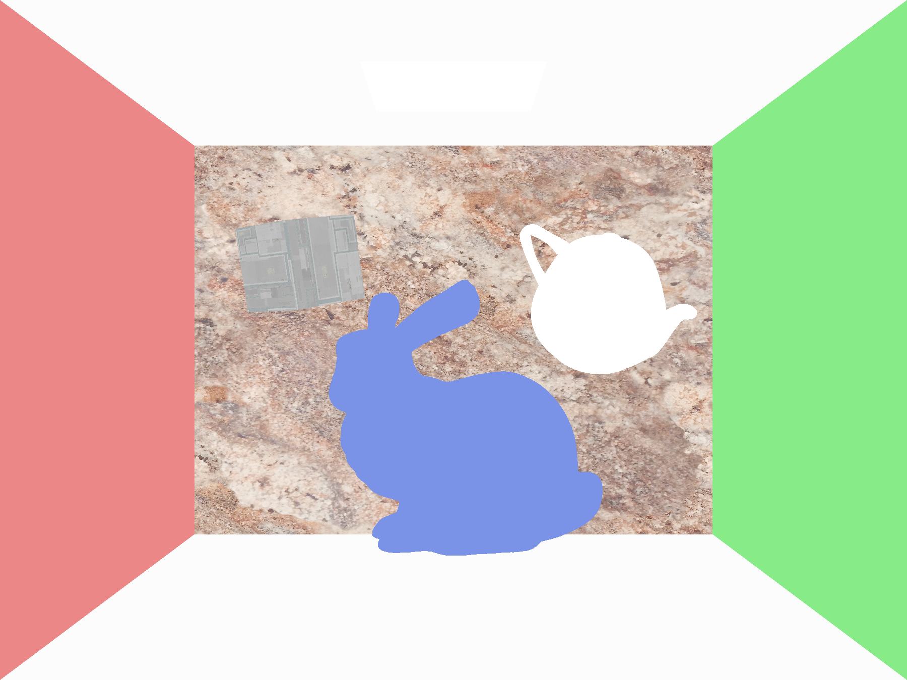</th>
        <th>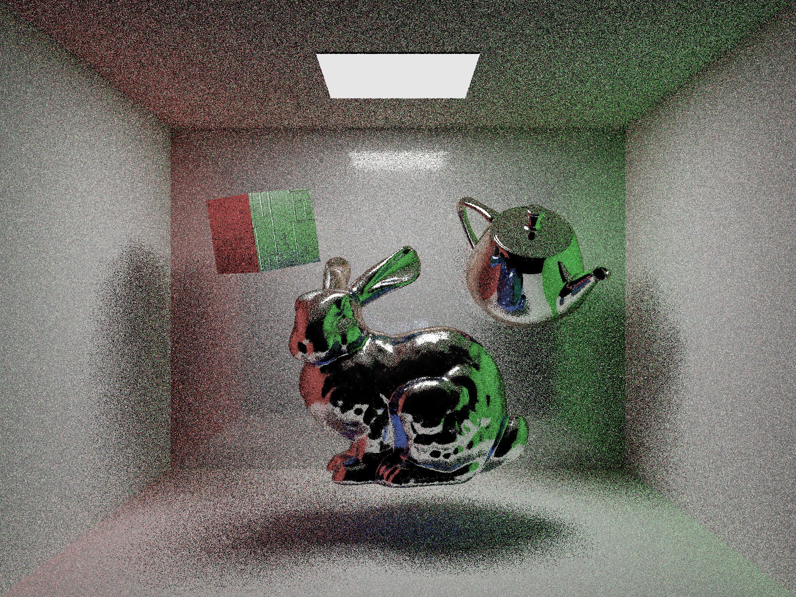</th>
    </tr>
</table>

Then, we send direct and indirect components to reconstruction filters guided by G-Buffer. The reconstruction filter is made up of five levels of Edge-Avoiding A-Trous Wavelet Filters, with each level's filter radius increasing. After filtering, we add direct and indirect components together and modulate albedo back to get the denoised illumination image, then do some post processing to get the final denoised image.

#### Reconstruction Filter

##### A-Trous Wavelet Filter

The filter we use in this filter is base on A-Trous Wavelet Filter, an approximation of Gaussian filter whose basic form is a 5x5 Gaussian kernel as well. But unlike Gaussian, A-Trous filter is a multi-pass algorithm. In each iteration we keep the size of base kernel 5x5 but double the stride between sampled pixels. Here is its 1D illustration.

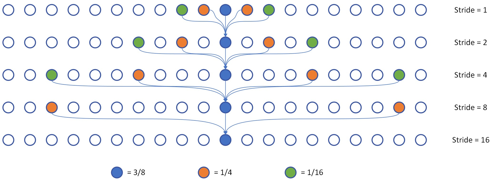

Assume the filter radius is $n=2^k$. For an ordinary Gaussian kernel, the time complexity is $O(n^2)$ (one pass) or $O(n)$ (two passes filtering X and Y independently). By contrast, the A-Trous wavelet approximation has time complexity of $O(\log{n})=O(k)$, which is much more efficient.

<table>
    <tr>
        <th>Gaussian</th>
        <th>A-Trous Wavelet</th>
    </tr>
    <tr>
        <th>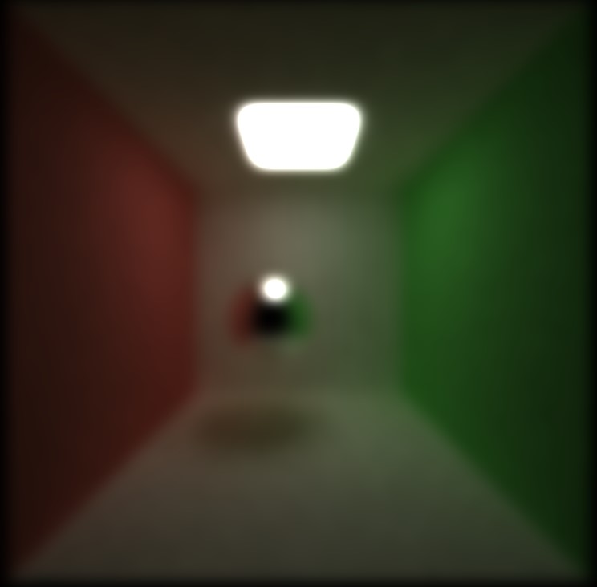</th>
        <th>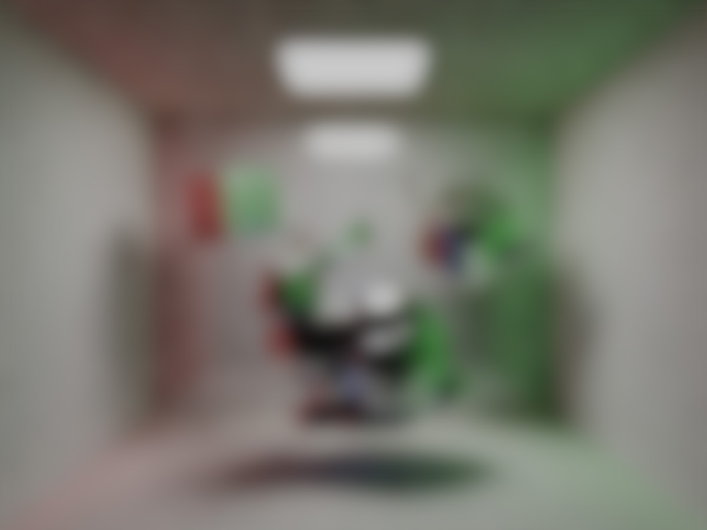</th>
    </tr>
</table>
In the graph above, A-Trous wavelet filter produces similar result to Gaussian (created with GIMP).

This denoiser's reconstruction filter includes five levels of A-Trous wavelet filters. The filters' radius increase from 1 to 16, covering an area of 31x31 pixels.

##### G-Buffer Guided edge-avoiding

To avoid blending some high frequency details like the boundary between two objects with different colors, additional geometry information is needed to adjust the weight of kernel. For example, the farther the sampled pixel's position from the pixel to be filtered, they are less likely to come from the same part of an object, so the weight of sampled pixel is supposed to be smaller.

For EAW filter, the required geometry information includes:

- Linear depth of view space, also objects' distance to eye. This can be used to reconstruct world positions (3 floats)
  - Or, raw position data, which takes 3 times space than recording depth (1 float)
- Normal, either raw data or oct encoded (3 floats / 2 floats)
- Albedo, for modulation after filtering (3 floats)
- Mesh ID or object IDs, used to check if two pixels belong to a same object so that they can probably be blended (1 int)

The kernel EAW uses is actually a multilateral filter kernel. Its weight is the product of four Gaussian kernels:

- The original 5x5 Gaussian kernel

- The luminance difference kernel $\exp(-\frac{||luminance_p - luminance_q||^2}{\sigma_{luminance}})$
  
- The normal difference kernel $\exp(-\frac{||normal_p - normal_q||^2}{\sigma_{normal}})$
  
- The distance kernel $\exp(-\frac{||position_p - position_q||^2}{\sigma_{position}})$

These four kernels work together to determine the filter's shape.

#### Result

<table>
    <tr>
        <th>1 SPP Input</th>
        <th>Filtered (sigma normal = 0.02)</th>
    </tr>
    <tr>
        <th>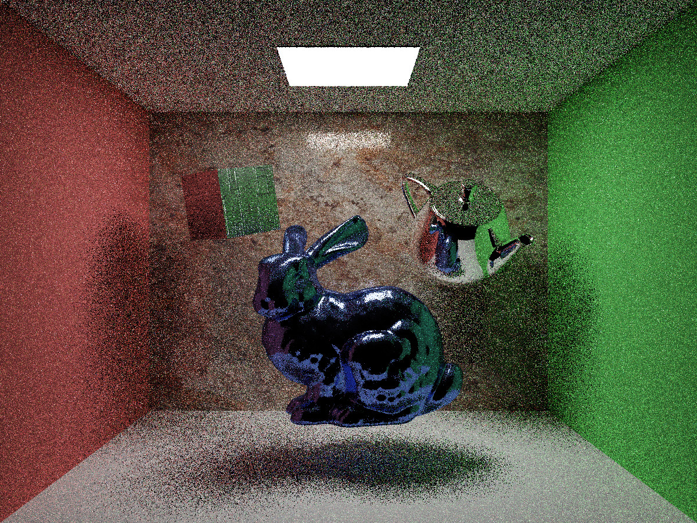</th>
        <th>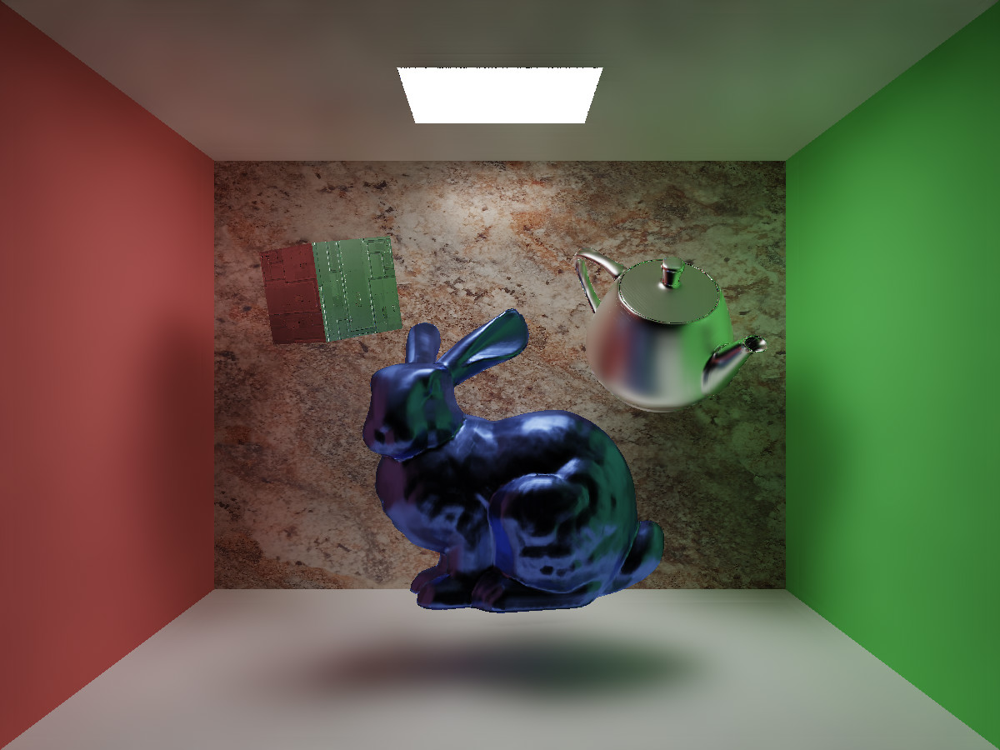</th>
    </tr>
</table>

The result EAW denoiser produces with 1 SPP input looks pretty good. However, there are some visible artifacts:

- Over blended glossy and specular reflections

- Still some low frequency noise on diffuse surfaces

If we let the path tracer accumulate input color to the denoiser, the quality will improve gradually. For example, the low frequency noise on diffuse surfaces will finally be removed. Glossy reflections will be a bit clearer, however still over blended.

<table>
    <tr>
        <th>1 SPP</th>
        <th>Many SPP</th>
    </tr>
    <tr>
        <th></th>
        <th>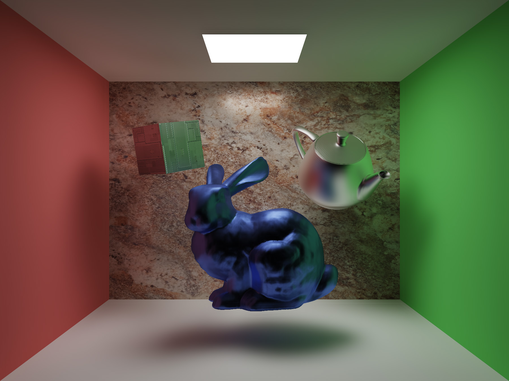</th>
    </tr>
</table>

A better solution would be reusing past frames' information and adjust the size of filter kernel based on pixels' convergence. This is what will be introduced below -- spatiotemporal variance guiding.

### Spatiotemporal Variance Guided Denoiser (SVGF Denoiser)

This part is implementation of the paper [*Spatiotemporal Variance-Guided Filtering: Real-Time Reconstruction for Path-Traced Global Illumination*](https://research.nvidia.com/publication/2017-07_Spatiotemporal-Variance-Guided-Filtering%3A).

In edge-avoiding A-Trous Filtering, our reconstruction kernel is only driven by spatial information of the scene at a certain frame. However, usually among several consecutive frames, if there isn't drastic change in camera's perspective or objects' position, we can still find rendered part of objects in the current frame to be appearing in previous frames. It turns out, these pixels can be taken into consideration for determining the weight of reconstruction filter.

Here are three critical ideas of SVGF in my opinion, which will be discussed later:

- Temporal color and moment accumulation
- Variance estimation
- Variance guided filtering

#### Pipeline

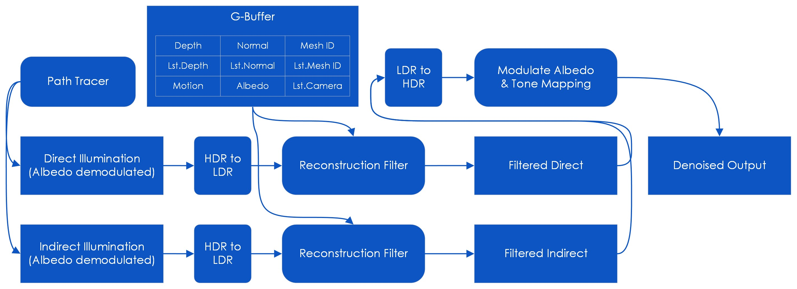

Since SVGF makes use of temporal accumulation, in each frame we need to generate additional temporal information with G-buffer -- motion vector. That is, the index of pixel matching the current pixel in mesh ID, color and normal in the last frame. Usually motion vector is stored as `float2`, either absolute coordinate or relative coordinate to the current pixel. In this denoiser, the motion vector is stored as `int`, directly pointing to the address of target pixel. The process finding the target pixel is called reprojection. It requires us to store last frame's position/depth and last frame's camera information with current frame's G-buffer.

Another change made to EAW denoiser's pipeline is that tone mapping and inversed tone mapping is added before and after filtering. This wasn't shown in the paper, but concluded by my own observation that raw radiance image from path tracer usually contains some isolated bright dots, which are hundreds of times brighter than surrounding pixels. They are likely to leave large bright areas after blurring thus make the image not smooth enough. To reduce this artifact, it'd be better to compress them to a low dynamic range.

I applied Reinhard because it's simple to inverse. It worked well but introduced some bias that would make what is supposed to be very bright look a bit darker. There may exist better curving approaches that preserve more highlight.

#### Reconstruction Filter

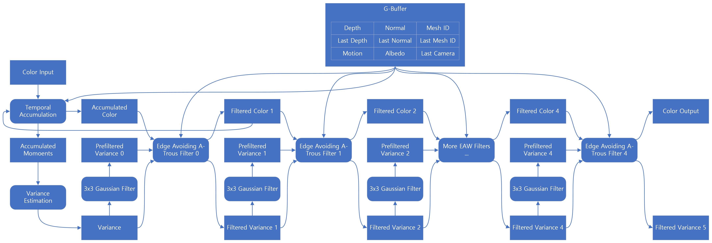

SVGF's reconstruction filter is much more complicated than EAW. It has three main steps:

- Temporal accumulation: this is very similar to TAA in real-time rendering. By mixing path traced input with past frames'  history, the input to wavelet filters is more temporally stable. SVGF even makes this idea further by filtering color history with the first wavelet (equivalent to a 5x5 Gaussian kernel) before mixing it with path traced input. SVGF uses exponential average to keep the number of history frames restricted for real-time respond to scene change, also to avoid ghosting:

$$
\bar{c_i}=\alpha\bar{c_{i-1}}+(1-\alpha)c
$$

- Variance estimation: this is another important factor SVGF introduced to drive edge-avoiding kernels along with geometry information. There are two  kinds of variance:

  - Temporal variance: the variance of pixel's brightness in its valid history. This is derived from the variance formula $V(X)=E^2(X)-E(X^2)$
    
    where the expectation is replaced by exponential average. It also means the first and second moments of pixel's brightness are to be temporally accumulated as well, so additional buffers are required
    
  - Spatial variance: the variance of pixels' brightness in its neighboring area. Larger variance indicates that the area is possibly noisier so that larger filter will be applied. In this denoiser, the area is set 5x5. This approach is also used by many variants of Bilateral Filter

  To combine these two for spatiotemporal variance, SVGF does something tricky but reasonable: temporal variance is used only when there are more than 5 valid history frames for a pixel. Otherwise, spatial variance is used. This is to prevent introduced variance with insufficient history

- Variance guided filtering: SVGF's edge-avoiding kernel is based on EAW's, but modified:

  - To let variance also drive the shape of filter, the new luminance difference kernel is $\exp(-\frac{||luminance_p - luminance_q||}{\sigma_{luminance}\sqrt{Gaussian_{3x3}(Var_p)}+\epsilon})$, with standard deviation of current pixel added to scale the exponent. And the variance of current pixel is even prefiltered by a 3x3 Gaussian kernel
  - The normal difference kernel is replaced by a step-like function $\max(0, normal_p \cdot normal_q)^{\sigma_{normal}}$
  - The distance kernel is also replaced by $\exp(-\frac{||depth_p-depth_q||}{\sigma_{depth}||\nabla depth_p \cdot(p-q)||+\epsilon})$, which requires to calculate the gradient of clip-space depth with respect to screen space. This is difficult to do with CUDA, so this denoiser uses EAW's original distance kernel

#### Result

It turns out that SVGF's spatiotemporal variance guiding is pretty efficient. 1spp input is sufficient to produce decent output, which is smoother than EAW. High frequency details like specular reflections are better preserved as well.

<table>
    <tr>
        <th>EAW (sigma normal = 0.02)</th>
        <th>SVGF</th>
    </tr>
    <tr>
        <th></th>
        <th>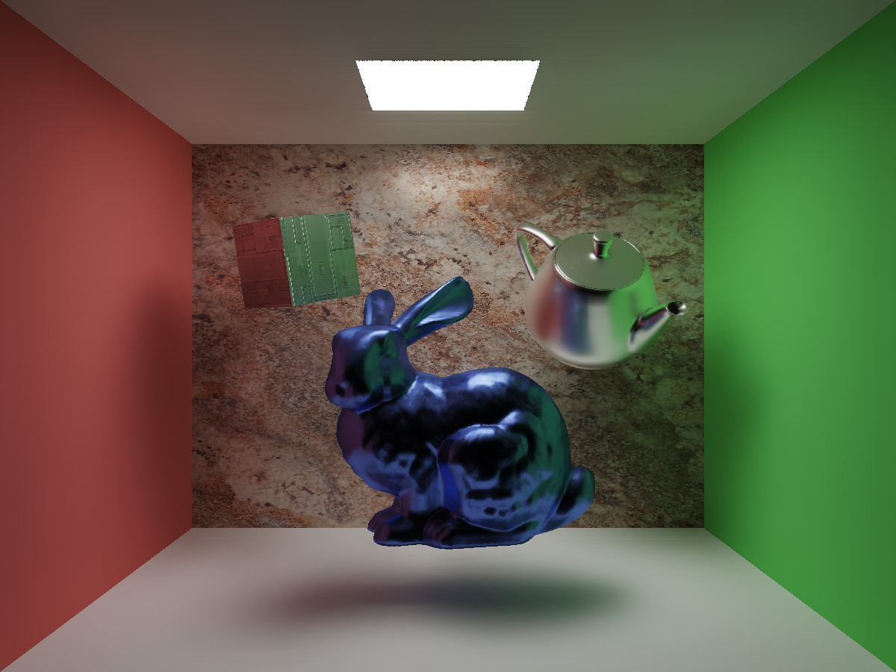</th>
    </tr>
</table>

More importantly, SVGF's result is much more temporally stable than EAW. For a scene that involves more indirect lighting like Sponza, EAW's dark parts flicker obviously while SVGF has this artifact greatly reduced.

<table>
    <tr>
        <th>EAW (sigma normal = 0.2)</th>
        <th>SVGF</th>
    </tr>
    <tr>
        <th>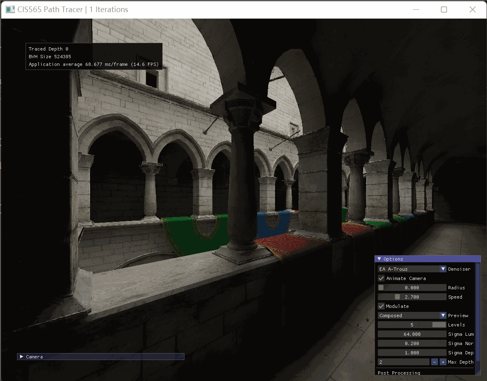</th>
        <th>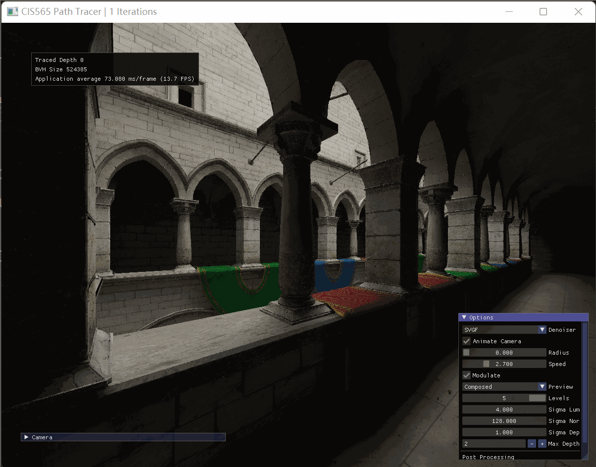</th>
    </tr>
</table>

If we let the scene stay still and accumulate ray traced color, the filter will gradually shrink in response to reduced variance. The denoised image will finally converge to the noiseless image we desire with all high frequency details preserved (see how the specular reflection on the teapot becomes clearer with increased sample number):

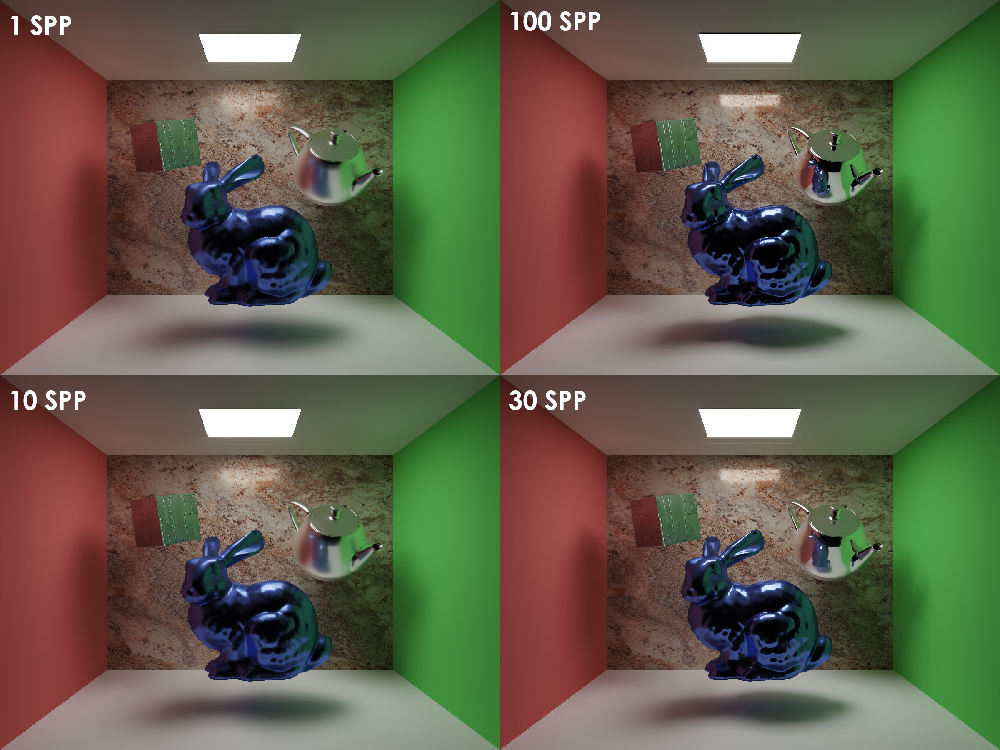

### G-Buffer Optimization

#### Storing Depth Instead of Position

Given a point's projected coordinate on a camera's film and its distance to the camera, we can calculate its world position based on the camera's position, rotation, FOV and aspect. In this denoiser, the position information is stored as linear depth (float) to the camera, saving 2 floats per pixel compared to storing all three components. Usually reconstructing world position from depth can be done by multiplying the inversed projection matrix, in this denoiser, however, there is already a ray shooting function in path tracer to use.

#### HemiOct Normal Decoding

This idea comes from the paper [*ASurvey of Efficient Representations for Independent Unit Vectors*](http://jcgt.org/published/0003/02/01/paper.pdf). What I implemented is the HemiOct32 approach mentioned in the last, which is said to have the least error.

This saves one float per pixel.

## Performance Analysis

### How Much Denoising Adds to Render Time

The tests are done at 1800 x 1350, about 20% pixels more than 1080p. Tracing depth for the two scenes are 3 and 2 respectively. From the graph we see that denoising with EAW takes ~28ms, while SVGF takes an additional 10ms. Even though SVGF's pipeline is much more complicated than EAW, it consumes less than expected.

    <image src="./img/denoise_time_by_scene.png" width="80%"/>

The next graphs show how resolution affects denoising time. Generally, denoising time increases in the same scale with path tracing time. For example, the time SVGF consumes is always about 1/3 of path tracing. (Tested with Sponza)

    <image src="./img/denoise_time_by_resolution.png" width="49%"/>
    <image src="./img/denoise_time_per_pixel.png" width="49%"/>

### Denoising Time by Different Kernel Sizes

In both EAW and SVGF, there are five levels of wavelet. By each iteration the size of wavelet doubles, meaning memory access is less coherent. It's expected that filtering time would be at least not decreasing. However, my test result shows different trend for two denoisers' wavelet kernels. And the largest kernel is not necessarily the least efficient.

    <image src="./img/filter_time_by_wavelet_size.png" width="80%"/>

This is tested with Sponza at 1800 x 1350.

### Denoising Time Before & After G-Buffer Optimization

    <table>
    	<tr>
        	<th></th>
        	<th>Before</th>
        	<th>After</th>
    	</tr>
    	<tr>
        	<th>EAW</th>
        	<th>21 ms</th>
        	<th>26 ms</th>
    	</tr>
        <tr>
        	<th>SVGF</th>
        	<th>30 ms</th>
        	<th>36 ms</th>
    	</tr>
	</table>

G-buffer optimization negatively optimized XD. When I used NSight to inspect the number of instructions of compiled wavelet kernels, the wavelet kernel with G-Buffer optimization has unusually 11786 instructions with at most more than 60 registers alive. while the wavelet kernel without optimization has only 1633 instructions with at most 40 registers alive. The kernel with position decoding actually executed 701 million instructions in total, while the number for kernel without G-buffer optimization is only 493 million.

Still, I can't believe decoding position from depth has introduced so many additional instructions, no wonder it's slower!

### SVGF Denoising Time Breakup

    <image src="./img/svgf_time.jpg" width="80%"/>

### Denoising Quality by Different Levels of A-Trous Wavelet Kernel

These results are from SVGF. By each level of wavelet kernel, denoising quality improves with diffuse surfaces. However, glossy and specular surfaces can't avoid being over blended.

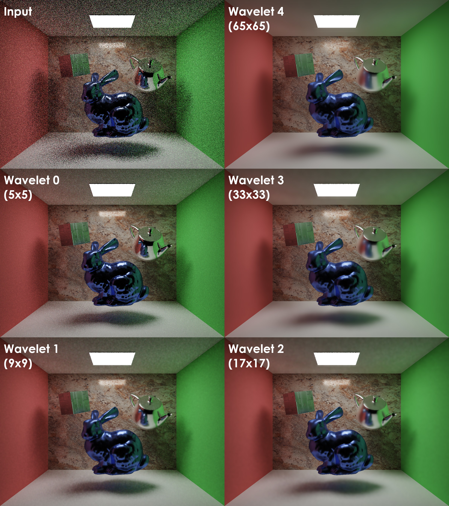

### Denoising Quality by Different Surfaces

<table>
    <tr>
        <th>EAW (1 SPP)</th>
        <th>SVGF (1 SPP)</th>
        <th>Ground Truth</th>
    </tr>
    <tr>
        <th>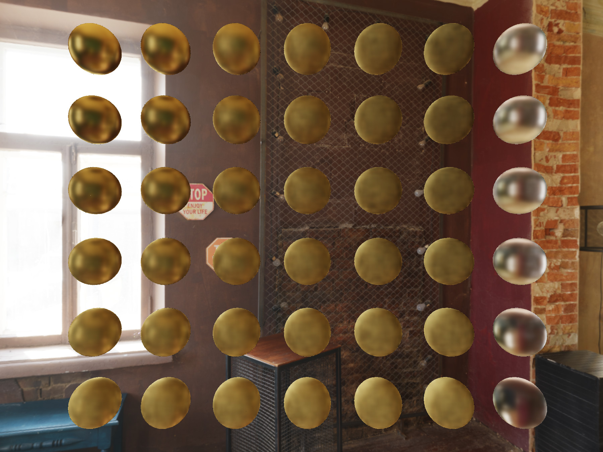</th>
        <th></th>
        <th>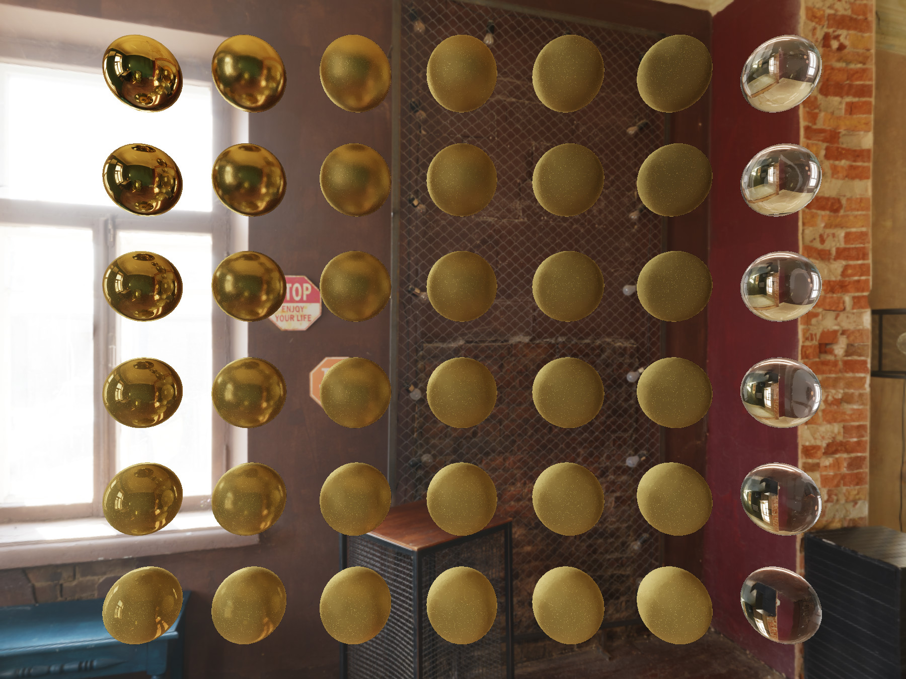</th>
    </tr>
</table>

It shows that both denoisers are better at denoising surfaces with low frequency details than that with high frequency details in general. More specifically, they are good at denoising:

- Diffuse surfaces
- Surfaces with correspondent G-buffer information

For glossy or specular surfaces, or any surface that doesn't have correspondent G-buffer information, like a refractive surface, whose geometry is different from its refracted space's geometry.

## Bloopers

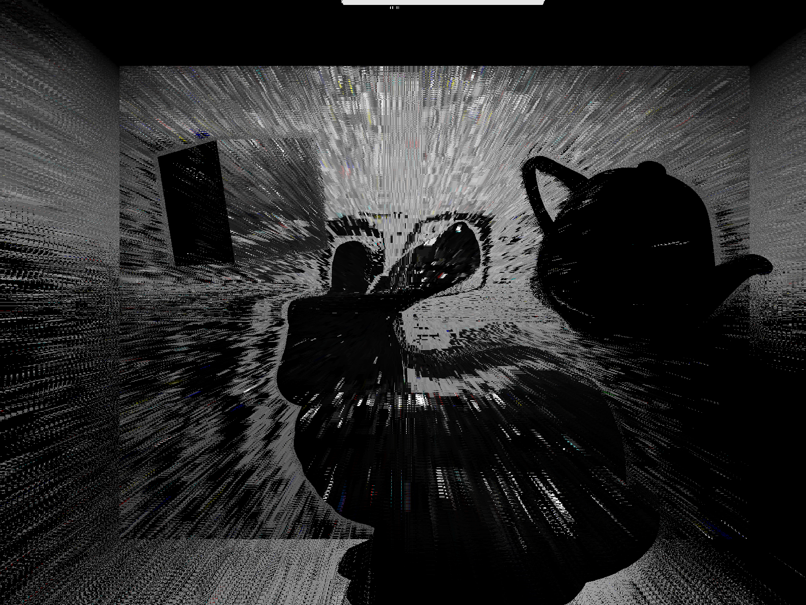

Forgot to use ping-pong buffer for temporal accumulation, data raced. This took me one day to figure out

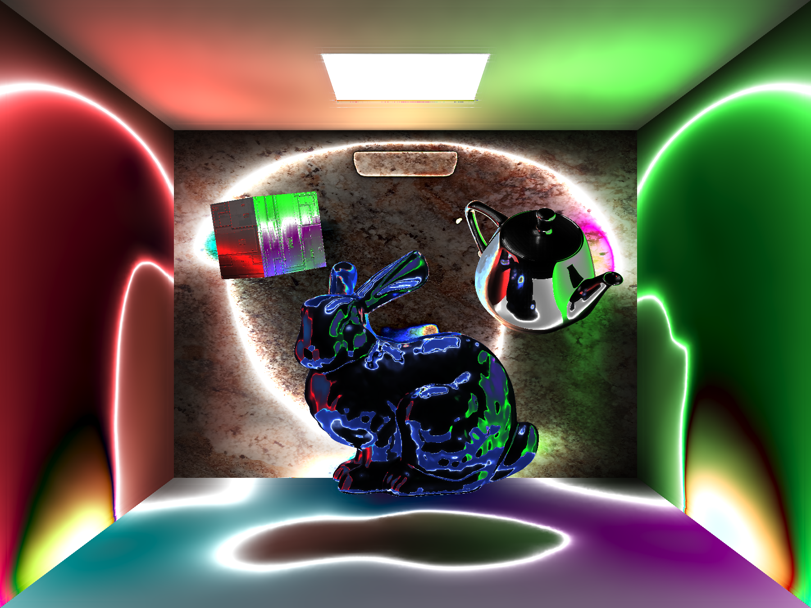

Cyberpunk: Overflow

