CUDA Denoiser For CUDA Path Tracer
================

**University of Pennsylvania, CIS 565: GPU Programming and Architecture, Project 2**

* RHUTA JOSHI
  * [LinkedIn](https://www.linkedin.com/in/rcj9719/)
  * [Website](https://sites.google.com/view/rhuta-joshi)

* Tested on: Windows 10 - 21H2, i7-12700 CPU @ 2.10 GHz, NVIDIA T1000 4096 MB
* GPU Compatibility: 7.5


## Introduction

[Link to full path tracer project](https://github.com/rcj9719/GPU-Programming-CUDA-Path-Tracer)

[Link to denoiser branch for denoiser code](https://github.com/rcj9719/GPU-Project4-CUDA-Denoiser/tree/denoiser)

Since we cast many rays per pixel in order to get enough light information, we can get effects like caustics, soft shadows, anti-aliasing, and depth of field. Since this technique involves computing a large number of rays independently, it can be highly parallelized to converge images incredibly faster on a GPU as compared to a path tracer implementation on CPU. In this project, I have used CUDA to compute intersections and shading per iteration for multiple rays parallelly.

In this branch, I have explained how I enhanced my path tracer by implementinf a pathtracing denoiser that uses geometry buffers (G-buffers) to guide a smoothing filter.

|Before denoising(10 iterations)|After denoising (10 iterations)|
|---|---|
|||
|Time taken: 776.137ms|Time taken: 798.5116ms|

## Technical Background

This implemetation is based on the paper ["Edge-Avoiding A-Trous Wavelet Transform for fast Global Illumination Filtering,"](https://jo.dreggn.org/home/2010_atrous.pdf) by Dammertz, Sewtz, Hanika, and Lensch.

Denoisers can help produce a smoother appearance in a pathtraced image with fewer samples-per-pixel/iterations, although the actual improvement often varies from scene-to-scene. Smoothing an image can be accomplished by blurring pixels - a simple pixel-by-pixel blur filter may sample the color from a pixel's neighbors in the image, weight them by distance, and write the result back into the pixel.

### A-Trous filter
A simple Gaussian blur may look something like this:
```
for each pixel being blurred:
	sample every pixel in blur radius
	multiply by a weight in a weight distribution called a "filter," or h
	sum results and write result into result buffer
```


However, this can be computationally expensive. For a 16x16 blur width/filter, this is 256 pixel reads for each pixel blurred. So instead, we use ATrous filter. Atrous filter reduces the number of pixels to be taken into consideration for blur, by iteratively spreading a small mask/filter spatially or in other words, by applying sparse blurs of increasing size.

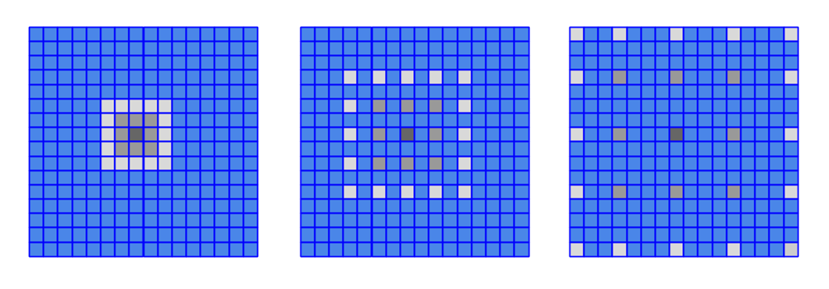

### G-buffers

Simply applying the filter blurs the entire image without taking features like edges, positions, depth and normals into consideration.

|ATrous simple blur| Atrous filter with edge avoidance|
|---|---|
||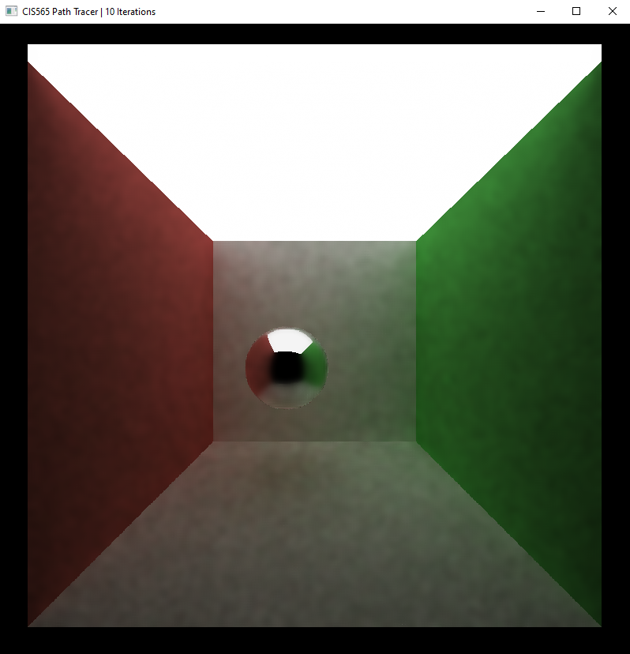|

To detect and avoid edges while applying the filter, we make use of deferred shading, in which we first store the geometry information such as position, normals and depth in a buffer and based on weights assigned to each buffer, tune our denoiser for better results.

|Position G-buffer|Normal G-buffer|Depth G-buffer|
|---|---|---|
|||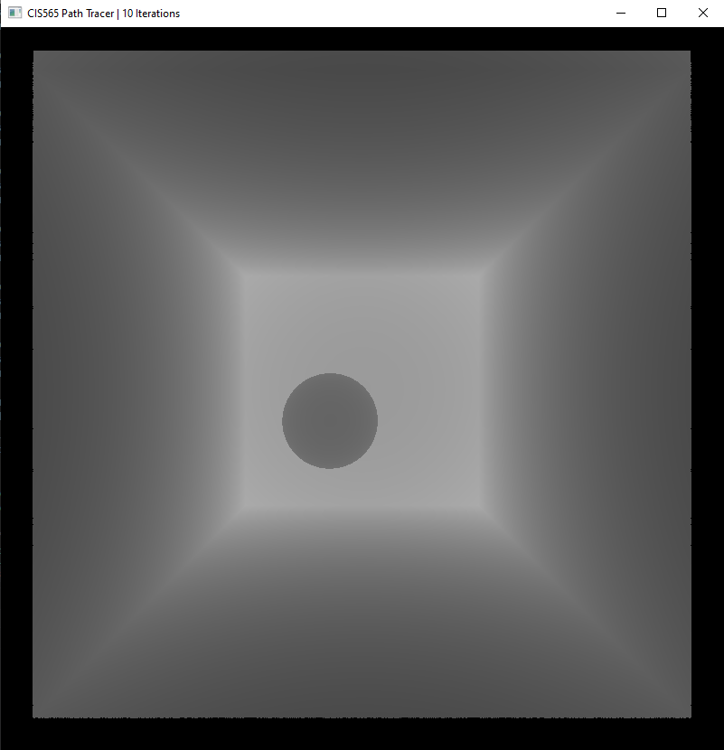|


## Denoising Results and Analysis

### Changing blur radius vs changing filter size

The following chart shows time taken for denoising an image of 10 iterations with a filter size of 5 and varying blur radius.

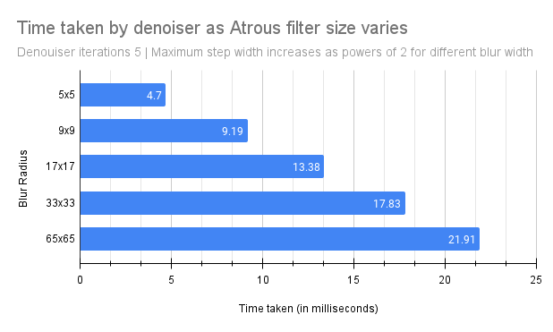

We can see that as the size of blur radius increases time taken to denoise the image also increases.
For a fixed filter size of 5, we can increase the blur radius to get better denoised images as you can see below:

### Gaussian vs ATrous filter

Since ATrous filter spreads out the filter sparsely and calculates the sam enumber of pixels per iteration, it performs much more effectively than Gaussian filter of same size as the blur radius. Visually, Gaussian may generate better blur images.

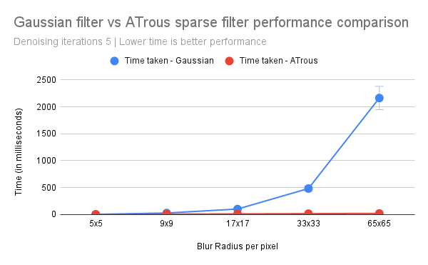

### Changing image resolution

Not surprisingly, as the resolution of our render increases, time taken to denoise it also increases because of increased number of pixels to be denoised.

While the denoiser may add a small overhead, it generates equally acceptable images in very less iterations, thus making it an effective feature for a path tracer.  For 10 iterations, filter width 5, blur width 17, we see the results below.

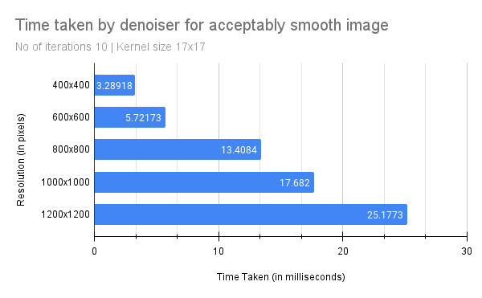

|Resolution|Time taken| Render|
|---|---|---|
|400 x 400|3.28918 ms |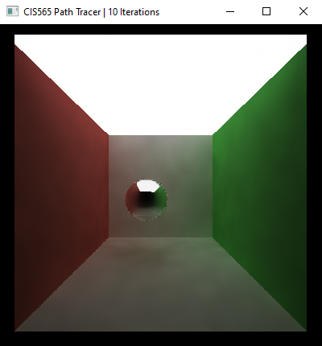|
|600 x 600|5.72173 ms|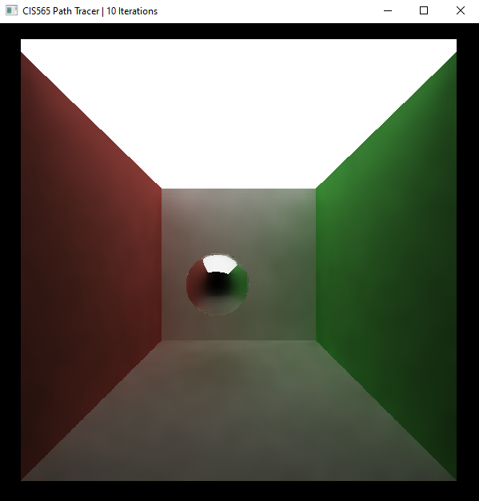|
|800 x 800|13.4084 ms|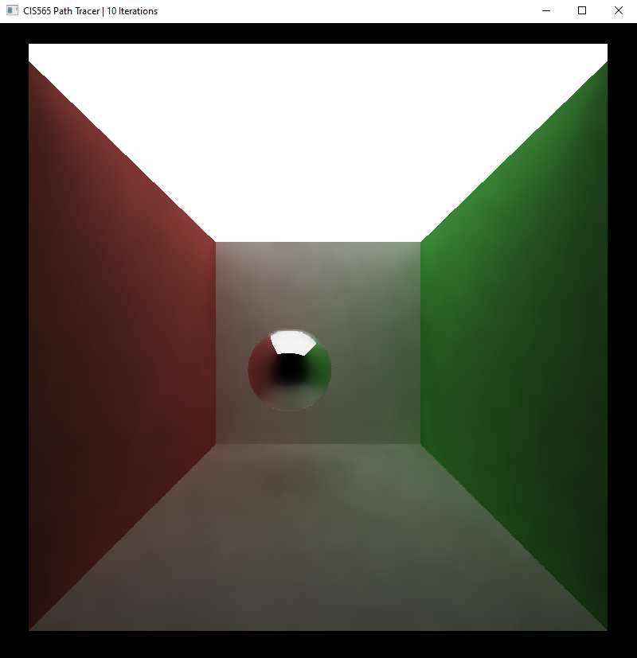|
|1000 x 1000|17.682 ms|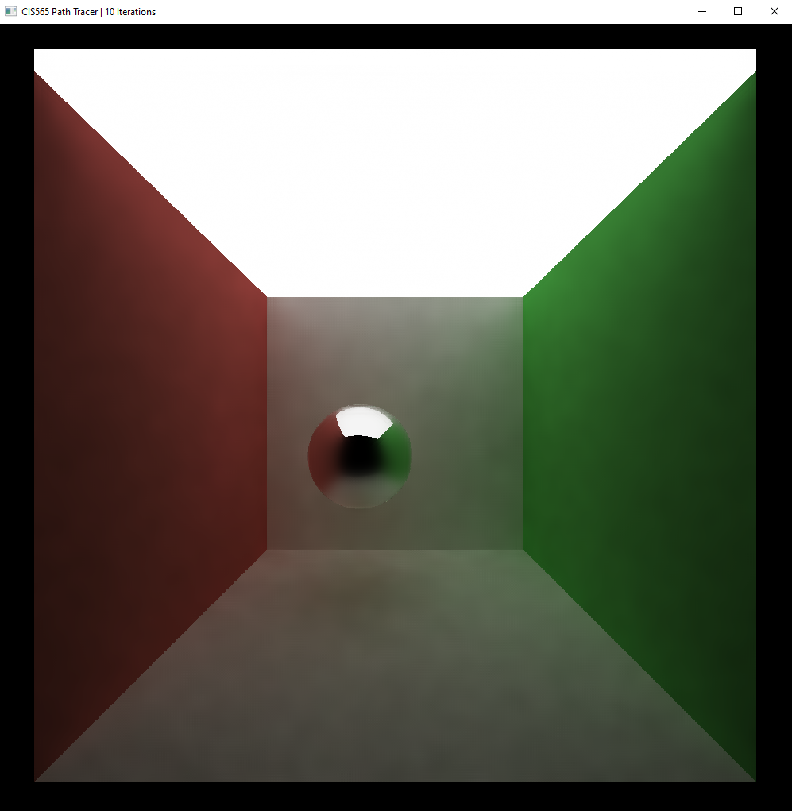|

### Denoiser on different materials

This denoiser does not always appear to give best visual approximation especially for specular transmissive materials as you can see below

**Diffused materials** - Diffused materials generally look good and do not lose out on any specific visual features like color, positions etc because of geometry buffers passed in.
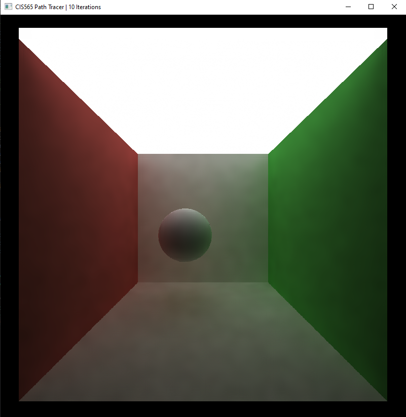

**Reflective** - Reflections can also get blurred, as edge avoidance does not avoid edges inside reflections, making it appear like a microfacet reflecting material with increased roughness instead of purely reflective specular material.
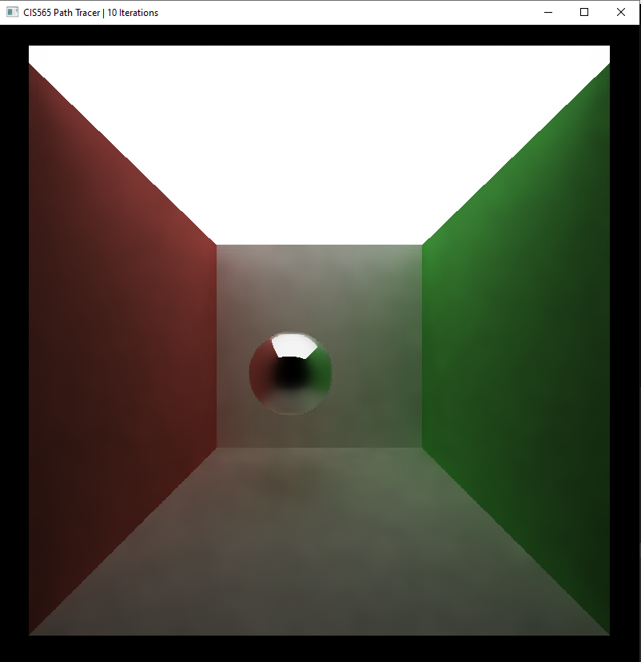

**Transmissive** - Transmissive materials may also lose some prominent visible features such as caustics.
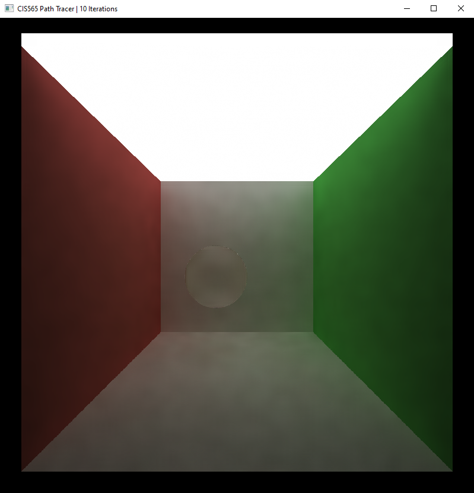

### Obtaining visually smooth results

|Status|Iterations|Time taken|Render|
|---|---|---|---|
|Denoiser on|10|0.798 seconds||
|Denoiser off|200|13.96 seconds|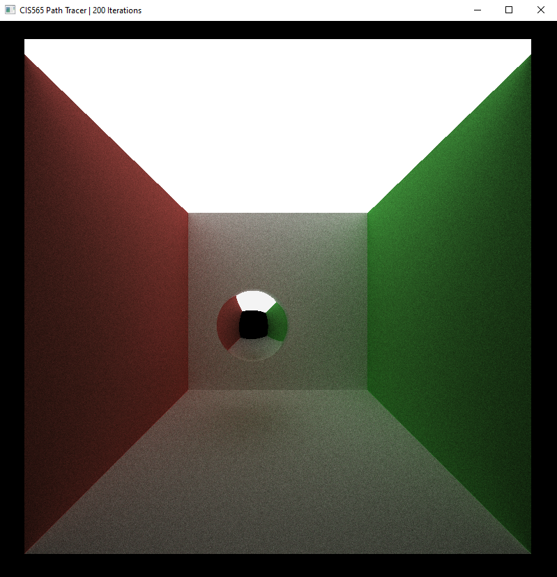|

We can see that while we make lose some details on specular reflections, a denoiser can give us fairly smooth images in very few iterations.

## References

1. ["Edge-Avoiding A-Trous Wavelet Transform for fast Global Illumination Filtering,"](https://jo.dreggn.org/home/2010_atrous.pdf) by Dammertz, Sewtz, Hanika, and Lensch.
2. UPenn CIS 565 Course Notes and presentation slides


## Bloopers

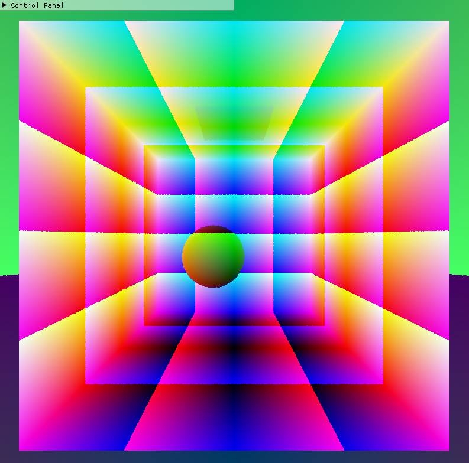
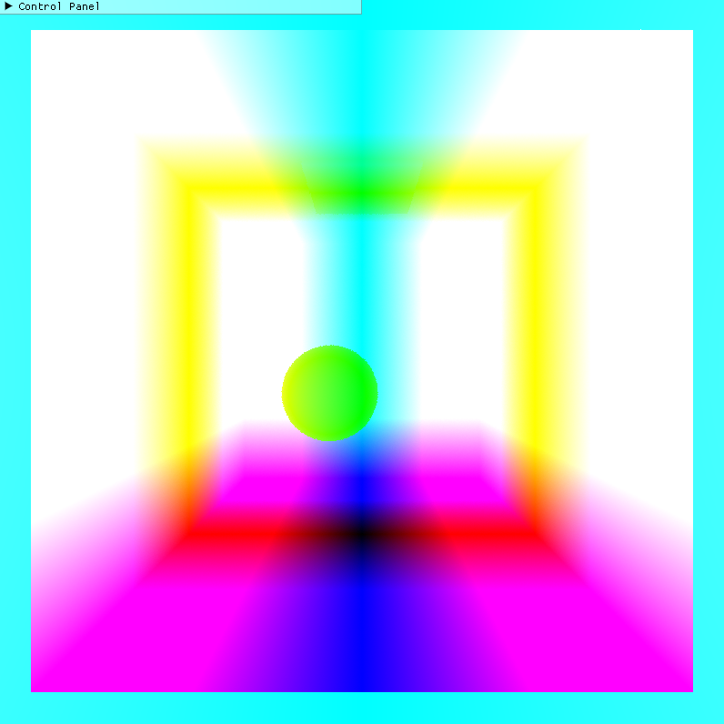
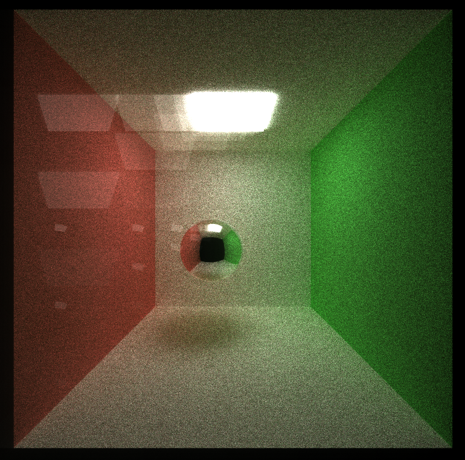
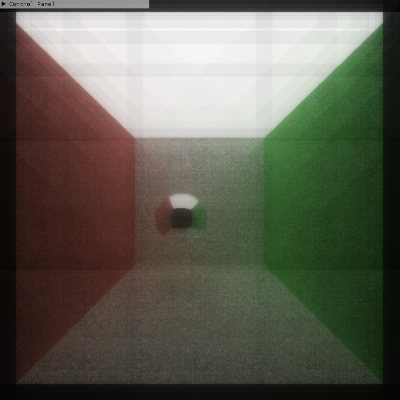
