CUDA Denoiser For CUDA Path Tracer
==================================

**University of Pennsylvania, CIS 565: GPU Programming and Architecture, Project 4**

* Nick Moon
  * [LinkedIn](https://www.linkedin.com/in/nick-moon1/), [personal website](https://nicholasmoon.github.io/)
* Tested on: Windows 10, AMD Ryzen 9 5900HS @ 3.0GHz 32GB, NVIDIA RTX 3060 Laptop 6GB (Personal Laptop)


**This project is an implementation of the Edge-Avoiding À-Trous Wavelet Transform for Fast Global
Illumination Filtering.
This denoising algorithm uses a style of gaussian blurring to smooth noisy parts of 
the render, while smartly detecting edges with G-Buffer values stored during path-tracing.
This allows for segmented denoising that preserves object boundaries.**

## RESULTS

*DO NOT* leave the README to the last minute! It is a crucial part of the
project, and we will not be able to grade you without a good README.


## IMPLEMENTATION

### Gaussian Blur and Filtering

As a small introduction, the core of the denoising algorithm is based on filters/kernels. These
are a collection of values that describe weighting around a center pixel ```p```. 
So, for example, if you have a 5x5
kernel ```k``` and are at pixel ```p``` then the middle element ```k[2][2]``` will be multiplied
by the value at pixel p, and the result accumulated for each of the 25 pixels around ```p```.

Below is an example of a kernel generated with the gaussian function:

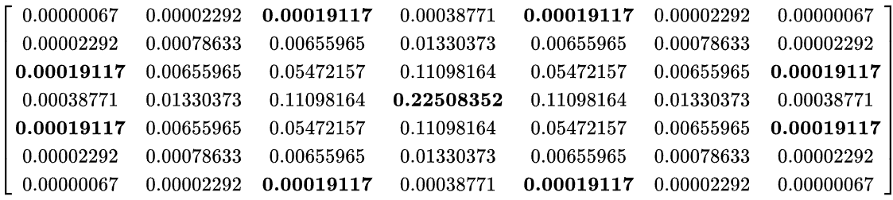

Applying the kernel to every pixel in an image will result in blur like the image below:

### À-Trous Wavelet Transform

The À-Trous Wavelet Transform described in the paper is a filter similar to the gaussian kernel, 
but optimized. Instead of having a kernel size that grows quadratically with the number of
pixels desired to be sampled, the À-Trous Wavelet Transform instead reuses the same kernel,
for example a 5x5 like used in this project, but performs multiple iterations of denoising
using exponentially greater offsets between pixels sampled each time. This allows for a larger
neighborhood of pixels to be sampled without significantly increasing the amount of computation
required. An illustration of this is shown in the below figure:

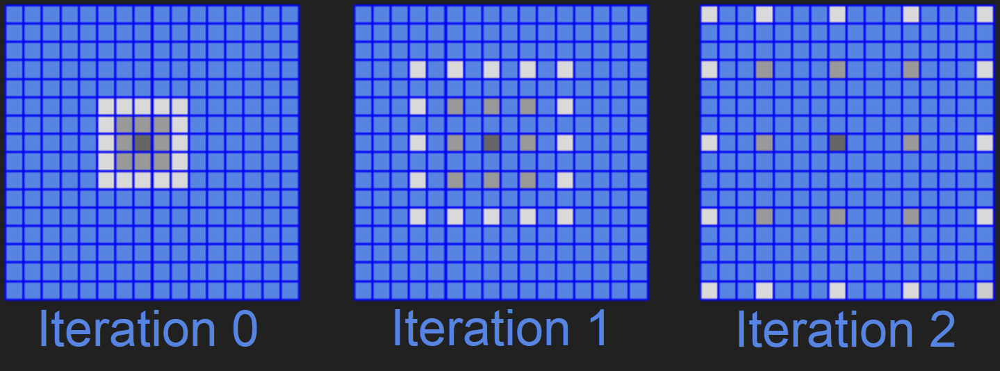

Below is also a demonstration of the À-Trous Wavelet Transform applied to a noisy path-traced
cornell box render, without the edge detection described in the next section:

| Max Kernel Size      | Blurred Image |
| ----------- | ----------- |
| 1      | 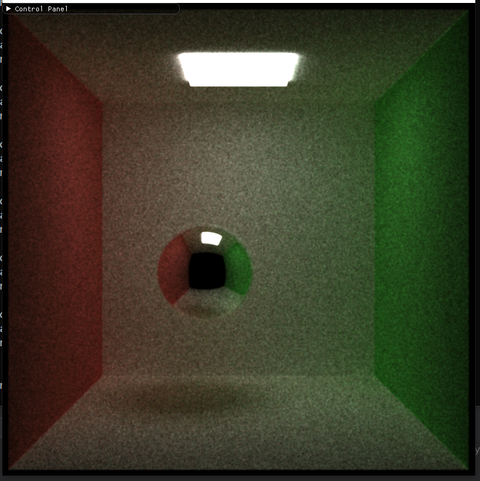       |
| 2   | 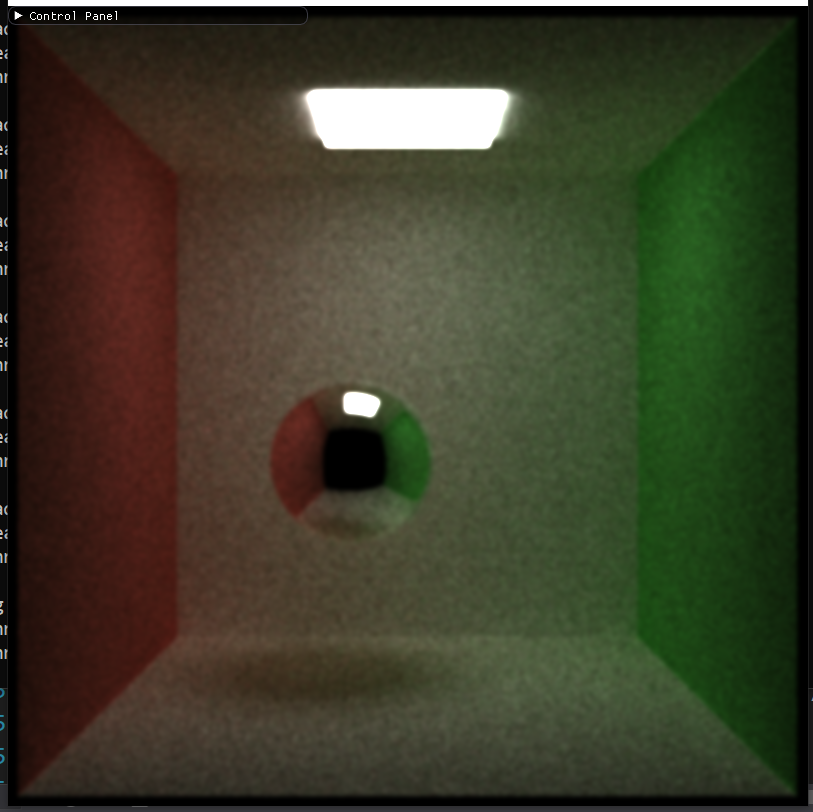        |
| 4   | 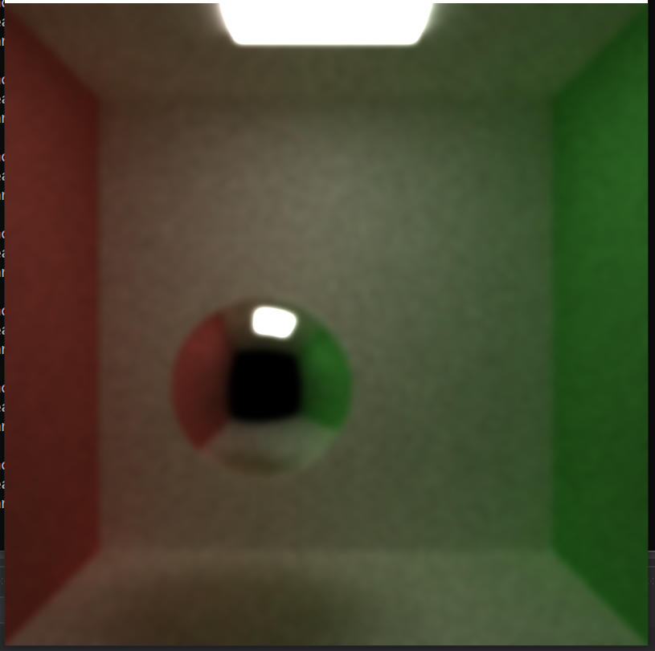        |
| 8   | 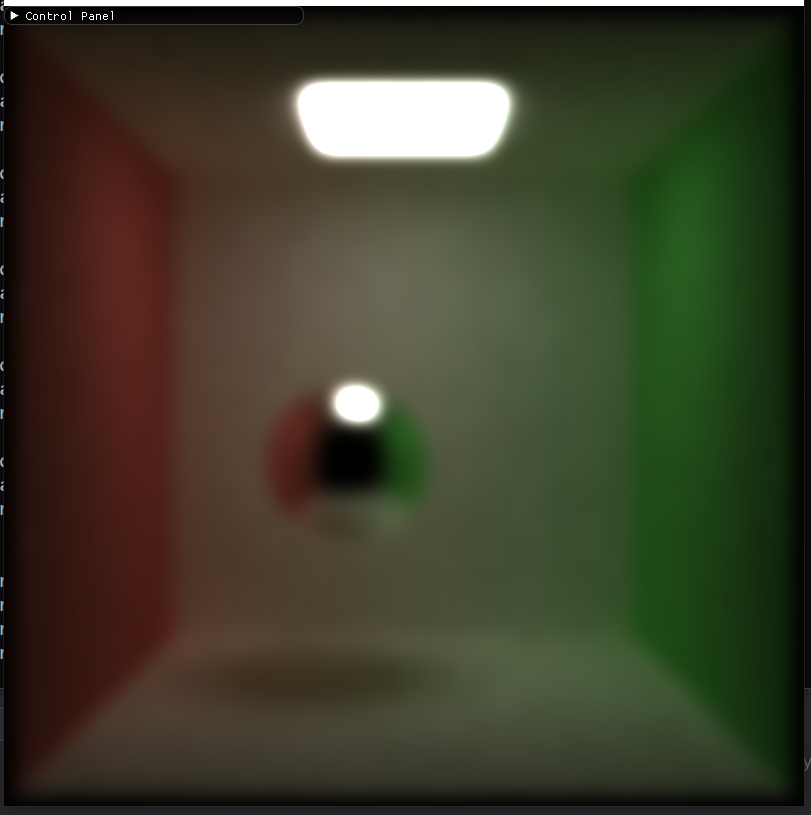        |
| 16   | 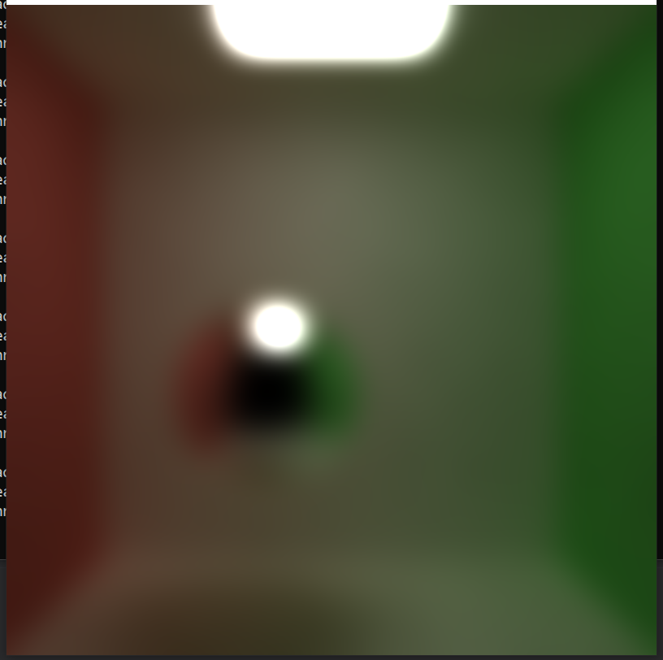        |
| 32   | 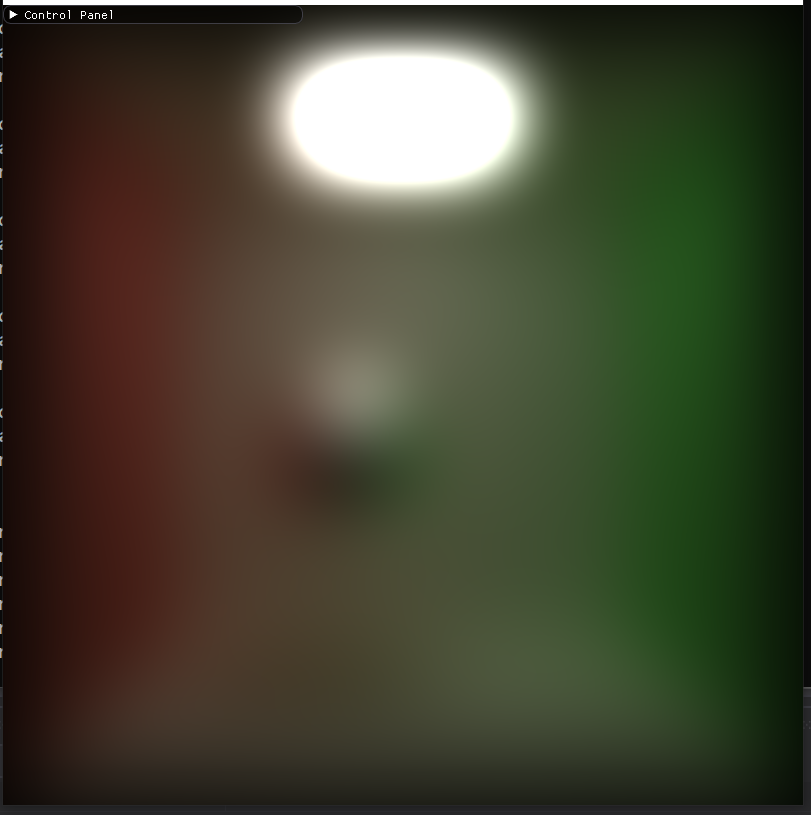        |
| 64   | 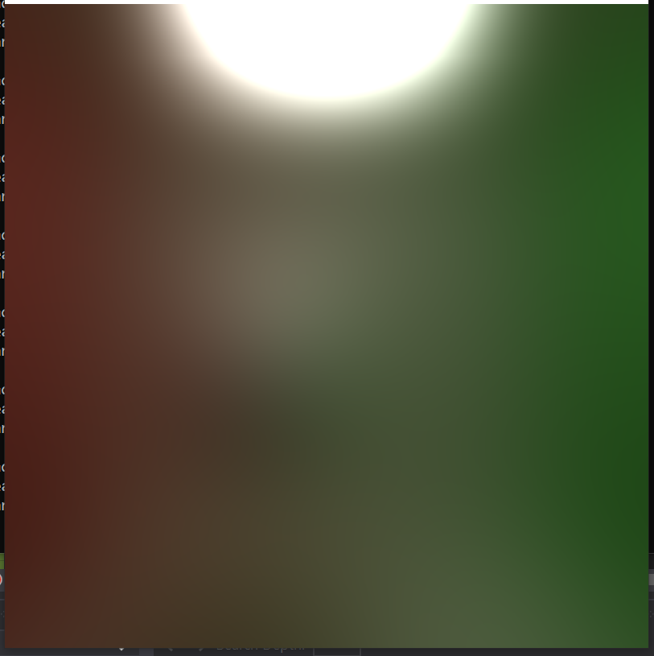        |

Specifically, the offset between pixels for each iteration ```i``` of the kernel is ```2^i```,
and the maximum number of iterations to reach a final kernel-width will be .


### Edge Detection

#### G-Buffer

The edge detection process uses the positions and normals at the intersection of the 
camera rays associated with each pixel. So, in order to have this information available to us
to use in post process, we need to create a new geometry buffer (G-Buffer) to store relevant 
information at each pixel.

Below you can see a visualization of the data collected in this G-Buffer for a simple scene:

| Position Buffer      | Normal Buffer | Depth Buffer |
| ----------- | ----------- | ----------- |
| 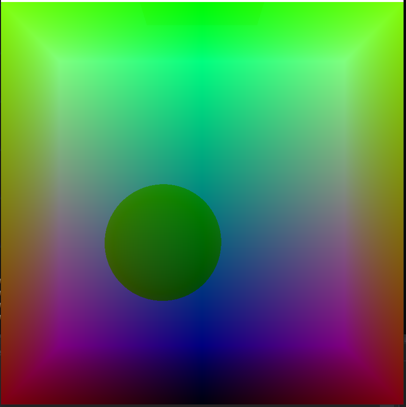     | 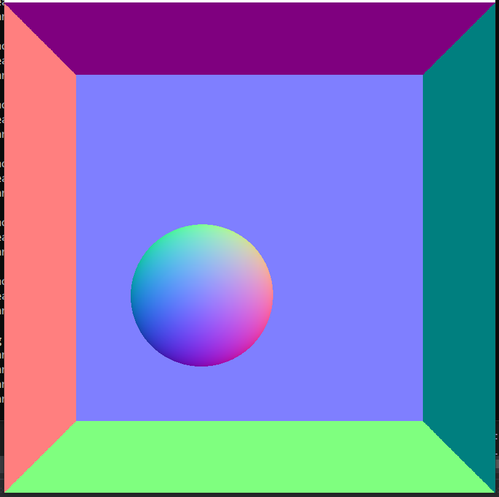       | 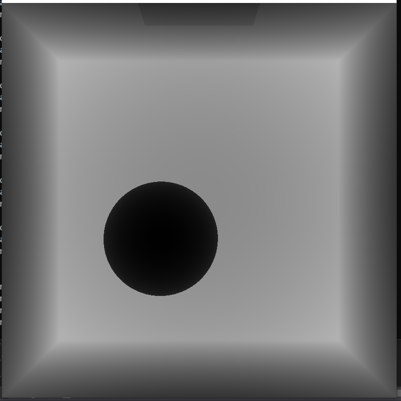 |

#### Edge Detecting with Weights


## Visual Analysis

## Performance Analysis

