CUDA Denoiser For CUDA Path Tracer
==================================

**University of Pennsylvania, CIS 565: GPU Programming and Architecture, Project 4**

Constance Wang
  * [LinkedIn](https://www.linkedin.com/in/conswang/)

Tested on AORUS 15P XD laptop with specs:  
- Windows 11 22000.856  
- 11th Gen Intel(R) Core(TM) i7-11800H @ 2.30GHz 2.30 GHz  
- NVIDIA GeForce RTX 3070 Laptop GPU  

This is an implementation of the [Edge-Avoiding À-Trous Wavelet Transform for fast Global
Illumination Filtering](https://jo.dreggn.org/home/2010_atrous.pdf) in CUDA, integrated into a CUDA pathtracer.

### Features
- Gbuffer to store normals and positions of each pixel
- Denoising pass that blurs pixels using an A-trous kernel, but avoids edges based on neighbouring pixels' ray-traced colour, normal, and position
- Parameters: filterSize = 5 * 2^(# of iterations of A-trous), and colorWeight, normalWeight, positionWeight which correspond to the sigma parameter in the weight calculations from the paper for colors, normals, and positions respectively
- Path-tracer integration: the bonus features and performance testing for this assignment were done in base code of this project. However, I also integrated the denoiser into my project 3 pathtracer to visually test more complex scenes, see the [proj-4-denoiser](https://github.com/conswang/Project3-CUDA-Path-Tracer/pull/1) branch
- Extra credit
  - Gaussian filter

Showing the gbuffers as colours for cornell ceiling light scene (click "Show G-buffers" with `SHOW_GBUFFER_NORMALS` or `SHOW_GBUFFER_POS` macros set to 1).
| Normals | Positions |
| ---- | ----|
| 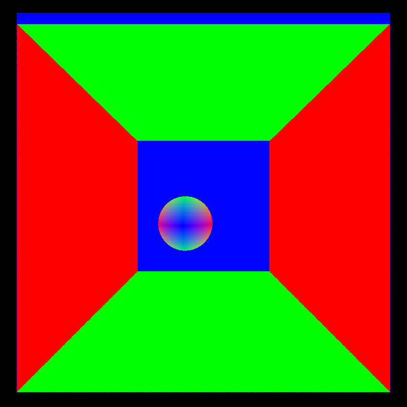 | 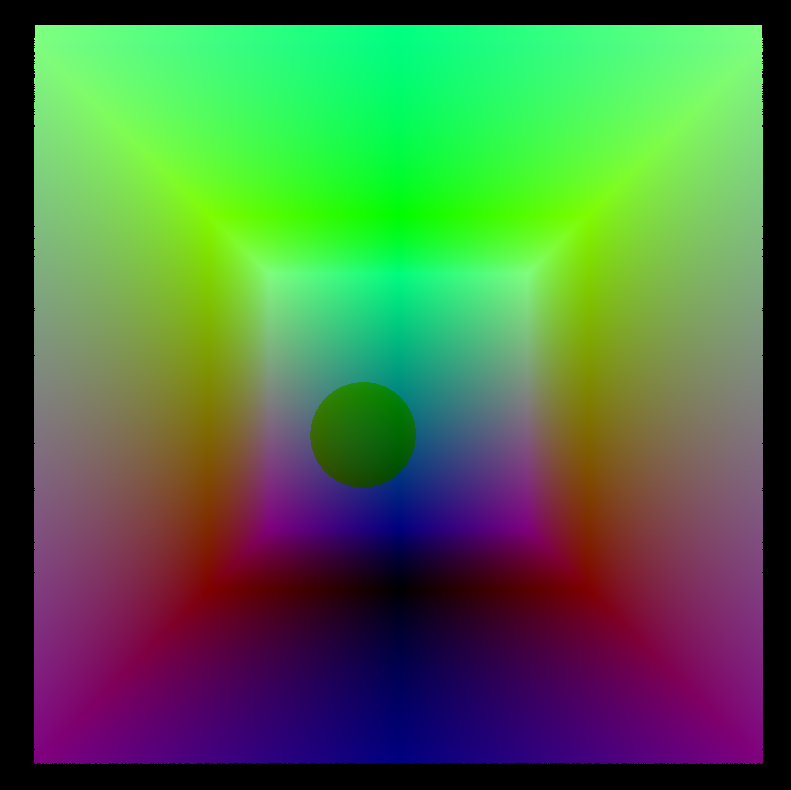 |

Denoiser on cornell ceiling light scene (10 samples) with filterSize = 80, colorWeight = 1.804, normalWeight = 0.309, positionWeight = 7.113. The a-trous only image shows the blur effect of the A-trous kernel only, without edge detection.

|Original | A-trous only | Denoised with edge detection |
| --- | ---| ---|
|  |  | 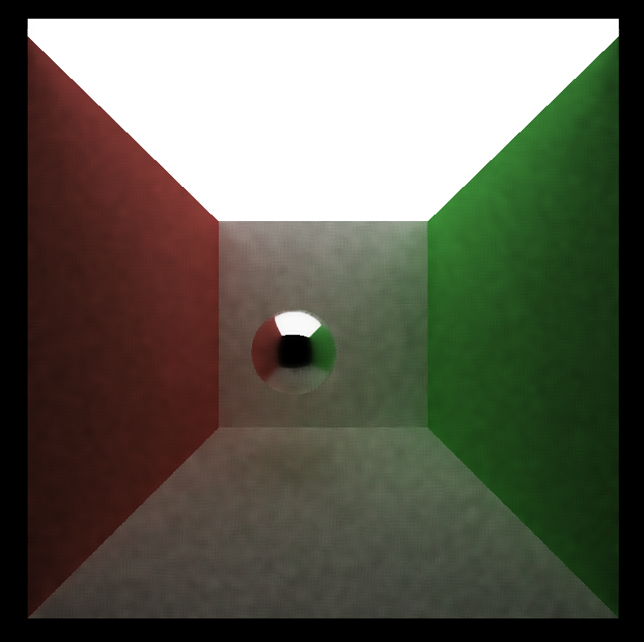 |

Denoiser tested on complex scene: [motorcycle.gltf](https://github.com/conswang/Project3-CUDA-Path-Tracer/blob/main/scenes/motorcycle/motorcycle.gltf) with filterSize = 320, colorWeight = 4, normalWeight = 1, positionWeight = 1.

| Samples | Original | Denoised |
|-----| ----- | ---- |
| 10 | 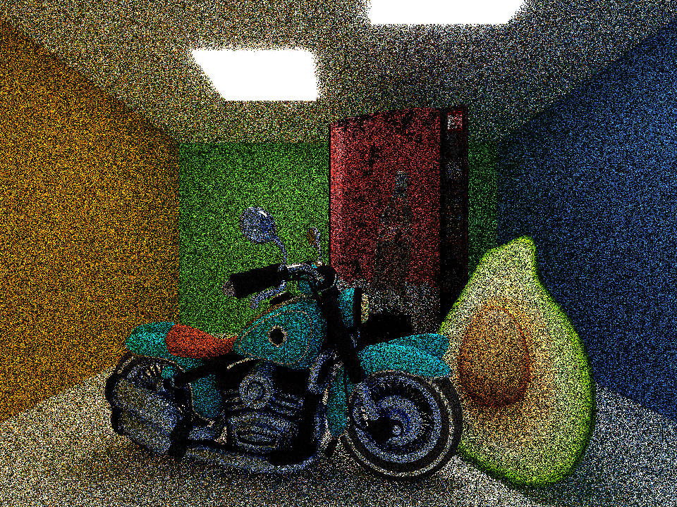 |  |
| 20 | 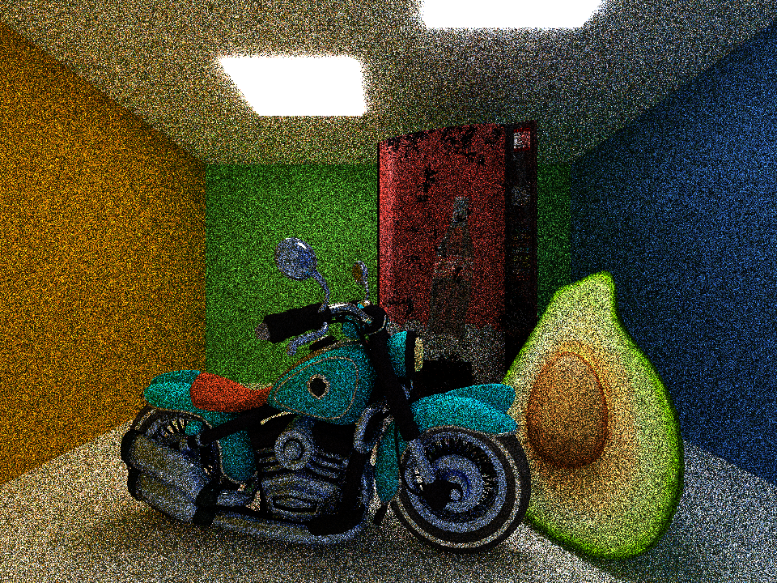 | 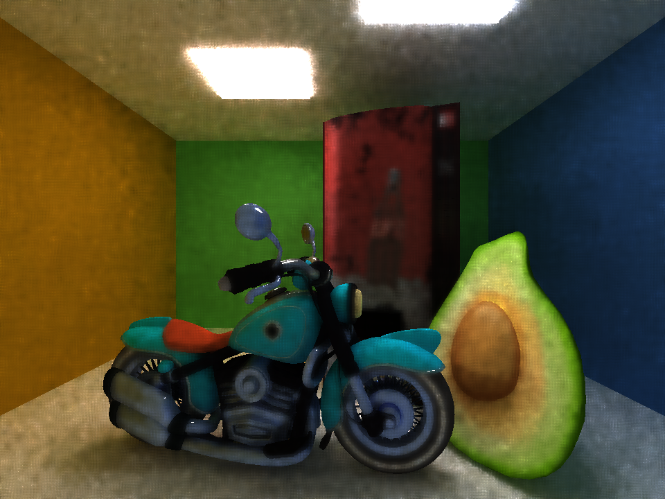 |
| 50 |  | 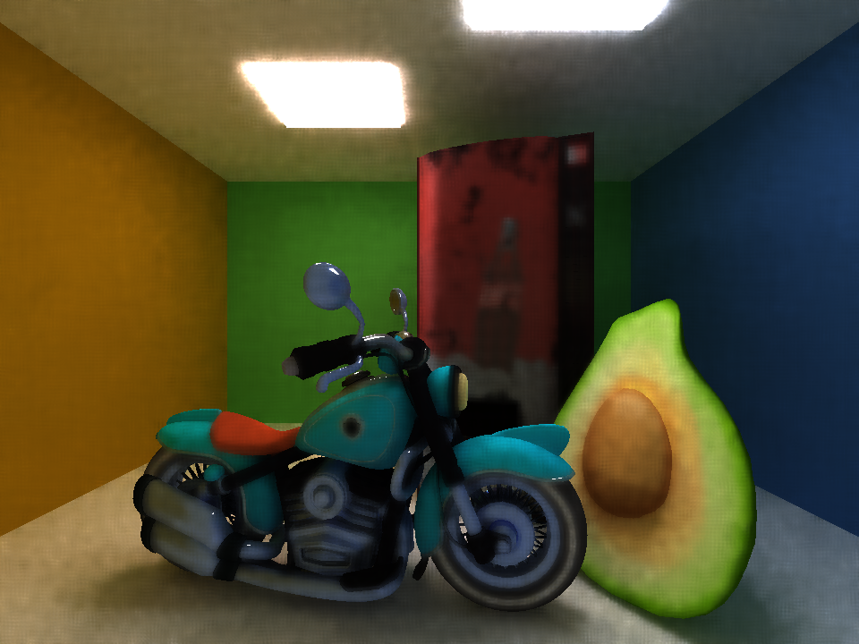
| 100 | 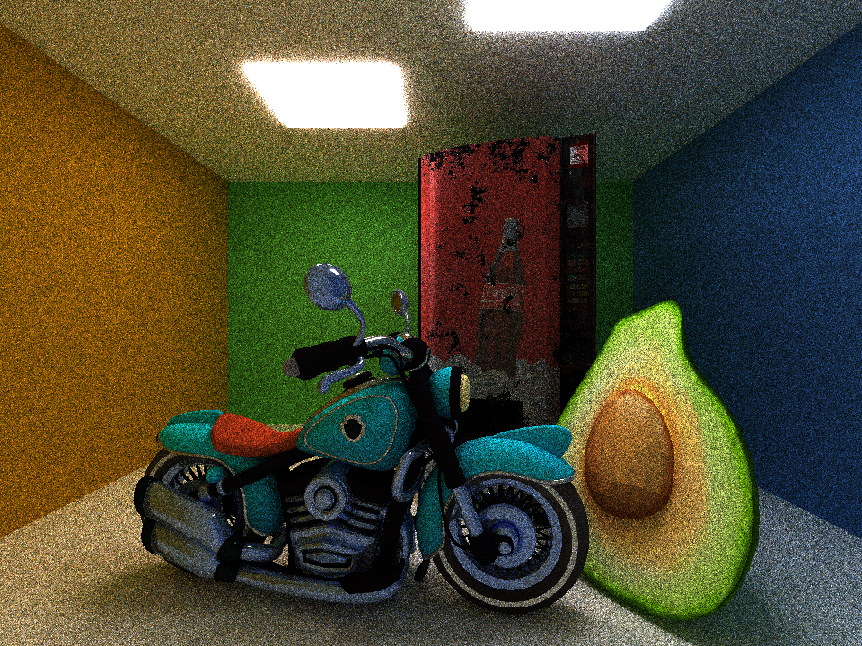 | 

### Gaussian Filter
I also implemented edge avoiding Gaussian instead of A-trous. The results are visually very similar, even without the weighted edge-avoidance:

### Visual Analysis

For the motorcycle scene, it takes about 100 iterations to get a smooth result. Note that it's very hard to save the details on surfaces like the vending machine. This is because the normals of neighbouring pixels are very similar (the surface is almost flat), positions are similar (object is centered and directly faces the camera), and the colours are similar, so the overall blend weight is high. To preserve the edges on the coke bottle, we'd need sigma values so small that the denoising effect in other areas would be greatly reduced. In other words, a big drawback of edge-avoiding A-trous is that different objects would render better with different parameters, but we use a uniform filter size and weights across the image.

For simpler scenes, it takes a lot less iterations, since we can just ramp up the weight values without losing too much detail. With less than 100 iterations, there tend to be some splotchy visual artifacts since there is still too much noise in the render to blur. 

Avocado with filterSize = 80, colorWeight = 2, normalWeight = 0.12, positionWeight = 0.5:

| Original (5000 samples) | Denoised (100 samples) |
| --- | ---|
 |  | 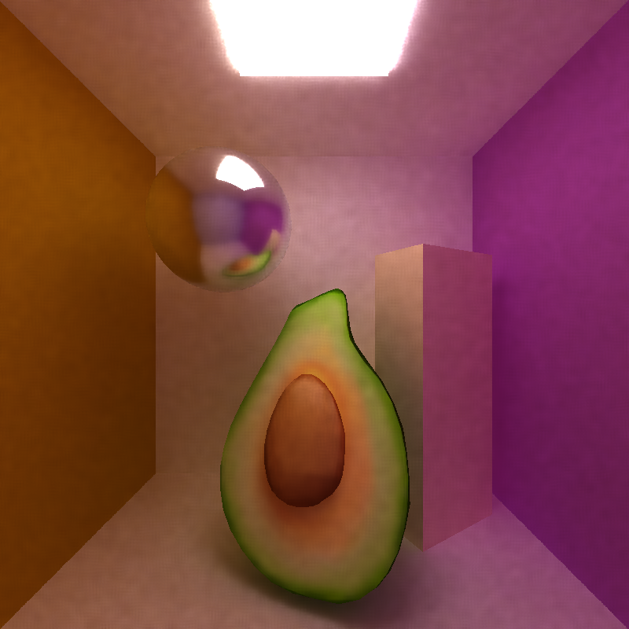 ||

The denoiser looks less splotchy on images that have less noise in the first place... The cornell box with ceiling light has a larger light with lower intensity compared to the cornell box with a smaller light of higher intensity. Although the overall amount of light is similar, the smaller light causes more noise since there is a smaller chance of sampling a ray that hits it.

10 samples for each:
| Cornell (filterSize=80, colorWeight=10, normalWeight=0.221, positionWeight=1.768) | Cornell with ceiling light (filterSize = 80, colorWeight = 1.804, normalWeight = 0.309, positionWeight = 7.113) |
|-- |--|
|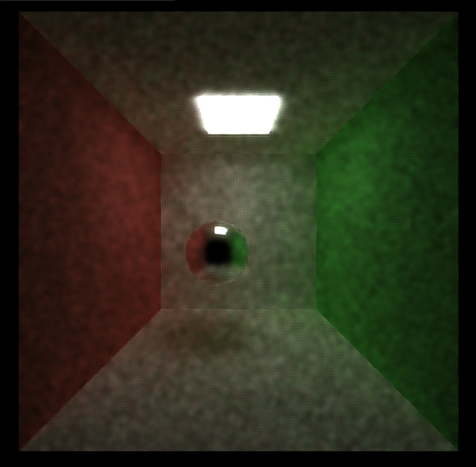|  |

#### Different Materials

The denoiser works well enough for diffuse materials, since they should look very smooth in the first place. Same with perfectly specular materials, since they end up just being reflections of different diffuse surfaces.

However, texture maps tend to be blurred too much even at very low colour/normal/position weights, as evidenced by the vending machine from the motorcycle render or this metal rectangle render:
| 20 samples denoised | Original (2000 samples) |
| ---|--|
| 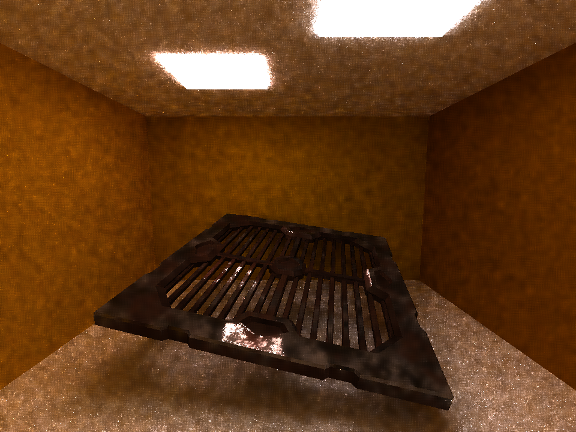 | 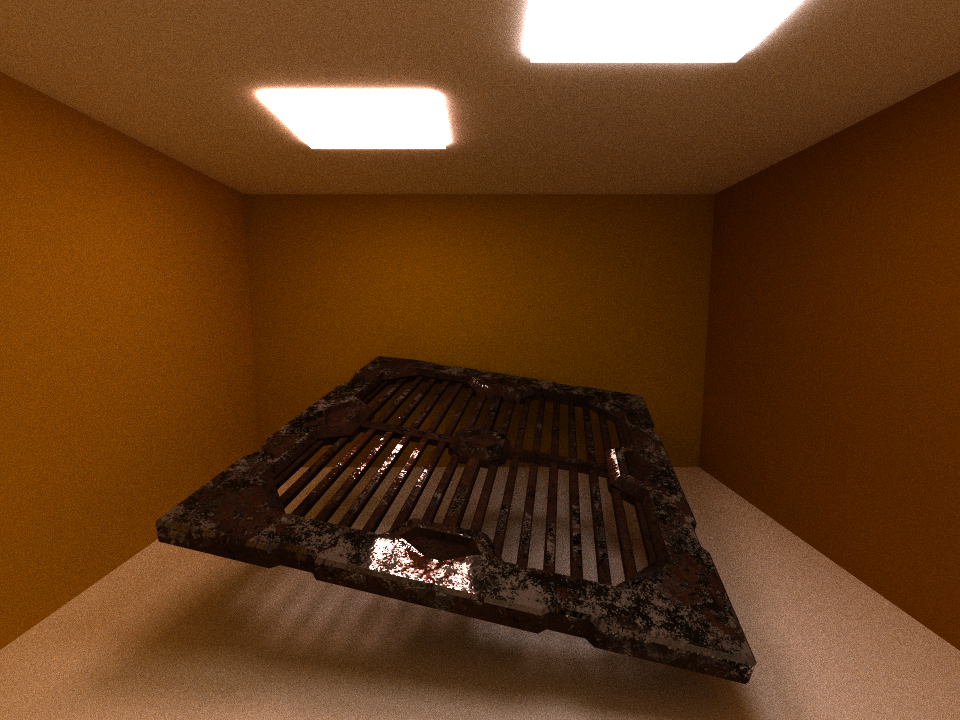 |

#### Varying Filter Size

Increasing the filter size makes the image smoother; however, filter sizes greater than 80 have less and less of an effect (most dramatic transitions from sizes 10-40). This is because the pixels end up so far apart that position weighting will greatly reduce the pixels' colour contribution, normals and colours may also be very different.

Avocado scene with colorWeight = 2, normalWeight = 0.12, positionWeight = 0.5.
| Filter size | Image |
|--|--|
| 10 | |
| 20 |  |
| 40 | 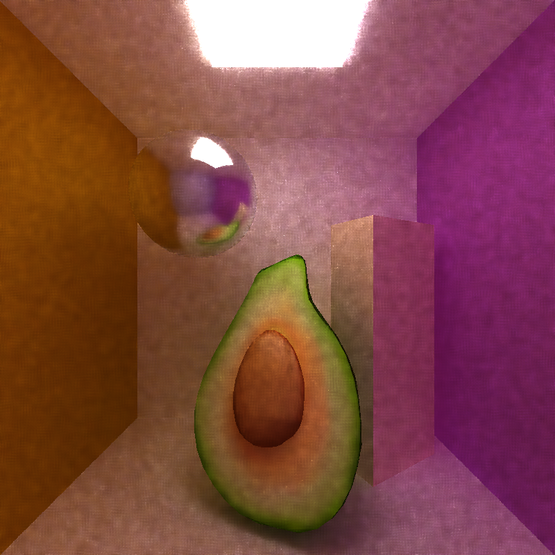 |
| 80 |  |
| 160 |  |
| 320 |  |

### Performance Analysis

When the `MEASURE_DENOISE_PERF` flag is set to 0, each iteration is denoised for more convenient debugging.  When set to 1, only the last path-traced iteration is denoised for a more accurate performance analysis. In the project 3 version of my denoiser (used for Avocado and motorcycle scenes), performance is always measured in the second way.

I measured the total render time (from `pathtraceInit`, up to but not including `pathtraceFree`), the g-buffer initialization time, and the denoising time. The path-tracing time is calculated by subtracting g-buffer and denoise from the total render time.

#### Denoising Runtime

Denoising should have a very small effect on render time, since it runs in constant time in parallel on the GPU. We only need to generate the g buffers on the first bounce of the first iteration. Then, we only need to denoise once after raytracing is complete. Both steps launch kernels that run in constant time for each pixel in parallel. 

The measurements show that denoising, including g-buffer generation are both very fast compared to path-tracing for 10 iterations. The results would be even more skewed as we increase the number of iterations.

#### Varying Image Resolution

We can also look at how the denoising time is affected by the image resolution. These results were tested on the cornell with ceiling light scene, with `filterSize = 80, colorWeight = 0.4, normalWeight = 0.35, positionWeight = 0.2`, and a block size of 16 x 16. G-buffer construction time is still negligible. I also implemented a version of the performance test where I grid-searched for the best block size (from 4 x 4 to 32 x 32), but found that the trend was almost exactly the same (see [graph](img/graphs/Effect%20of%20Increasing%20Image%20Resolution%20on%20Denoising%20Time%20with%20Variable%20Block%20Size.png)).

| Resolution (pixels) | Denoising Time (seconds) | Percent of Time to Render 10 Iterations |
| --|--|--|
| 200 x 200| 0.0001851 | 0.13% |
| 400 x 400| 0.0003627 | 0.24% |
| 800 x 800| 0.001175 | 0.68% |
| 1600 x 1600| 0.0043464 | 1.34% |
| 3200 x 3200 |0.0159033 | 2.03% |

Plotting the results shows that the denoising time increases almost perfectly linearly with respect to the number of pixels. In comparison, the other path-tracing steps do not scale linearly as resolution increases, so the total proportion of time spent denoising increases, making denoising slightly less efficient at higher resolutions.

.png)

Through the very rigorous method of commenting out parts of the code and checking the run time, I found two sections that made the code extra slow:
1. global memory access when getting gbuffer data at neighbouring pixels' indices
2. calculating the edge avoidance weight (specifically, the exp function)

#1 probably scales badly due to the increase in number of pixels that need to access neighbouring pixels' data from different blocks, so caching isn't as helpful. Without these two steps, the 3200 x 3200 resolution test would run about 10x faster.

#### Varying Filter Size  

Tested on cornell ceiling light scene with default color/normal/position weights, filter sizes = 10, 20, 40, 80, ... 640. 

Denoising time increases linearly with respect to log filter size. This makes sense, since filter size = 2 ^ (# of iterations) x 5, and denoising time should increase linearly as the number of A-trous iterations does.

### Bloopers
[are here](https://docs.google.com/document/d/1BJmclri4VJY_IXbsLU8Er_CQihQnfmzTQRi5cz9FthM/edit#heading=h.9whglgx4yoxx)
