CUDA Denoiser For CUDA Path Tracer
==================================

**University of Pennsylvania, CIS 565: GPU Programming and Architecture, Project 4**

* Megan Reddy
  * [LinkedIn](https://www.linkedin.com/in/meganr25a949125/), [personal website](https://meganr28.github.io/)
* Tested on: Windows 10, AMD Ryzen 9 5900HS with Radeon Graphics @ 3301 MHz 16GB, NVIDIA GeForce RTX 3060 Laptop GPU 6GB (Personal Computer)
* Compute Capability: 8.6

### Overview

Denoising is a technique used to remove noise from path-traced images. In scenes where ray paths are unlikely to hit light sources, we perceive 
a lot of noise. In real-time ray tracing, we often desire high quality images that can be rendered at interactive rates. In traditional path tracing,
we must take hundreds of samples per pixel to achieve the high visual quality we desire. For real-time applications, it is impractical to wait such a long time
for a frame to render, so we desire a technique that can achieve an acceptably "smooth" image in fewer iterations. This is where denoising comes in handy.

| Iterations      |      Raw Pathtraced      |  Denoised |
|----------       |:-------------:           |------:|
| 100             |   | 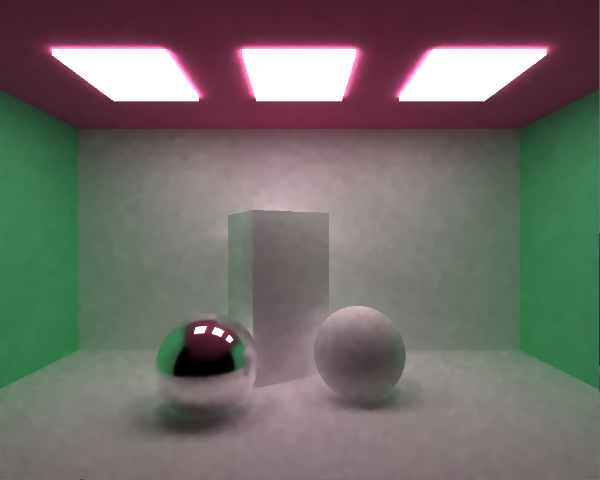 |
| 1000            |  | 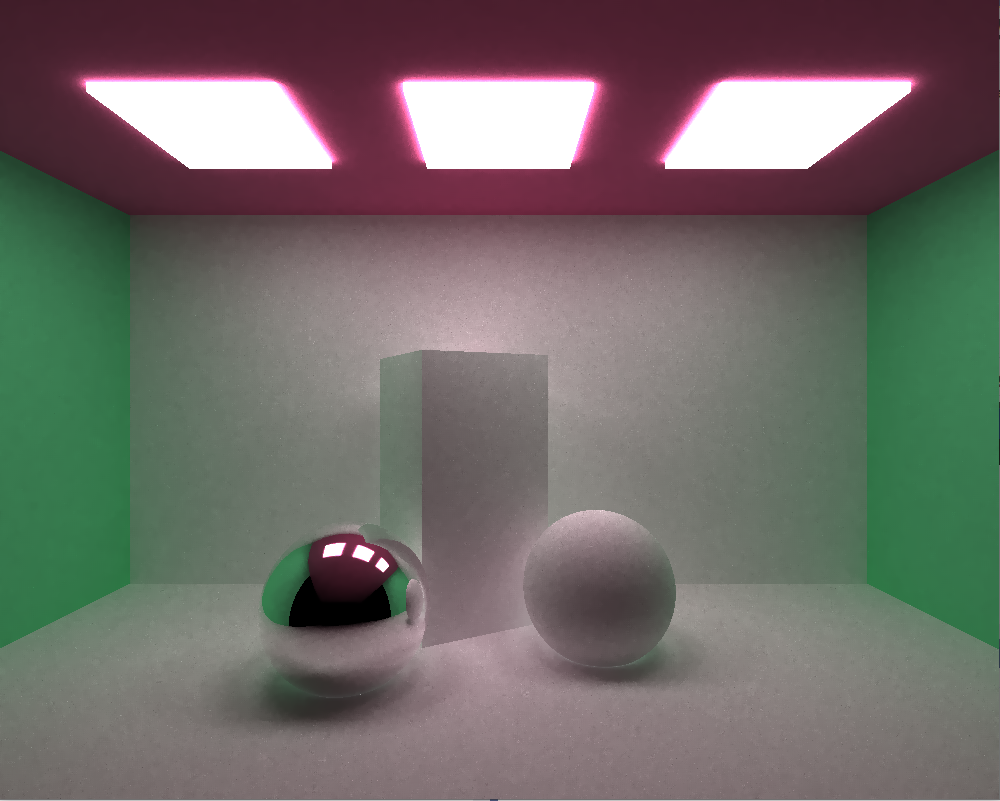 | 

<em>Figure 1. Raw path-traced and denoised image comparison with 80 x 80 À-Trous filter. </em>

#### Edge-Avoiding À-Trous Wavelet Transform

This implementation uses the technique described in the paper [Edge-Avoiding À-Trous Wavelet Transform for fast Global Illumination Filtering](https://jo.dreggn.org/home/2010_atrous.pdf)
to implement denoising. The basis of the technique is to take in a noisy path-traced image, as well as information from a G-buffer (normals and positions), to strategically perform a blur on the image to 
remove noise. The À-Trous filtering technique is an approximation of Gaussian blur, but instead uses a fixed kernel size. In our implementation, the kernel remains at a fixed size of 5x5, but we increasing
space out samples each iteration instead of using a larger filter. The step size increases by a factor of 2 each iteration. The illustration below demonstrates this idea.

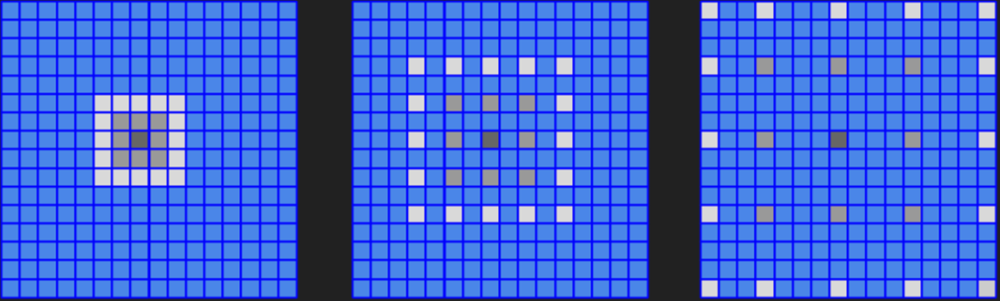

<em>Figure 2. Spacing of À-Trous kernel at iteration 0, 1, and 2 (left to right). </em>

At the first path tracing iteration, we store information in our G-buffer. We store intersection depth, normal, and position in a `GBufferPixel` struct to read later.
We use this information to detect edges in our filtering scheme. When we blur an image, we want to preserve edges between objects. If normals or positions differ significantly between pixels,
we most likely have encountered an edge. A visualization of the normal, position, and depth buffers is provided below. 

 Per-Pixel Normals (remapped to [0, 1]) | Per-Pixel Positions (abs value and scaled down) | Per-Pixel Depth |
|---|---|---|
|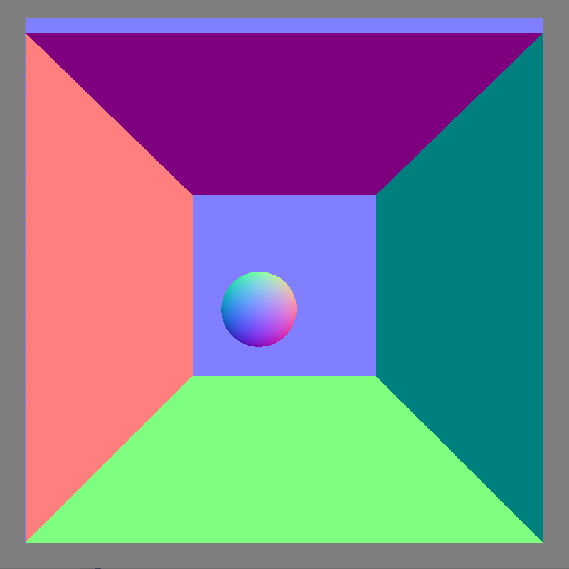|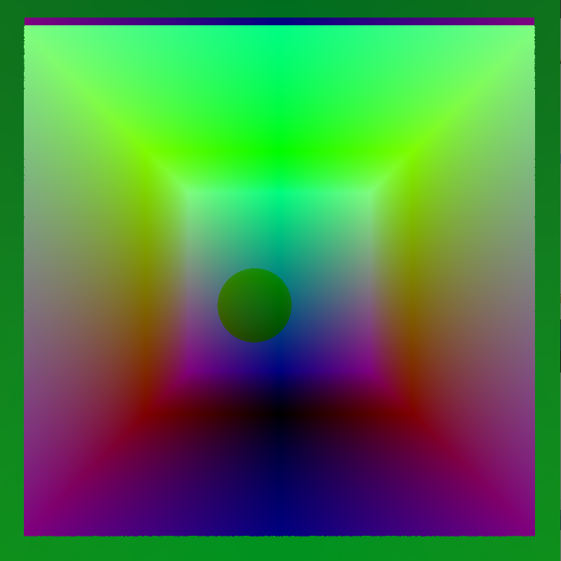|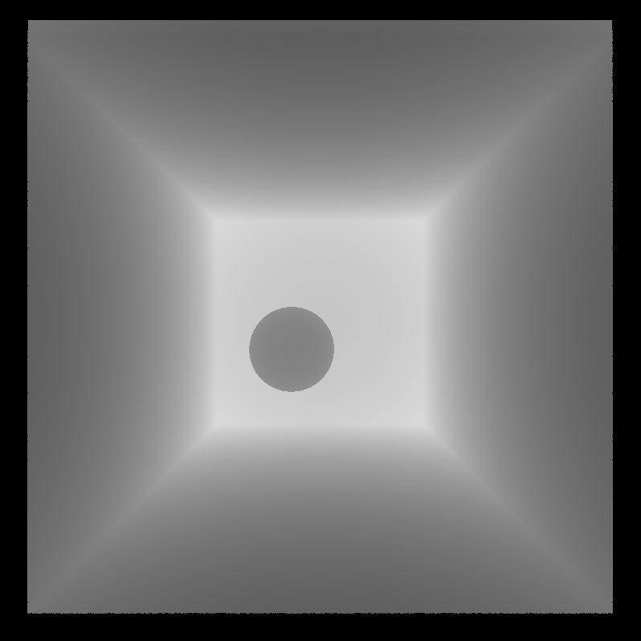|

<em>Figure 3. G-buffer visualizations </em>

Our next step is implement a weighted filter that we will use to gather an accumulated color for each pixel. Without any weighting, the result
of denoising is simply a blur across the entire image since we have no edge detection scheme in place. We have provided a comparison to GIMP's Gaussian blur
in the table below. We notice that the À-Trous filter and Gaussian filter produce similar results.

 Raw Pathtraced (100 iterations) | Simple Blur 80x80 Filter | GIMP Gaussian Blur 80x80 Filter |
|---|---|---|
|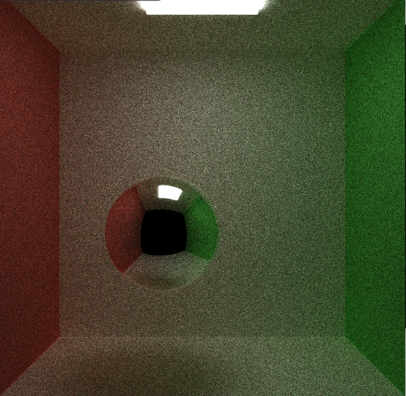||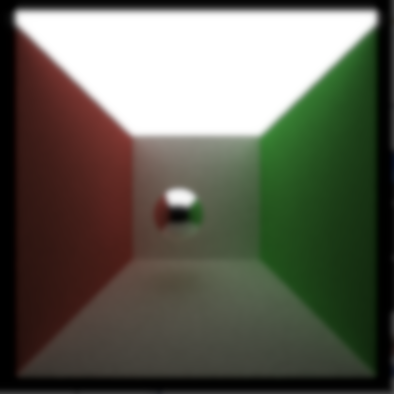|

<em>Figure 4. A comparison of basic blur between the À-Trous filter and GIMP's Gaussian filter (100 iterations). Note that the À-Trous algorithm is an approximation of Gaussian blur.</em>

Lastly, we implement edge-avoiding filtering using the weighting function described in the paper. We compute the edge-stopping function for the path-traced pixel color,
pixel normal, and pixel position (see Equation 5 in the paper) and multiply these together to get a pixel weight. We attenuate the current color by the weight and kernel value and
add this to the accumulated sum. We also keep a cumulative sum of weights. At the end, we set the denoised pixel color equal to the `accumulated_color_sum / weight_sum`. 

 Raw Pathtraced (100 iterations) | Simple Blur 80x80 Filter | Edge-Avoiding 80x80 Filter |
|---|---|---|
||||

<em>Figure 5. Result of adding in weighting functions. We use a color weight of 25.0, normal weight of 0.35, and position weight of 0.2.</em>

### GUI Controls

* `iterations`     - number of path tracing iterations.
* `denoise`         - check to show denoised image.
* `filter size`     - size of À-Trous filter. Determines the number of filter passes.
* `color weight`     - sigma value in color edge-stopping function.
* `normal weight`     - sigma value in normal edge-stopping function.
* `position weight`     - sigma value in position edge-stopping function.
* `show gbuffer`     - show the g-buffer. Use dropdown to select which buffer you want to see.

### Visual Analysis

For the following results, we use a `color_weight` of 150.0, a `normal_weight` of 0.5, and 
a `position_weight` of 0.4. The resolution of the image is fixed at 800 x 800. 

#### Varying Filter Size

To observe the effect of filter size on visual quality, we denoise the same scene using 100 path-tracing iterations 
and varying filter sizes. The results suggest that visual quality increases as filter size increases. In the images below, we can still see noise
at low filter sizes. As we increase the filter size, it becomes less noticeable. The visual improvement
does not scale uniformly with filter size; we can see a large improvement in quality between sizes 10, 20, and 40,
but the amount of quality we gain afterwards is much less noticeable. 

| Filter Size  |      Result (100 iterations)     |  Filter Size | Result (100 iterations)
|----------    |:-------------:  |------:       |------:|
| 10x10        |  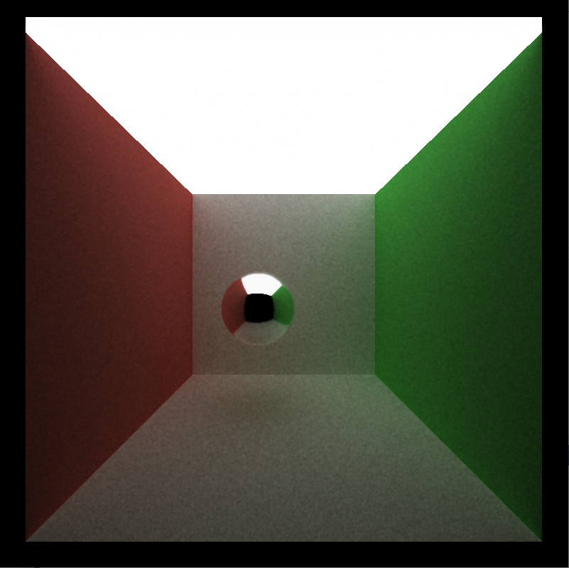   | 160x160      | 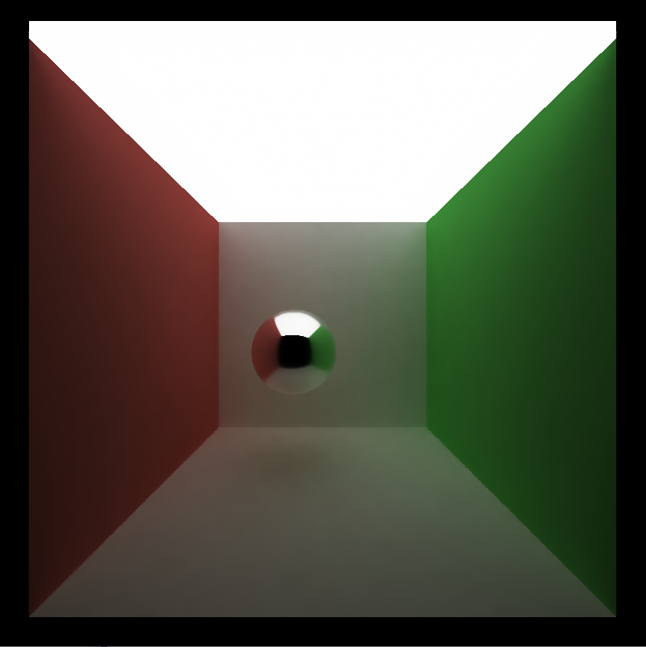 |
| 20x20        |     | 320x320      | 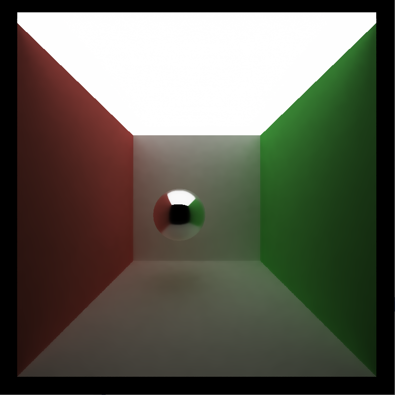 |
| 40x40        |  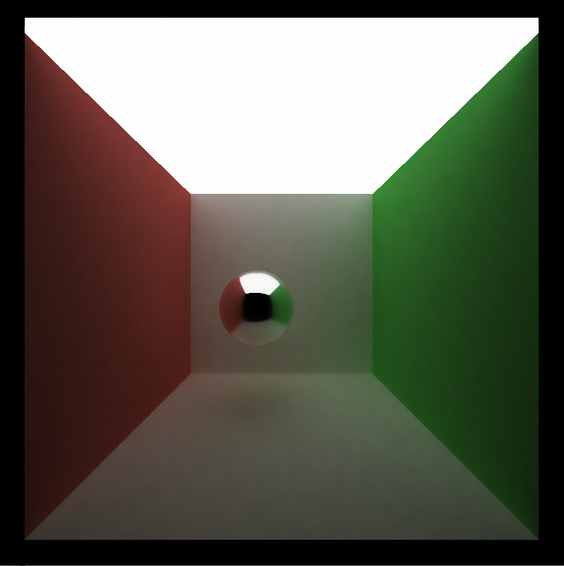   | 640x640      |  |
| 80x80        |     | 1280x1280    |  |

<em>Figure 6. Visual impact of varying filter size on an 800 x 800 image.</em>

##### Different Material Types

The following scenes were rendered with an 80 x 80 filter. We compare our denoising results to these ground-truth images
of a diffuse and specular reflective sphere rendered at 10,000 iterations to judge visual quality. 

| Iterations      |      Diffuse      |  Specular Reflective |
|----------       |:-------------:           |------:|
| 10000            |   | 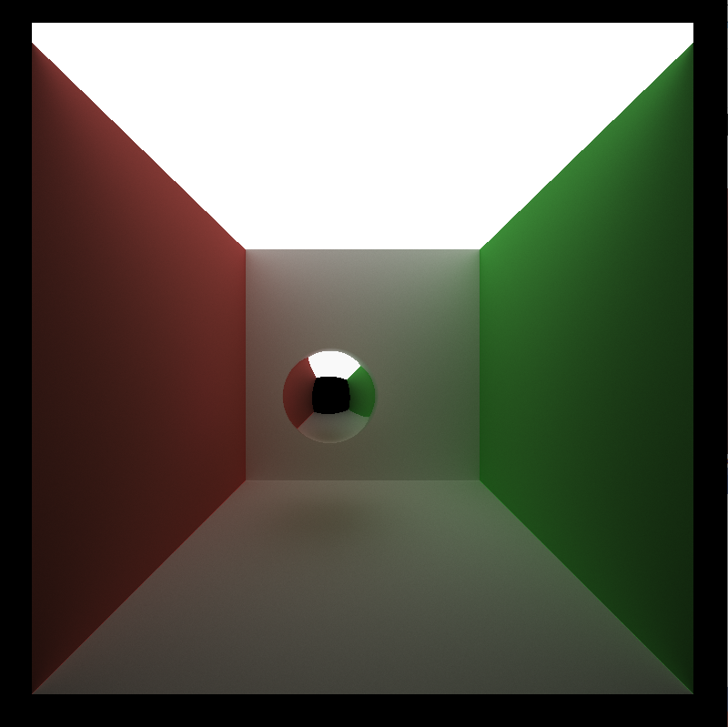 |

<em>Figure 7. Ground-truth reference images for diffuse and reflective scenes (10,000 iterations).</em>

Denoising is very effective for scenes with diffuse materials, since there aren't many fine details to capture. We can see that
the denoised result is close to the outcome that we would expect after running the program for many iterations.

| Iterations      |      Raw Pathtraced      |  Denoised |
|----------       |:-------------:           |------:|
| 100             |  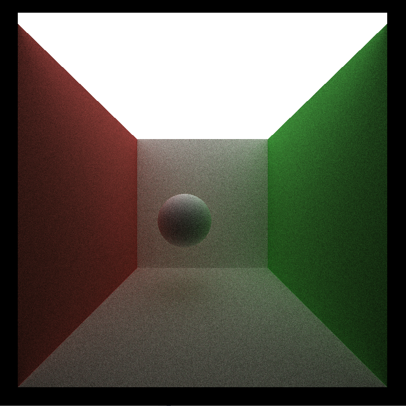 | 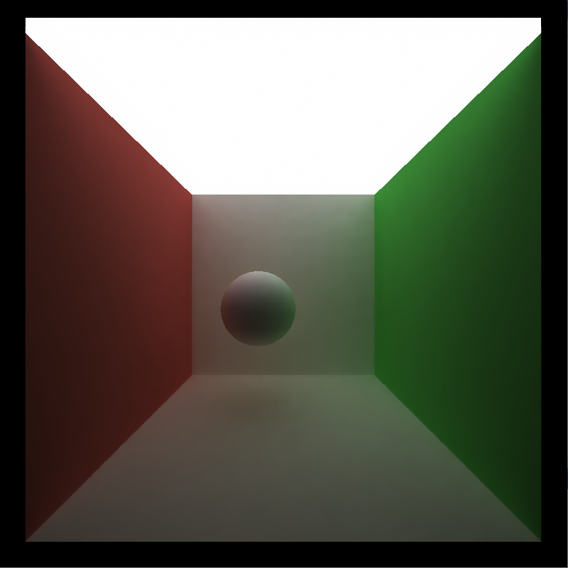 |
| 1000            |  | 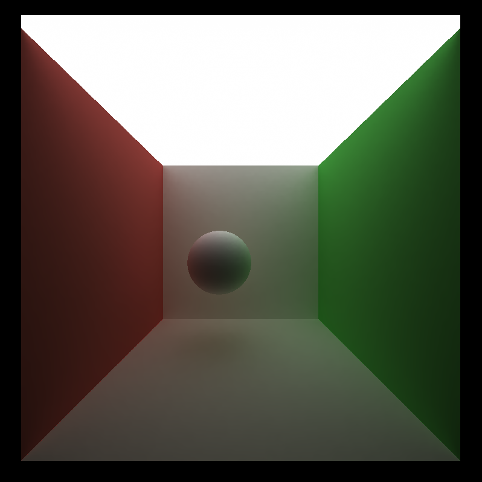 | 

<em>Figure 8. Effect of denoising a scene with a diffuse sphere.</em>

Denoising is less effective for specular materials, especially at lower iteration counts. Since the image is less converged,
many of the fine details are less apparent and therefore the denoised image blurs the reflection at the edges. At 1000 iterations, 
the reflective detail is more clear.  

| Iterations      |      Raw Pathtraced      |  Denoised |
|----------       |:-------------:           |------:|
| 100             |   |  |
| 1000            |  |  |  

<em>Figure 9. Effect of denoising a scene with a reflective sphere.</em>

##### Different Scenes

The scene with the larger ceiling light produces much better denoised results than the scene with the smaller light.
Since the light is bigger in the first scene, rays are more likely to hit it, meaning that the image will converge faster.
In the smaller light scene, rays are more likely to miss the light, which leads to a noisier image. Since the first image 
produces less noise at lower iterations, the denoiser is able to produce an image much closer to the expected outcome quickly. 

| Iterations      |      Raw Pathtraced      |  Denoised |
|----------       |:-------------:           |------:|
| 100             |     |  |
| 1000            |    |  | 

<em>Figure 10. Denoising a scene with a large area light.</em>

| Iterations      |      Raw Pathtraced      |  Denoised |
|----------       |:-------------:           |------:|
| 100             |  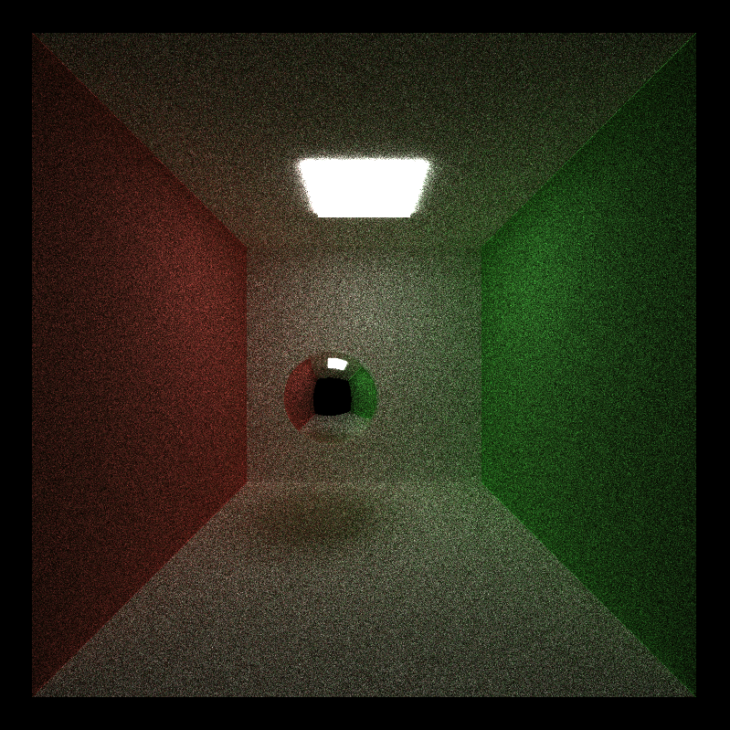   |  |
| 1000            |  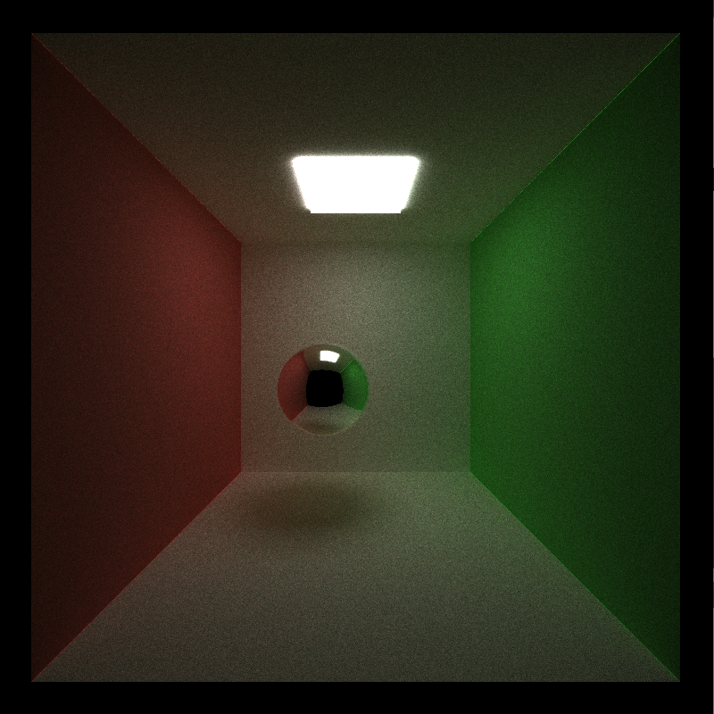  |  | 

<em>Figure 11. Denoising a scene with a small area light.</em>

### Performance Analysis

We measure performance by timing the denoising kernel, which is only run once at the end of pathtracing. We use `cudaEvents`
to record the total execution time of the kernel. Note that we do not include the path-tracing time in the measurements, just the
additional time spent denoising. Additionally, the number displayed on the graphs are the average of 10 runs of the denoising kernel.  

For the following measurements, we use a `color_weight` of 25.0, a `normal_weight` of 0.35, and 
a `position_weight` of 0.2. The resolution of the image is 800 x 800 unless otherwise noted.

##### How Much Time Denoising Adds to Renders

Denoising time is indepedent of total path tracing iterations since it only runs once at the end. 
In the graph below, we can see that total denoising time did not vary much between iteration counts.

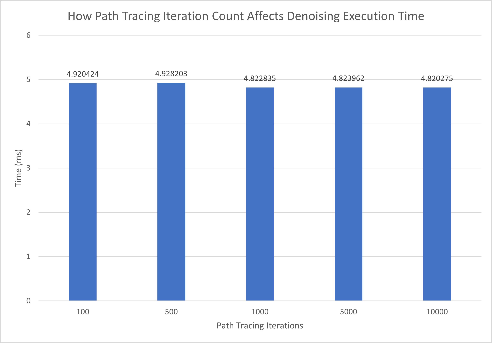

<em>Figure 12. Impact of increasing iteration count on denoising kernel execution time.</em>

##### Varying Filter Size

If we increase filter size, we do see an increase in the total time spent denoising. This is because
we must perform more passes over the image (i.e. increase the number of denoising iterations). The filter size
directly determines the number of times we apply the À-Trous filter. If `filterSize = 5 * 2^(iterations)`, then
we can calculate iterations from filter size using `iterations = floor(log2(filterSize / 5))`.

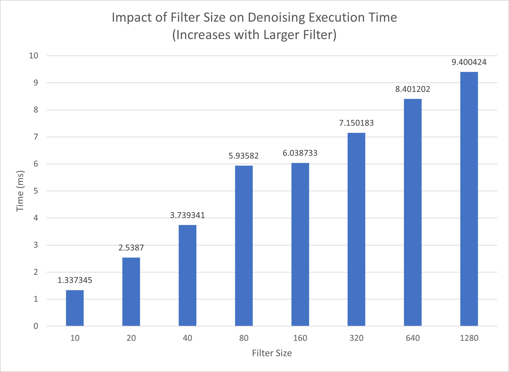

<em>Figure 13. Impact of increasing filter size on denoising kernel execution time.</em>

##### Number of Iterations to "Acceptably Smooth" Result

Using 10,000 iterations as the "perfectly smoothed" reference, we'll take 1000 iterations as the "acceptably smoothed" result.
We observe that the difference image shows variation along the edges, but this is fine for our purposes since the largest areas of the scene
match. We will observe how many iterations it will take us to get a comparable result using denoising. 

| Raw Pathtraced (10000 iterations) |  "Acceptably Smooth" Pathtraced (1000 iterations) | Difference |
|----------       |:-------------:           |
|  |  | 

<em>Figure 14. Comparison of the ground-truth result to an acceptably-smoothed image.</em>

With denoising, it takes about 100 iterations to achieve the "acceptably smooth" result. The difference image is about the same as the one above.
This is about a 90% decrease in iterations.

| "Acceptably Smooth" Pathtraced (1000 iterations) |  Denoised (100 iterations) | Difference |
|----------       |:-------------:           |
|  |  | 

<em>Figure 15. Fewer iterations are necessary to achieved an acceptably-smoothed result using denoising.</em>

##### Denoising at Different Resolutions

Denoising time increases with increasing resolution. This is because we have to run our filter over more pixels, which 
will directly increase runtime.

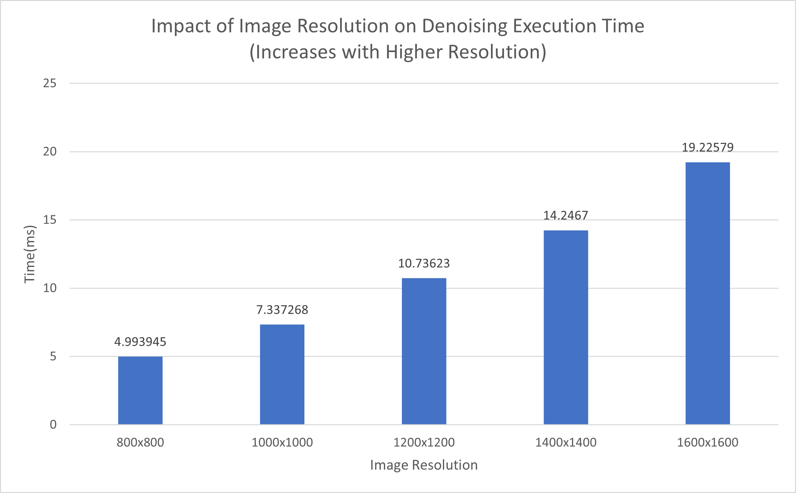

<em>Figure 16. Impact of increasing image resolution on denoising kernel execution time.</em>

### Bloopers

**Foggy Cornell**

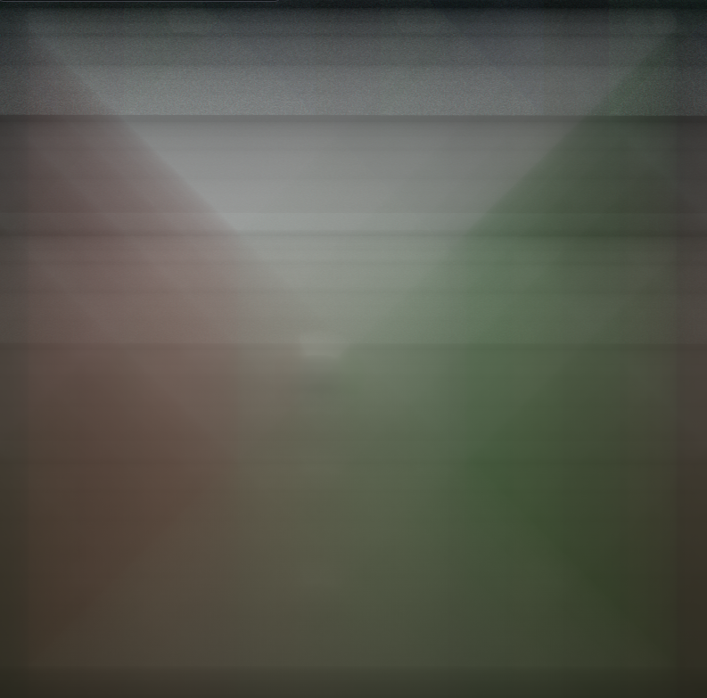

**Ghost Lights**

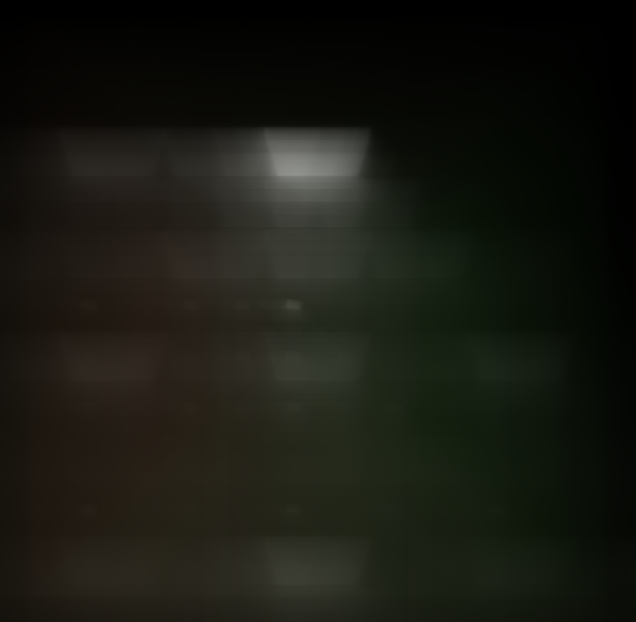

### References

* Paper - [Edge-Avoiding À-Trous Wavelet Transform for fast Global Illumination Filtering](https://jo.dreggn.org/home/2010_atrous.pdf)
* Convolution Filter - [The à trous algorithm](https://www.eso.org/sci/software/esomidas/doc/user/18NOV/volb/node317.html)
* UPenn CIS 565 Course Notes

