CUDA Denoiser For CUDA Path Tracer
==================================

**University of Pennsylvania, CIS 565: GPU Programming and Architecture, Project 4**

* David Li
* [LinkedIn](https://www.linkedin.com/in/david-li-15b83817b/)
* Tested on: Windows 10, Intel(R) Core(TM) i9-10980HK CPU @ 2.40GHz 32Gb, GTX 2070 Super (Personal Computer)

[Repo Link](https://github.com/theCollegeBoardOfc/Project4-CUDA-Denoiser)

### Denoiser Motivation
Path tracers are excellent at generating realistically lit scenes, but can be quite slow to converge even when built on the GPU. Path tracers early in their iteration cycle produce images that appear staticky and rough. Denoisers act as a sort of more precise blur effect. For each pixel, the colors of its neighboors are gathered, and accumulated. The magnitude of color taken from each neighboor is dependent on the neighboors color, position in the scene and normal vector with respect to the original pixel. By doing so, we can achieve edge detection, choosing which neighboor pixels actually matter in generating a better color and render as a whole. [This paper](https://jo.dreggn.org/home/2010_atrous.pdf) outlines the implementation of Edge-Avoiding A-Trous Wavelet transformation (The Denoising Algorithm). 

### Examples:
 
Here is what a standard gaussian blur looks like. It sill uses the A-trous wavelet to approximate a gaussian kernel, but no normal, position or color weights are used for edge detection.

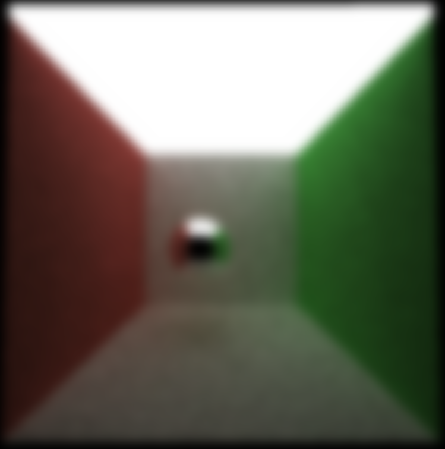
 

With just the position weights, the image develops a bit more crispness. Especially surrounding the sphere. The wall and sphere have drastically different position values lead to this effect.

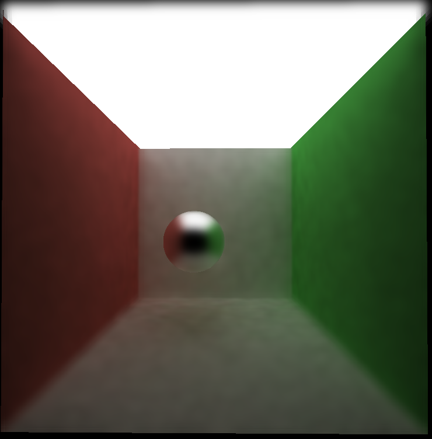
 
With just normal weights, the corners of the wall are more clear. The sphere still has the same level of crispness on the edges as well. Here all the crisp edges are a result of objects having different normals than other. Note though, that the sphere itself is quite blurry because all the pixels showing the sphere have different normals.

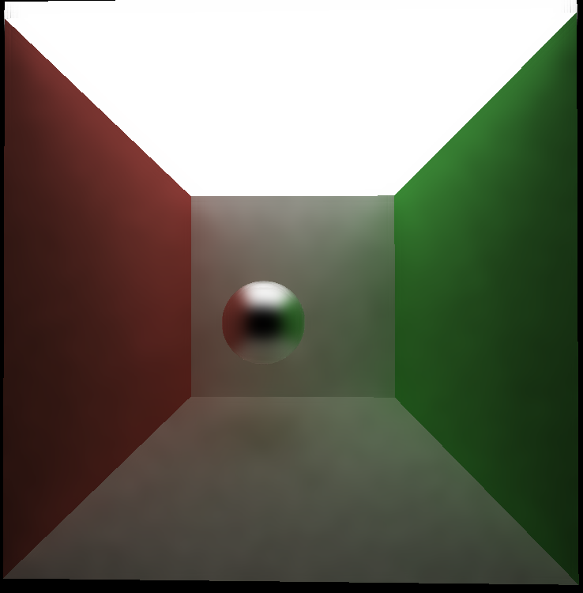
 
With just color weights, there remains some garininess in the image, even though it has been through the same number of iterations as past images. This is because in the non denoised image, there remains a lot of graininess. Since the color weights depend on neighbooring pixels to be similar color to the original pixel, high amounts of graininess in the original image will cause the denoiser to discard neighboors of disimilar values, even if their addition would make the final render appear better.

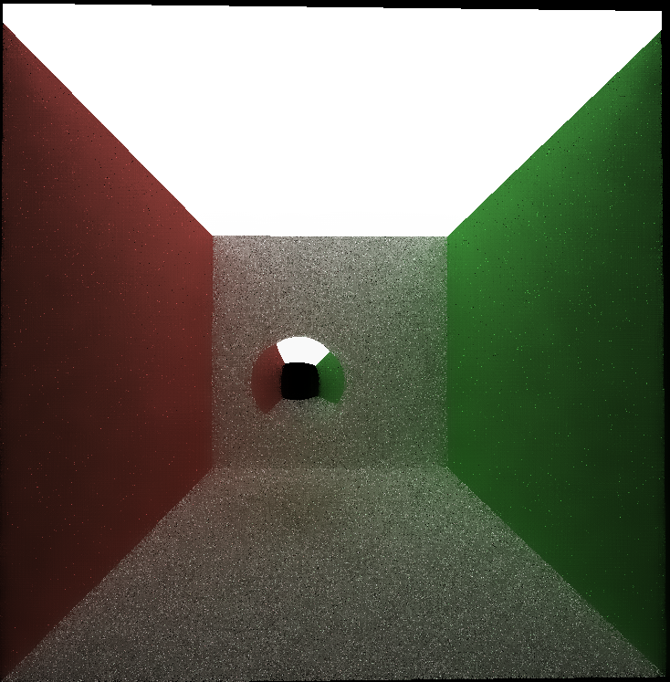
 

Lastly, here is the render with all weights applied, and with no denoising at all.
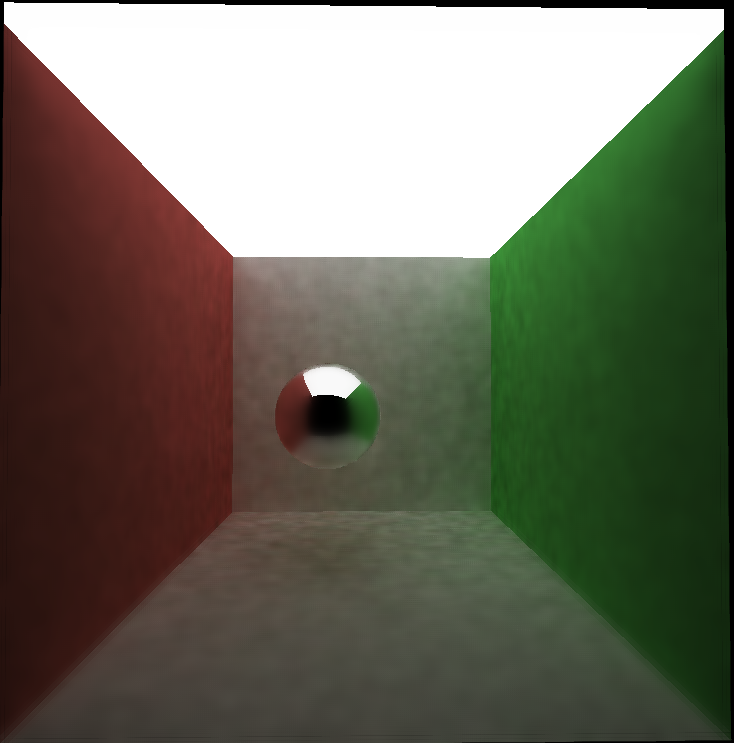
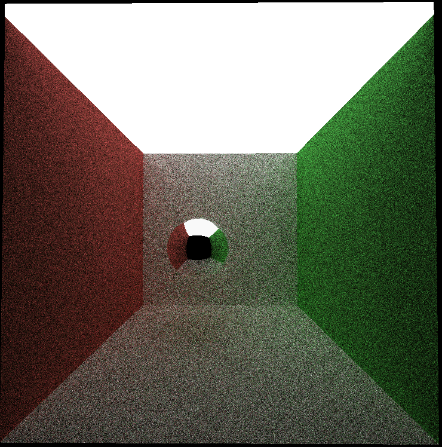
 

### Performance Analysis

Denoising is actually a very efficient process. For starters it's also a highly parallelizable process, just like path tracing, meaning it can be accelerated with use of the GPU. It also only needs to be done once at the final iteration of the pathtracer. Even if the pathtracer has a relatively modest 50 iterations, the addition of a denoiser at the end would have little impact on the runtime. As a result, we will be denoising at every iteration, to get a better idea of the added runtime of using the denoiser at one iteration. Unless otherwise specified, filtersize will be 80 and image resolution is 800 x 800. 

 
It's difficult to quantify how much quicker the denoising causes convergence. Here is a scene from before of the denoised image at 10 iterations.

 
And here is the same scene but at 200 iterations but with no denoising. 

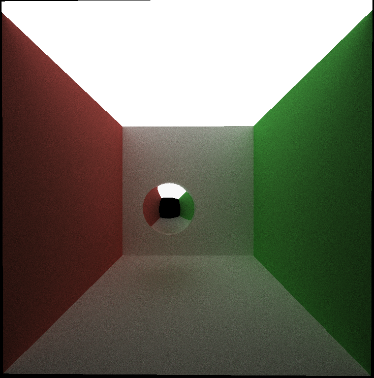

 
Both images are lacking in different ways. The denoised image is splotchy as not enough convergence has occured for the blur effect to generate uniform colors. The nondenoised image is simply still a bit grainy. Both could be considered acceptably converged, as nothing is off at first glance though. 

 
Also, here is the scene at 200 iterations while denoised, and 2000 iterations not denoised. 

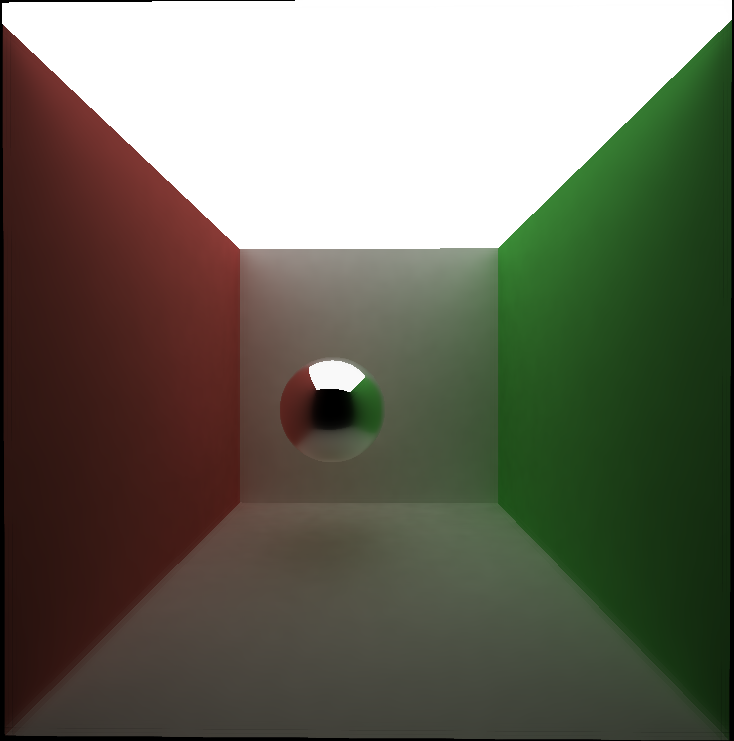 

 

 
The scenes are pretty indistinguishible. It may be safe to say that the denoiser, when paramaters are adjusted properly, can reduce the number of required iterations for an image to converge by a factor of 10 to 20. However, this statement is completely subjective.

 
 

Clearly, adding more work will increase the runtime of the Denoiser. Here is a comparison of using and not using the denoiser of different resolution images.

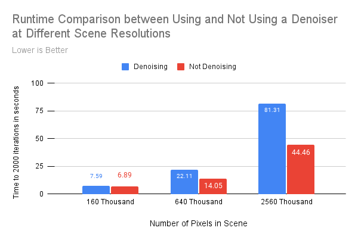 

If the denoiser took a similar amount of time to run regardless of the resolution, we would expect the ratio of denoised and non-denoised times to be similar. However, at low resolution the denoiser added almost no time at all. Whereas it almost doubled the required time in the high resolution scene. This indicates that the size of the buffers has an effect on performance. My best guess is that there is some sort of memory coalescence problem, with larger resolutions the distance between accessed indices for individual threads is much higher, and is this unoptimal.
 
 
Here is a comparison of using and not using the denoiser with varying frame size.

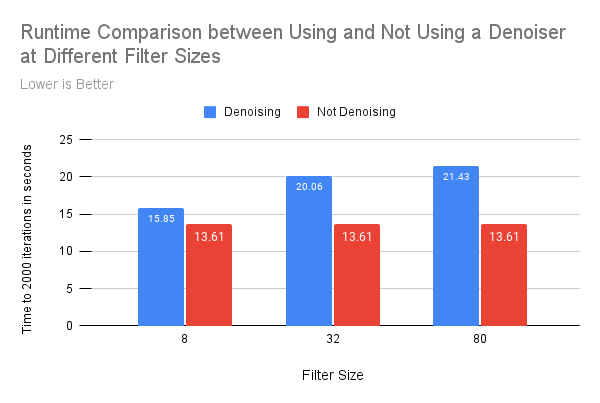 

Increasing filter size may seem to perform better than expected, but the number of times the atrous kernel is run is logarithmic with respect to the filter size. Though one may initially expect that increasing filter size will always increase the quality of the image, there does appear to be some sort of cut off where additional improvements are minimal or the quality even degrades. Take these images for example: They had filter sizes of 1, 4, 16 and 64 respectively.

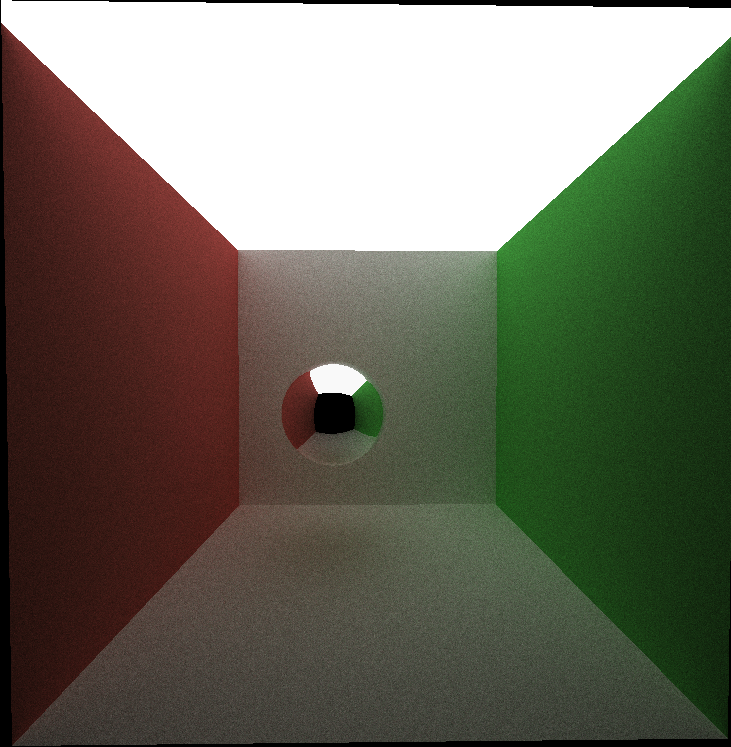 

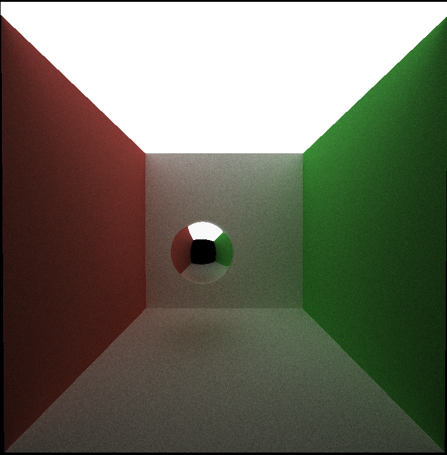 

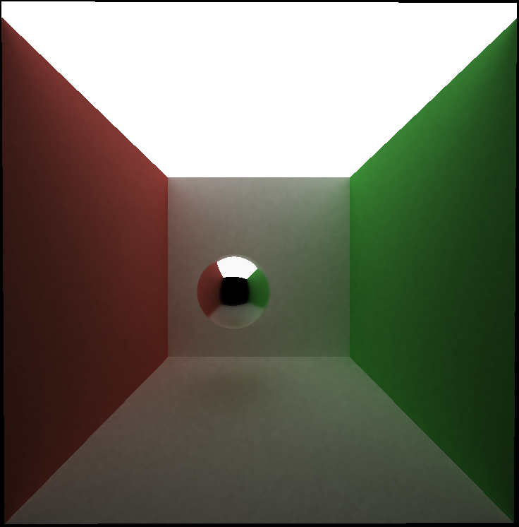 

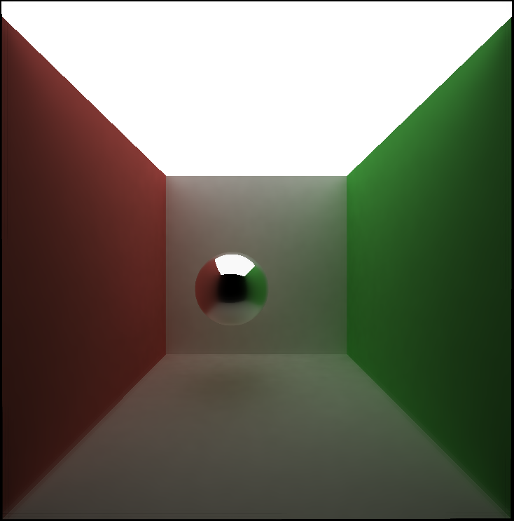 

 
From size 1 to 16, the quality does appear to increase, but at size 64. We can see more blurring at the corners of the room. Thus, there does seem to be some cut off at when it is no longer beneficial to increase the filter size, especially considering larger filter sizes take more time.
 
 
The denoiser also seems to struggle a bit with specular materials. Take this scene for example, where the right wall has been made specular. 

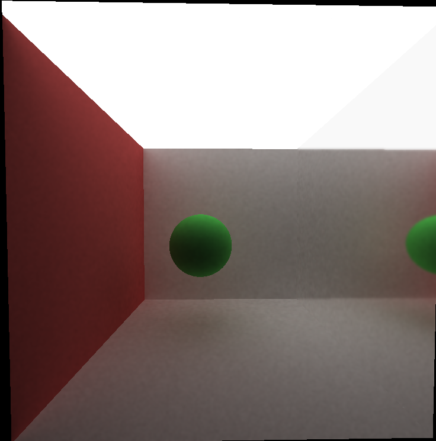 

 
The specular material is blurry even though we would expect it to be a perfect reflection. Denoising specular materials is probably a bit unecessary, as the ray bounces are always along the normal, so the material has an easier time converging. By applying the denoiser we seem to obscure this reflective quality a bit.
 
 
Lastly, scenes with more light seem to perform better than scenes with less light. This is most likely because having more light allows the scene to converge easiers: more rays have a chance of bouncing into it and returning a color, rather than returning nothing. In short, more light means less graininess in the image we are trying to denoise. Take these two scenes both at 200 iterations. The lower image has less light, and is splotchier

 

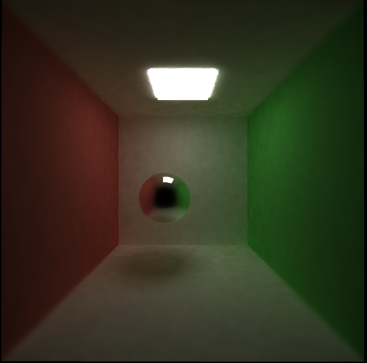 
 
### References
* [Edge-Avoiding A-Trous Wavelet Transform for fast Global Illumination Filtering](https://jo.dreggn.org/home/2010_atrous.pdf)

