CUDA Denoiser For CUDA Path Tracer
==================================

**University of Pennsylvania, CIS 565: GPU Programming and Architecture, Project 4**

* Zhuohao Lin
  * [LinkedIn](https://www.linkedin.com/in/zhuohao-lin-960b54194/)
* Tested on: Windows 10, i7-10875H @ 2.30GHz 16GB, NVIDIA Grforce RTX 2060 6GB (personal machine)

# Overview
This is a GPU based path tracer. The project focus on implementing an edge-avoiding A-Trous Wavelet denoiser based on a [paper](https://jo.dreggn.org/home/2010_atrous.pdf).
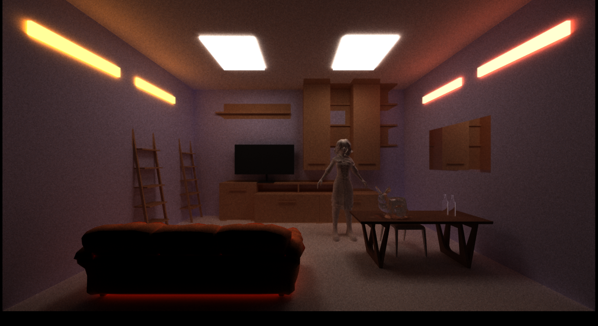

# Features
### `GBuffer Data Visualization`
Normal                     |  Position 
:-------------------------:|:-------------------------:
  |  

### `Denoiser`
Before denoising (50 iterations) | Simple blur (50 iterations) |  After denoising (50 iterations) 
:-------------------------:|:-------------------------:|:-------------------------:
  |  |  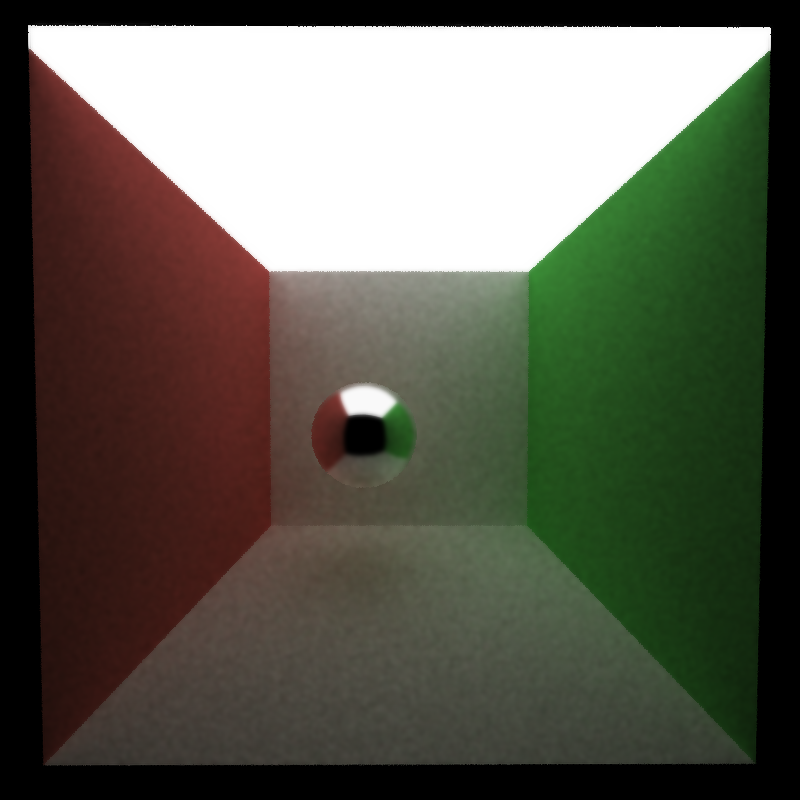

Before denoising (100 iterations) |  After denoising (100 iterations) 
:-------------------------:|:-------------------------:
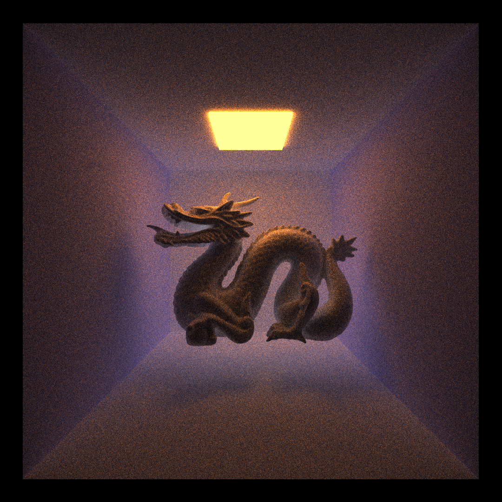  |  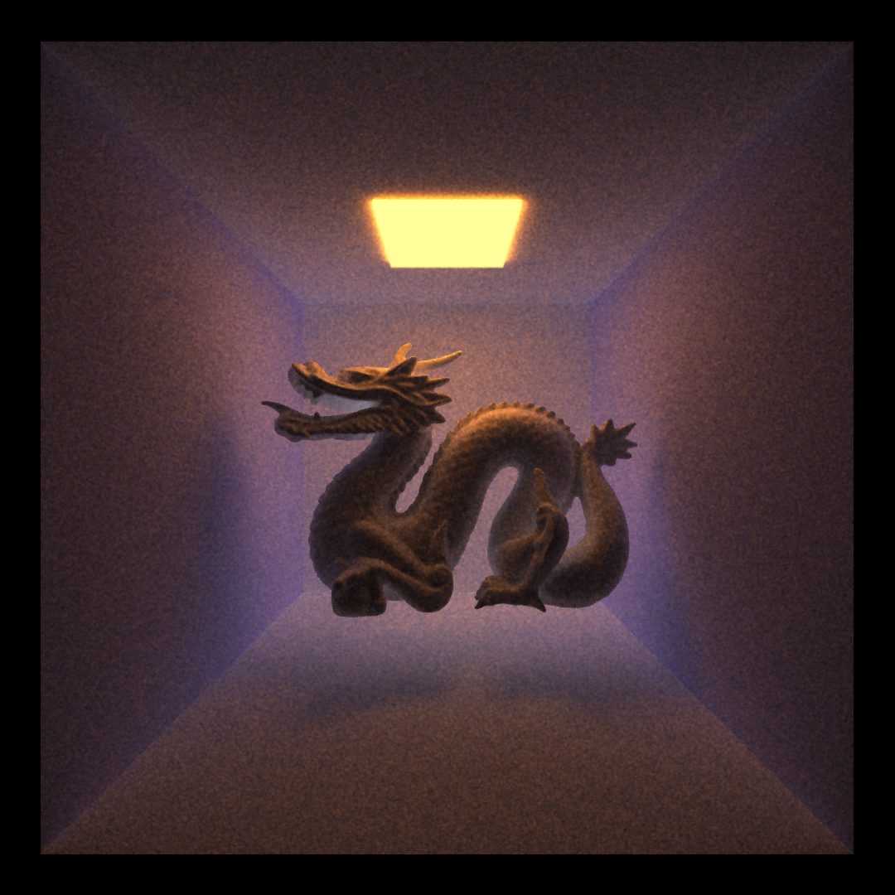

# Performance Analysis

### `How much time denoising adds to my renders`

The time cost for a scene with 800 x 800 resolution is only 1.28314 ms. The time cost for a scene with 1080 x 1080 resolution is 2.69891 ms. Comparing to the huge time cost for compution in path tracer (especially when there are thousands of iterations), denoising almost costs nothing.

### `how denoising at different resolutions impacts runtime`

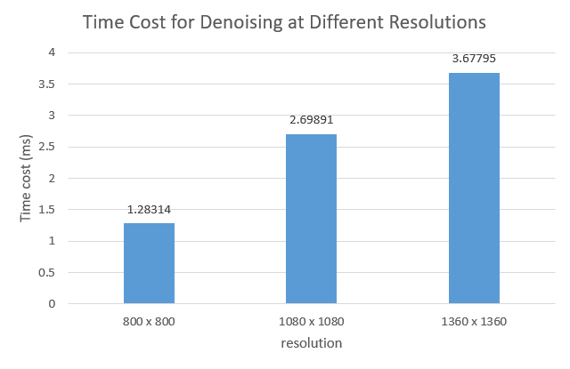

Denoising costs more time as the resolution increases according to the data shown above. This is because denoising takes each pixel and tries to blend neighbor pixels with certain weights.

### `How denoising influences the number of iterations needed to get an "acceptably smooth" result`

cornell box (200 iterations) | denoised cornell box (50 iterations)
:-------------------------:|:-------------------------:
 | 

The denoiser can produce a smooth image for cornell box with 50 iterations, but it costs 200 iterations without a denoiser. The denoiser definitely reduces the number of iterations required to produce a smooth scene, but the actual number would be dependent on the subjective judgements and complexities of a scene.

### `how varying filter sizes affect performance`

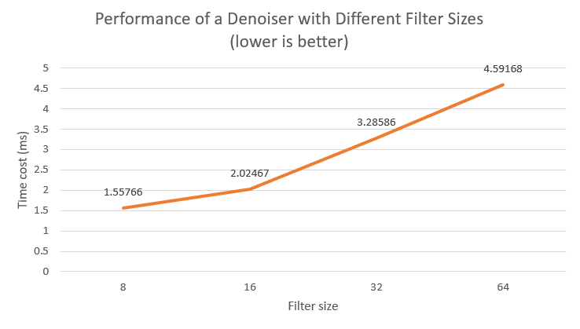

According to the graph shown above, the performance of the denoiser is higher when the filter size is smaller. Large filter size still costs very little time, which is ignorable.

### `How visual results vary with filter size`
Filter size 8 | Filter size 16 |  Filter size 32 | Filter size 64 
:-------------------------:|:-------------------------:|:-------------------------:|:-------------------------:
  | 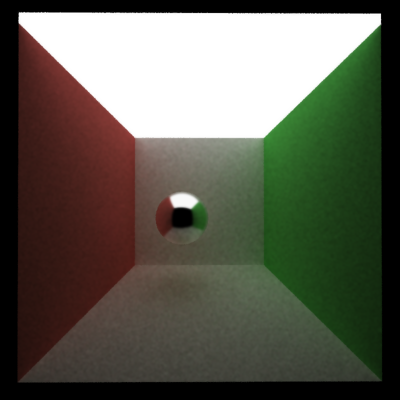 |  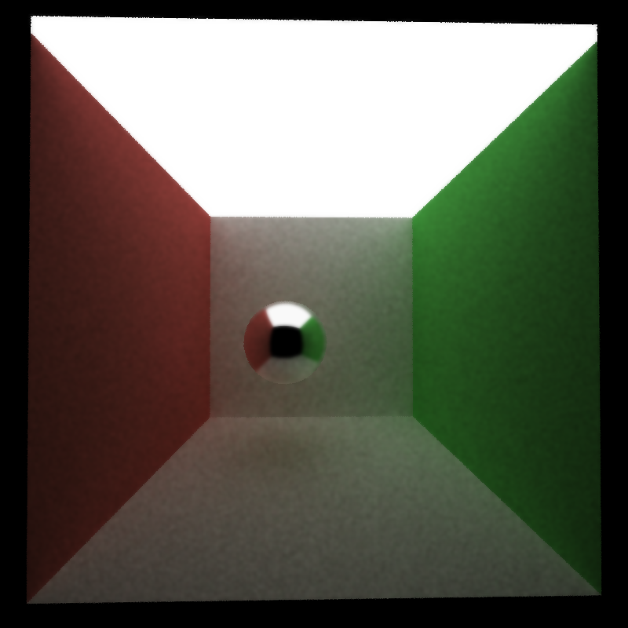 |  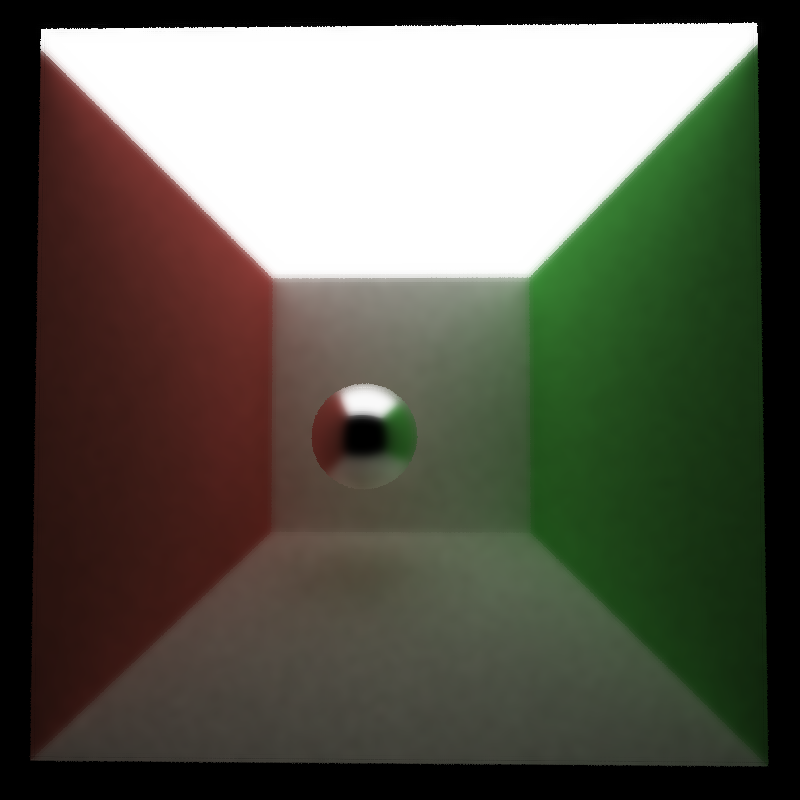

Visual results does not scale uniformly with filter size. If the filter size is too small, the noise was blended but still visible. If the filter size is too large, the image would become too blurry. The optimal filter size needs to be determined by comparing images produced by different filter sizes.

### `How effective/ineffective is this method with different material types`
Diffuse material | Reflective material |  Refractive material
:-------------------------:|:-------------------------:|:-------------------------:
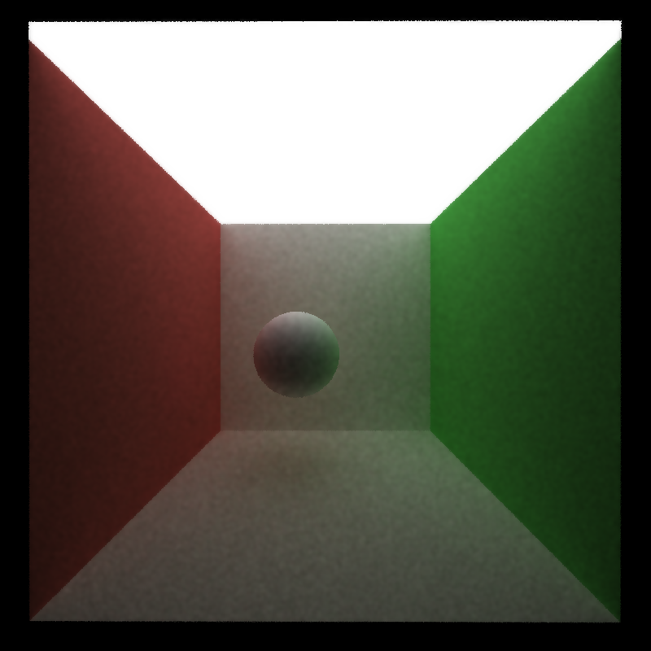  |  |  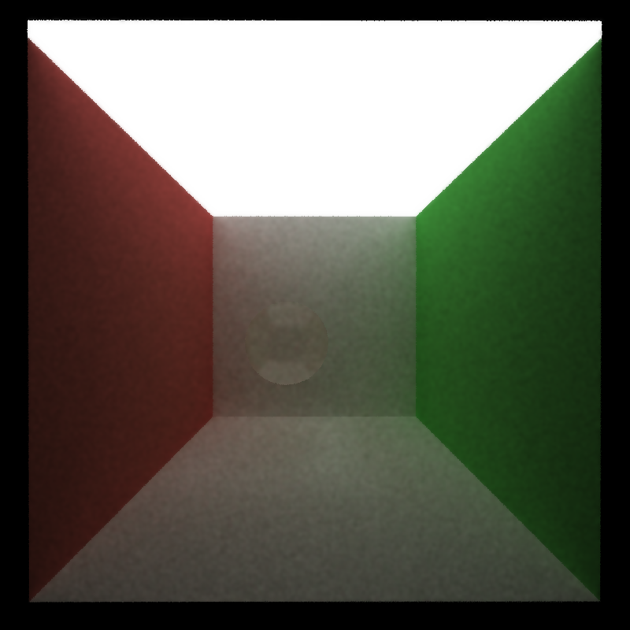

The denoiser is quite effective with diffuse material, since everything on the surface can be easily blended. For reflective and refractive materials, the denoiser would blend out the details which should be diplayed on the surface of these materials. There is no way to avoid it with this denoiser, since we cannot know the materials reflect or refract an edge or not.

### `How do results compare across different scenes`

Cornell box                |  Dragon
:-------------------------:|:-------------------------:
  |  

The denoising quality of results from different scenes varies a lot. The light in a scene affects the quality a lot, since it directly determines the amount of visible noises with the same path trace iterations. Another facter of the denoising quality is the complexity of objects and scenes. If a scene is too complex, the position and normal we stored in GBuffer won't be enough to detect edges. Thus, the details on objects will be blended out.

