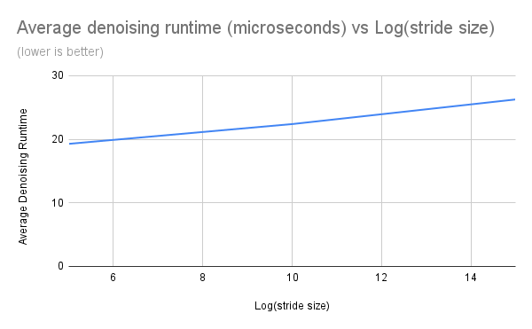
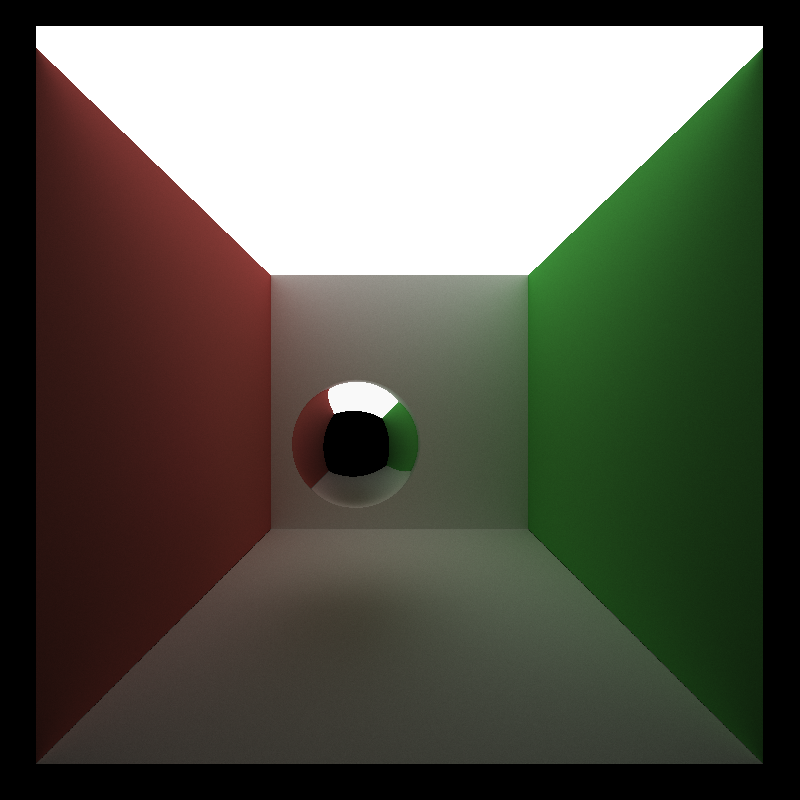
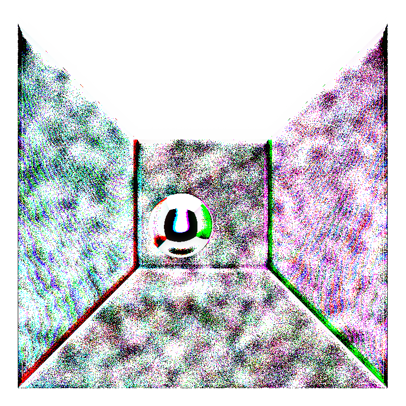
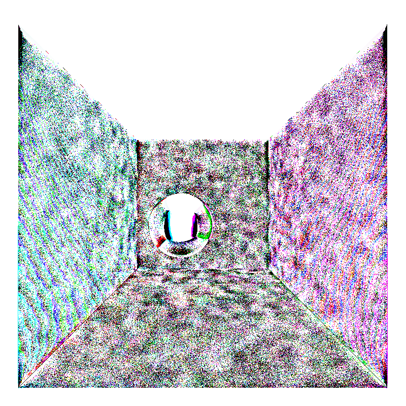

CUDA Denoiser For CUDA Path Tracer
================

**University of Pennsylvania, CIS 565: GPU Programming and Architecture, Project 3**

* Evan S
* Tested on: Strix G15: Windows 10, Ryzen 7 4800H @ 2.9 GHz, GTX 3050 (Laptop)

## Overview
This is introduces a denoiser for the [previous project, the CUDA Path Tracer](https://github.com/esiaero/CIS_565-Project3-CUDA-Path-Tracer). Denoising is intended to be used since running numerous iterations is often prohibitively slow. 

The denoiser implemented here is a very simple edge-avoiding blur-based algorithm, lifted from the paper [Edge-Avoiding À-Trous Wavelet Transform for fast Global
Illumination Filtering by Dammertz, et al.](https://jo.dreggn.org/home/2010_atrous.pdf).

The name À-Trous means "with holes" in French; our denoised image is produced by convoluting the base image with larger and larger blur kernels with larger and larger holes (0-value indices). See paper for in-depth explanation and refer to the previous project link for the base path tracer functionality.

## Denoiser Analysis
The performance of the features in this section are measured with frames per second (FPS) of the overall render, so a higher FPS is better.

### Time added by denoising

The denoiser is run on the noisy output image, so it is and independent of any variables inherent to the path tracer. To the left is a chart to roughly show the linear relation between runtime and log of the stride size (the log of stride size is used to determine the number of A'Trous denoising). Note the trivial runtime. 

 

### Denoising influence on number of iterations for smooth result
Comparing a basic Cornell scene, we look to try and roughly judge how many iterations are necessary for a result similar to "ground truth" (many iterations).

| Image | Ground truth | Denoised(20 iters) | Denoised(100 iters) |
| :----: | :----------: | :-----------------: | :-------------------: |
| Scene |  |  |  |
| Diff |  |  |  |

The "diff" is a measure of difference, per-pixel, between ground truth and the denoised version; the brighter/whiter a pixel, the more correct it is. This difference is determined with a [rudimentary python program](./diff.py). Note that at just 100 iterations, the number of pixels that are clearly not white are spread around or relatively bright, and by inspecting the image the difference between it and ground truth is not significant.  
Much of the ability for a denoised image to resemble ground truth is determined by the tunable weights(color, position, normal) and filter size.