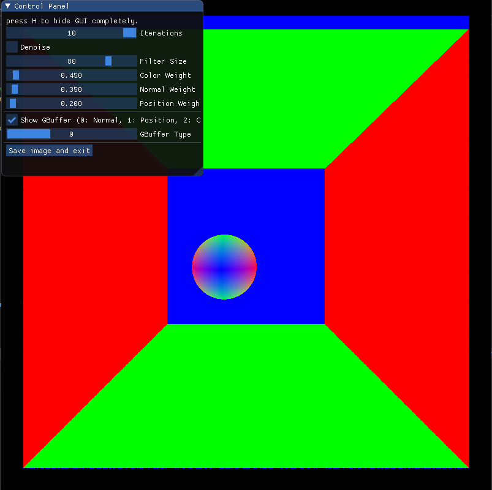
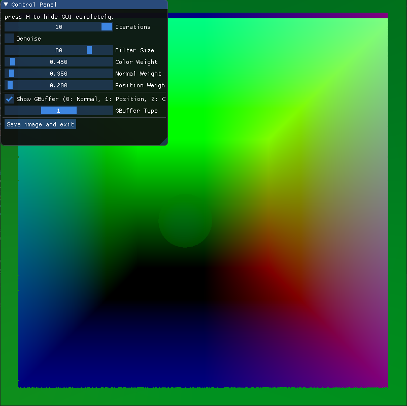
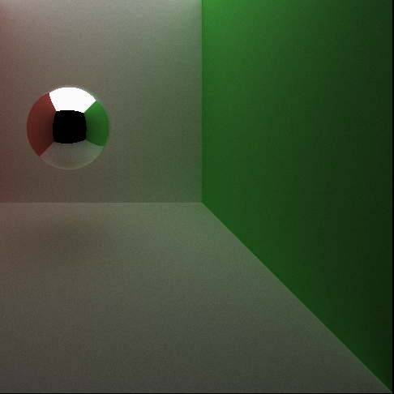
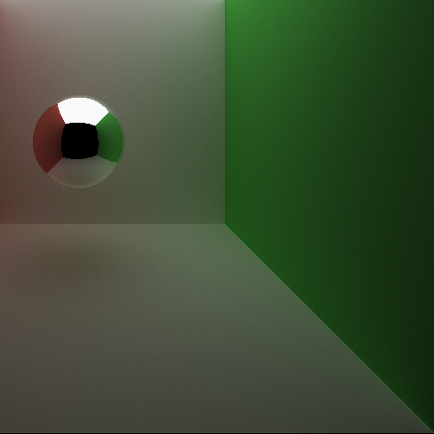
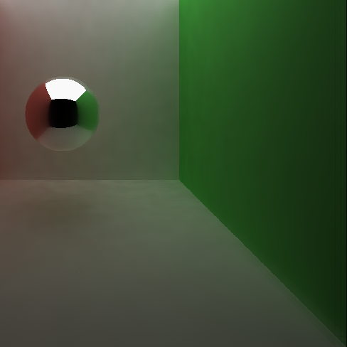
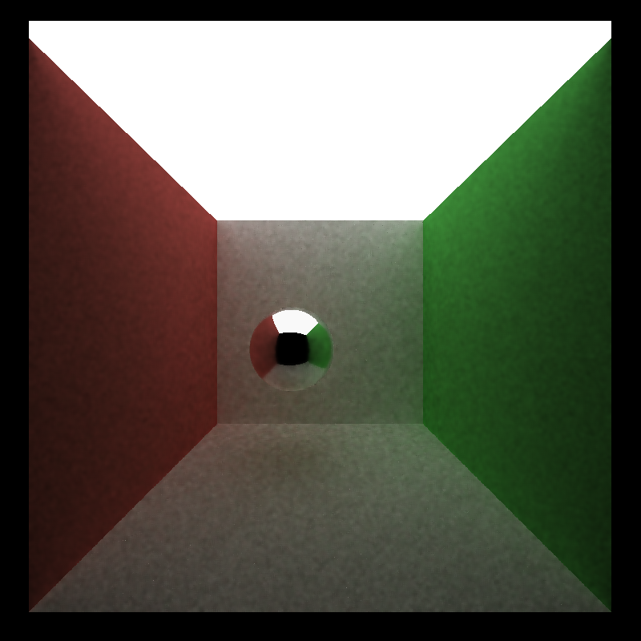
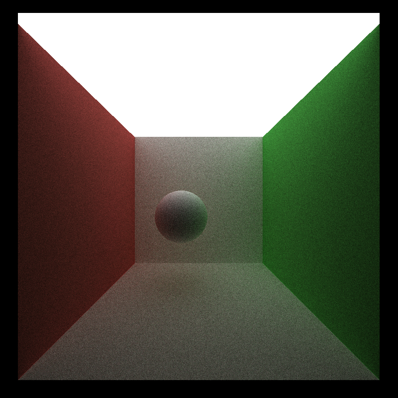
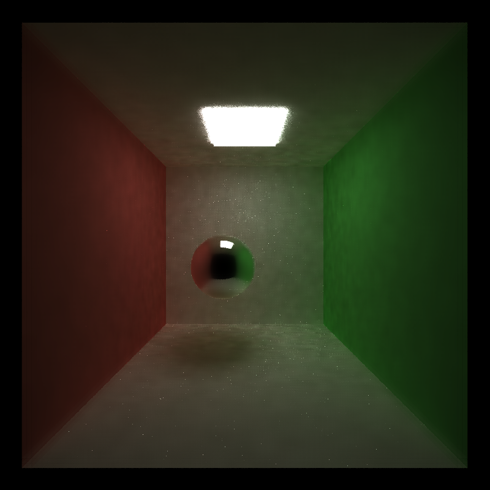
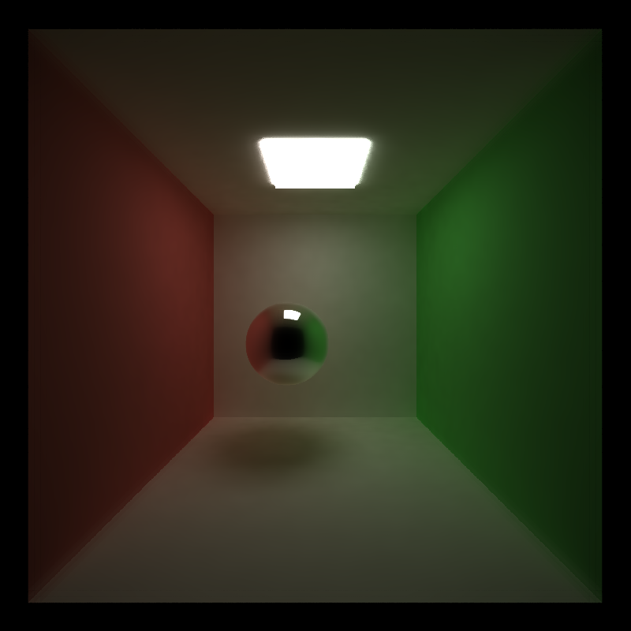

CUDA Denoiser For CUDA Path Tracer
==================================

**University of Pennsylvania, CIS 565: GPU Programming and Architecture, Project 4**

* Yu-Chia Shen
  * [LinkedIn](https://www.linkedin.com/in/ycshen0831/)
* Tested on: Windows 10, i5-11400F @ 4.3GHz 16GB, GTX 3060 12GB (personal)

# Overview
This project is to build a denoiser using colors and 2 geometry buffer: normals, and positions. The effect of the denoiser can smooth the image while not blur the edges between objects. The technique is based on the paper "Edge-Avoiding A-Trous Wavelet Transform for fast Global Illumination Filtering". You can find the paper here: https://jo.dreggn.org/home/2010_atrous.pdf

# Result

## **Before & After Comparison**
| Raw Image | After Denoise | 
| :--------------------------: | :-------------------: | 
|  |  |

| Blur Image | After Denoise | 
| :--------------------------: | :-------------------: | 
|  |  |

## **GBuffer**
| Normal Buffer |  Position Buffer | 
| :--------------------------: | :-------------------: | 
|  |  |

# Performance Analysis

## Time Analysis for Denoiser

The following chart shows that the Denoiser time is approximately the same as the ray tracer in one iteration. Also, since denoise only needed to be applied in the final iteration, it doesn't not affect the whole render too much. It only count as one iteration of the ray tracer. 

%20vs%20Run%20Time%20(ms)%20vs%20iter.png)

## Visual Effect Analysis

### Visual Effect
| Iteration 1000 without Denoiser | Iteration 6000 without Denoiser | Denoised Image 100 iteration
| :--------------------------: | :-------------------: | :-------------------: | 
|  |   |  | 

We can see that the image needed 6000 iteration to achieve the effect of the denoiser. Even go throught 1000 iteration, the image is still noisy when zoom in. Therefore, the denoiser can greatly improve the visual effect with very less iteration.

### Image Difference Using tools
| Iteration 500 without Denoiser | Difference | Denoised Image 100 iteration 
| :--------------------------: | :-------------------: | :-------------------: | 
|  |   |  | 

| Iteration 1000 without Denoiser | Difference | Denoised Image 100 iteration 
| :--------------------------: | :-------------------: | :-------------------: | 
|  |   |  | 

| Iteration 6000 without Denoiser | Difference | Denoised Image 100 iteration 
| :--------------------------: | :-------------------: | :-------------------: | 
|  |   |  | 

## **Resolution vs Execute Time**
%20vs%20Run%20Time%20(ms).png)

## **Filter Size vs Execute Time**
%20vs%20Run%20Time%20(ms).png)

## **Visual Effect with different Iteration**
| Denoised Image 5 iteration| Denoised Image 10 iteration | Denoised Image 20 iteration 
| :--------------------------: | :-------------------: | :-------------------: | 
|  |   |  | 

| Denoised Image 40 iteration| Denoised Image 80 iteration | Denoised Image 100 iteration 
| :--------------------------: | :-------------------: | :-------------------: | 
|  |   |  | 

We can see that the visual quality improve when we use more iterations. However, there is a limit for high iteration. The images with 80 iteration and 100 iteration seems the same.

## **Visual Effect with different Filter Size**
| 8 x 8 | 20 x 20 |  40 x 40 |
| :--------------------------: | :-------------------: |  :-------------------: | 
|   |  |  |

| 80 x 80 | 200 x 200 | 400 x 400|
| :--------------------------: | :-------------------: |  :-------------------: | 
|   |  |  |

You can see that the visual quality improve while increasing the filter size. The surface of the objects are smoother when filter size is larger. However, there is a limit for the filter size. When the filter size is larger than 80 x 80, the visual improvement is no longer exist. That means the visual quality does not scale uniformly with the filter size.

## Visual Effect with Different Material

| Material Type | Before | After |
| :--------------------------: | :-------------------: |  :-------------------: | 
| Diffuse  |  |  |
| Specular  |  |  |

We can see that the denoise effect is better on diffuse object than specular objects. The contour of the specular is blured after denoise.

## Visual Effect with Different Scenes
| Light Source | 100 iteration | 1000 iteration |
| :--------------------------: | :-------------------: |  :-------------------: | 
| Small Light Source  |  |  |
| Large Light Source  |  |  |

We can see that for 100 iteration, large light source has better denoised result. This is because before denoise, small light source has a more noisy image. Therefore, too many noise in the image result in a poor denoiser effect. However, when the image converge after 1000 iteration, the denoiser effect become better.
