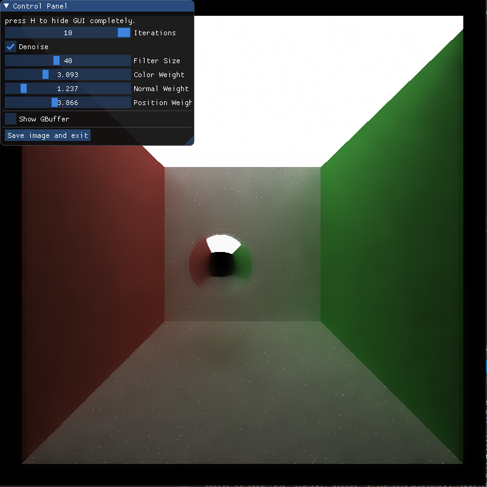
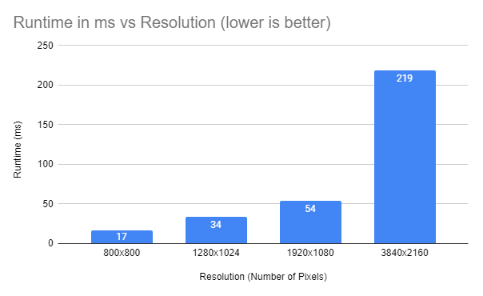
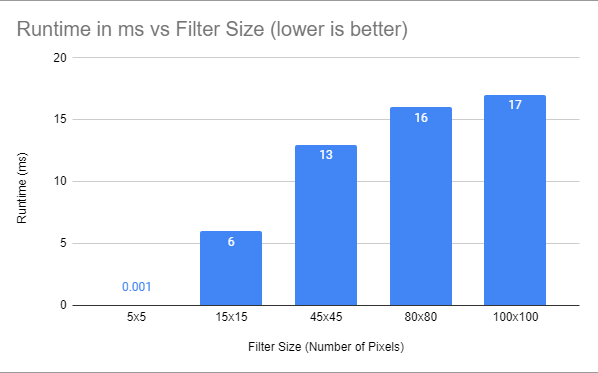
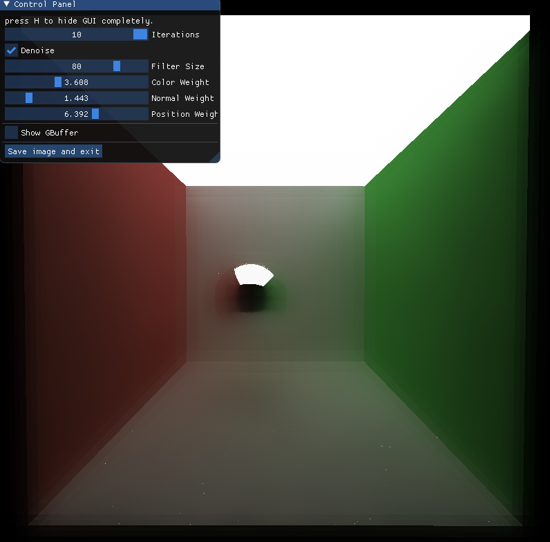
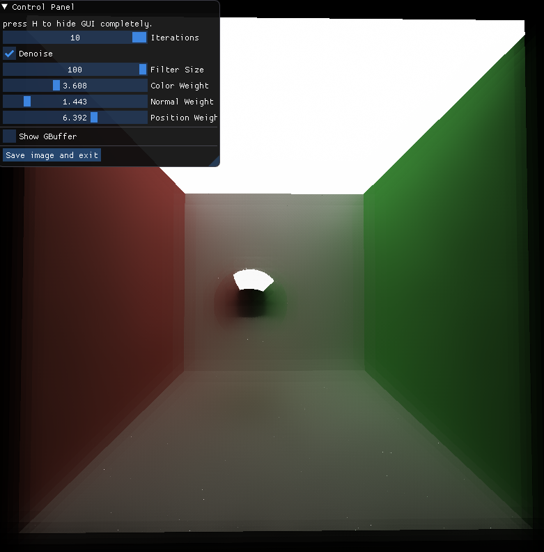
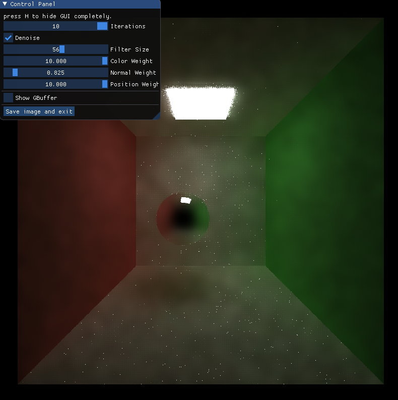

CUDA Denoiser For CUDA Path Tracer
==================================

**University of Pennsylvania, CIS 565: GPU Programming and Architecture, Project 4**

* Ryan Tong
  * [LinkedIn](https://www.linkedin.com/in/ryanctong/), [personal website](), [twitter](), etc.
* Tested on: Windows 10, i7-8750H @ 2.20GHz 16GB, GeForce GTX 1060 6144MB (Personal Laptop)

### Project Description
This project uses an A-Trous filter to denoise a pathtraced image at an early iteration stage to reduce the number of iterations needed to generate an acceptably smooth image. The paper followed was: https://jo.dreggn.org/home/2010_atrous.pdf

### Performance
To generate an “acceptably smooth” image as shown above, I found that the denoiser takes about ~13ms. Note that this image was generated using 800x800 resolution and filter size of 40.

Compared to using many thousands of iterations to generate an acceptably smooth image with only 10 iterations with denoising as opposed to 500 iterations without denoising.

### Denoised vs Not

2 parameters that affect runtime of the denoiser are resolution and filter size. For resolution, this makes sense because resolution determines the total number of operations needed to be performed. Specifically, the higher the resolution, the more threads need to be launched since one denoising thread is launched per pixel. Similarly, increasing filter size increases runtime because it increases the number of iterations of increasing the filter size. Specifically, we start at a size of 5x5 and increase the step width by a factor of 2 until we reach the desired filter size. We can see these affects reflected in the data below:

### Resolution Performance Impact

### Filter Size Performance Impact

### Filter Size Visual Analysis
Here are some images comparing the effects of filter size. As you can see, filter values that are too small are ineffective and filter sizes that are too big make the image too blurry. This makes sense because smaller filters do not take into account enough of the neighboring pixels to be effective and larger filters take into account too many neighboring pixels. 

### Material Type
The material type also determines the effectiveness of this technique. Diffuse materials work best while specular is worse since the reflections are blurred as well.

###
The amount of light also determines the effectiveness of this technique. Specifically, brighter scenes work better since there is less complexity in the lighting and more uniformity. 

