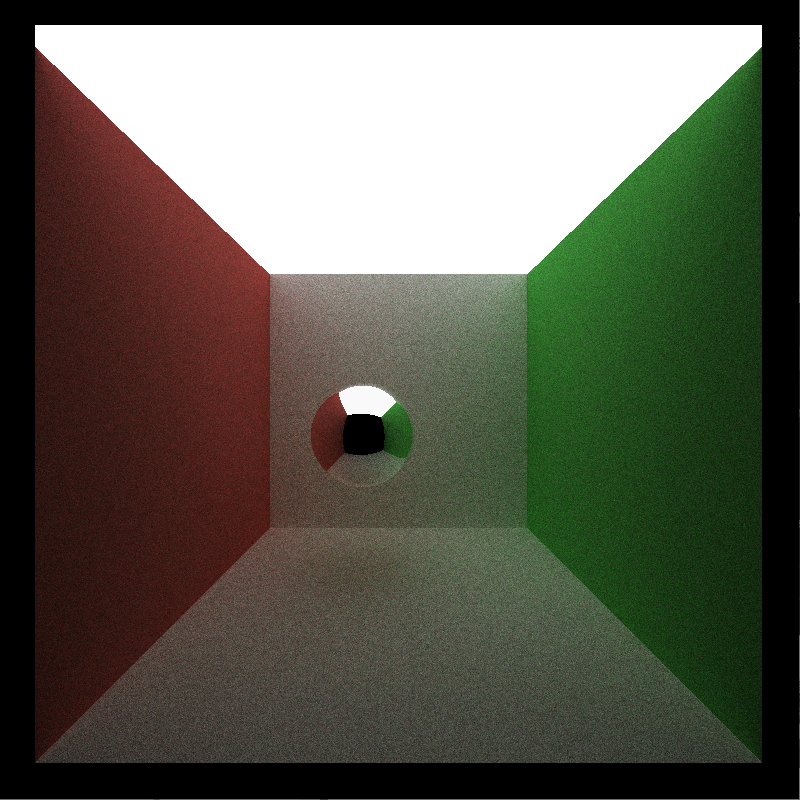

CUDA Denoiser For CUDA Path Tracer
==================================

**University of Pennsylvania, CIS 565: GPU Programming and Architecture, Project 4**

* Megan Reddy
  * [LinkedIn](https://www.linkedin.com/in/meganr25a949125/), [personal website](https://meganr28.github.io/)
* Tested on: Windows 10, AMD Ryzen 9 5900HS with Radeon Graphics @ 3301 MHz 16GB, NVIDIA GeForce RTX 3060 Laptop GPU 6GB (Personal Computer)
* Compute Capability: 8.6

### Overview

[General description of denoising and why it's useful]

| raw pathtraced image | simple blur | blur guided by G-buffers |
|---|---|---|
||||

<em>Figure 1. Raw path-traced, blurred, and denoised image comparison (100 iterations) </em>

#### Edge-Avoiding À-Trous Wavelet Transform

[General description of A-trous filter]

[G-buffer explanation]

 Per-Pixel Normals (remapped to [0, 1]) | Per-Pixel Normals (abs value and scaled down) | Per-Pixel Depth |
|---|---|---|
||||

<em>Figure 2. G-buffer visualizations </em>

[Simple blur pass explanation]

 Raw Pathtraced (100 iterations) | Simple Blur 80x80 Filter | GIMP Gaussian Blur 80x80 Filter |
|---|---|---|
||||

<em>Figure 3. A comparison of basic blur between the À-Trous filter and GIMP's Gaussian filter (100 iterations). Note that the À-Trous algorithm is an approximation of Gaussian blur.</em>

[Edge-avoiding filter explanation]

Color weight: 25.f, Normal: 0.35f, Position: 0.2f

 Raw Pathtraced (100 iterations) | Simple Blur 80x80 Filter | Edge-Avoiding 80x80 Filter |
|---|---|---|
||||

<em>Figure 4. Result of adding in weights based on G-buffer values.</em>

### GUI Controls

### Visual Analysis

[Describe methodology - such as sigma weights, etc. used to test]

#### Varying Filter Size

[Description of observations as you increase filter size]

| 10x10      |      20x20      |  40x40 | 80x80
|----------  |:-------------:  |------:|------:|
| 100        |  left-aligned   | $1600 | $1600 |

| 10x10      |      20x20      |  40x40 | 80x80
|----------  |:-------------:  |------:|------:|
| 100        |  left-aligned   | $1600 | $1600 |

##### Different Material Types

[Description of observations in scene with diffuse surfaces and scene with reflective surfaces]

[Diffuse Material Comparisons]

| Iterations      |      Raw Pathtraced      |  Denoised |
|----------       |:-------------:           |------:|
| 100             |  left-aligned            | $1600 |
| 1000            |    centered              |   $12 | 

[Specular Reflective Material Comparisons]

| Iterations      |      Raw Pathtraced      |  Denoised |
|----------       |:-------------:           |------:|
| 100             |  left-aligned            | $1600 |
| 1000            |    centered              |   $12 | 

##### Different Scenes

[Description of observations between ceiling light scene and small light scene]

[Ceiling Light Scene]

| Iterations      |      Raw Pathtraced      |  Denoised |
|----------       |:-------------:           |------:|
| 100             |  left-aligned            | $1600 |
| 1000            |    centered              |   $12 | 

[Smaller Light Scene]

| Iterations      |      Raw Pathtraced      |  Denoised |
|----------       |:-------------:           |------:|
| 100             |  left-aligned            | $1600 |
| 1000            |    centered              |   $12 | 

### Performance Analysis

[Describe methodology - such as sigma weights, etc. used to test]

##### How Much Time Denoising Adds to Renders

Denoising time is indepedent of total path tracing iterations since it only runs once at the end. 
In the graph below, we can see that total denoising time added did not vary between iteration counts.

[GRAPH: Additional Time Spent Denoising With Increasing Iterations]

##### Varying Filter Size

However, if we increase filter size, we do see an increase in the total time spent denoising. 

[GRAPH: Additional Time Spent Denoising With Increasing Filter Size]

##### Number of Iterations to "Acceptably Smooth" Result

| "Acceptably Smooth" Pathtraced (1000 iterations) |  Denoised (100 iterations iter) | Diff |
|----------       |:-------------:           |
|  |  | 

With denoising, it takes about 100 iterations to achieve an "acceptably smooth" result. This is a 90% decrease in iterations. 

| "Acceptably Smooth" Pathtraced (1000 iterations) |  Denoised (100 iterations iter) | Diff |
|----------       |:-------------:           |
|  |  | 

##### Denoising at Different Resolutions

[GRAPH: Additional Time Spent Denoising With Increasing Resolution]

### Bloopers

**Foggy Cornell**

**Ghost Lights**

### References

* Paper - [Edge-Avoiding À-Trous Wavelet Transform for fast Global Illumination Filtering](https://jo.dreggn.org/home/2010_atrous.pdf)
* Convolution Filter - [The à trous algorithm](https://www.eso.org/sci/software/esomidas/doc/user/18NOV/volb/node317.html)

