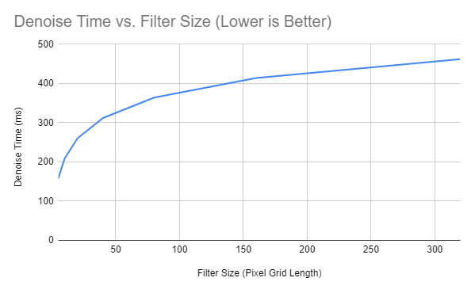

CUDA Denoiser For CUDA Path Tracer
==================================

**University of Pennsylvania, CIS 565: GPU Programming and Architecture, Project 3**

* Edward Zhang
  * https://www.linkedin.com/in/edwardjczhang/
  * https://zedward23.github.io/personal_Website/
 
* Tested on: Windows 10 Home, i7-11800H @ 2.3GHz, 16.0GB, NVIDIA GeForce RTX 3060 Laptop GPU

## Denoiser Showcase

Cornell Box - Denoised (10 Iterations)

Cornell box with a large ceiling light denoised using an A-Trous filter using differences in color, normal, and position as stored in a frameBuffer to weight the gaussian-approximated neighbors' contributions to the denoised image output.

Cornell Box - Without Denoising (10 Iterations)

Standard path-traced output of the same scene for the sake of comparison.

## Outputs from Different Weight Combinations

Only Normals

Only Colors

Only Positions

Individually, each component does not seem to guide the denoising process very strongly.

## Runtime Analysis

Runtime to denoise a framebuffer using the A-Trous filter increases logarithmically since the total number of neighbors per filter only increases logarithmically due to the nature of our For Loop doubling our step_width each time.

The denoising does impact the overall pathtrace operations at all; they are separate operations.

