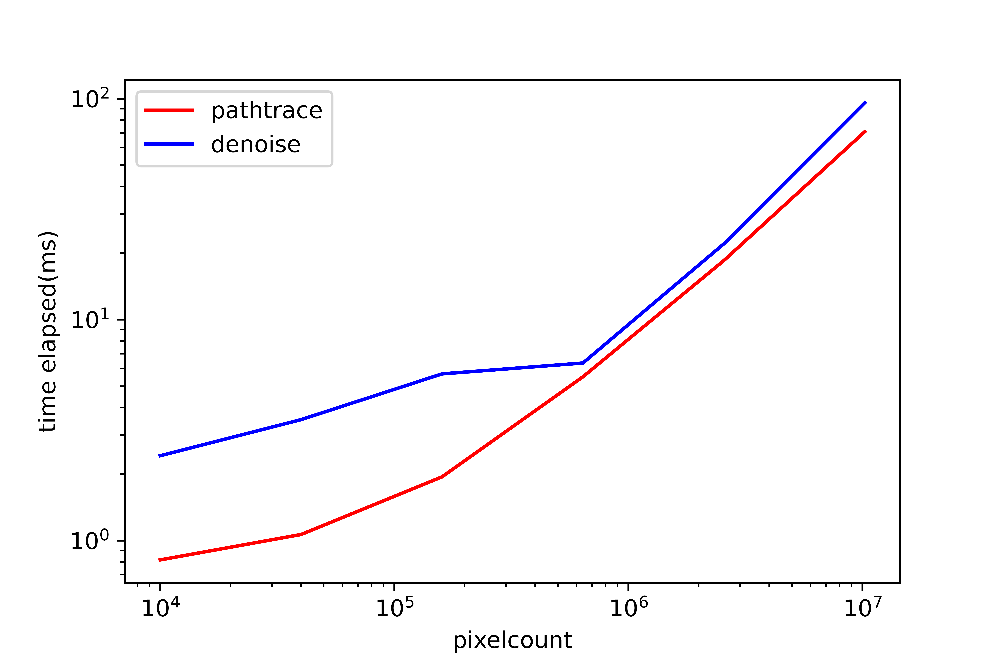

CUDA Denoiser For CUDA Path Tracer
==================================

**University of Pennsylvania, CIS 565: GPU Programming and Architecture, Project 3**

* Zhangkaiwen Chu
  * [LinkedIn](https://www.linkedin.com/in/zhangkaiwen-chu-b53060225/)
* Tested on: Windows 10, R7-5800H @ 3.20GHz 16GB, RTX 3070 Laptop GPU 16310MB (Personal Laptop)

This project implement a pathtracing denoiser that uses geometry buffers to guide a smoothing filter, which is based on the paper ["Edge-Avoiding A-Trous Wavelet Transform for fast Global Illumination Filtering"](https://jo.dreggn.org/home/2010_atrous.pdf). This paper use wavelet to approximmate Gaussion filter. By guiding the filter with edge-stopping function, the denoiser will not make the whole image blurry.

| raw pathtraced image | simple blur | blur guided by G-buffers |
|---|---|---|
|||
| SSIM = 0.5651 | SSIM = 0.8352 | SSIM = 0.9704 |

The G-buffer contains position and surface normal informations.
| scene | position | surface normal |
|---|---|---|
||||

## Performance Analysis

To measure the performance, a ground truth image is used to compare with denoised image. The ground truth image is generated by the pathtracer with 5000 iterations, and the metric is Structural Similarity Index (SSIM).

### Runtime Analysis

**Runtime with Different Resolutions**

The denoiser is using a 80*80 filter size. As expected, the runtime of both the pathtracer and the denoiser scale linearly with the number of pixels when the number of pixels is not too small. When the number of pixels is small, other overheads may dominate the runtime. 

**Runtime with Different Filter Size**

The number of A-Trous iterations determines the actual filter size. The runtime scales linearly with the number of A-Trous iterations. This is because each iteration the work load of the A-Trous algorithm is the same.

### Image Quality Analysis

**Denoising with Different # of Iterations**

| 1 iteration | position | surface normal |
|---|---|---|
||||
| SSIM = 0.4597 | SSIM = 0.9668 | SSIM = 0.9704 |

With a denoiser, the pathtracer can reach 0.97 SSIM with only 7 iterations, which needs about 1500 iterations without denoiser, so the denoiser can greatly reduce the number of iterations needed to get an acceptly smooth result. 

**Denoising with Different Filter Size**

| 0 A-Trous iteration |  1 A-Trous iteration |  2 A-Trous iteration |
|---|---|---|
||||
| SSIM = 0.4597 | SSIM = 0.7744 | SSIM = 0.9261 |

| 3 A-Trous iteration |  4 A-Trous iteration |  5 A-Trous iteration |
|---|---|---|
||||
| SSIM = 0.9653 | SSIM = 0.9704 | SSIM = 0.9704 |

The number of A-Trous iterations determines the actual filter size. The image quality didn't scale uniformly with the filter size. This is because when the filter size is small, increase the filter size will increase the number of pixels having similar color, position and normal greatly, while when the filter size is large, continue increasing the filter size will only add pixels far from the center to the filter, and these newly added pixels are likely to have different position, color anr surface norm, thus contribute little to the result.

**Denoising with Different Scene**

| cornell box with ceiling light | cornell box |
|---|---|
||

The denoising performance also greatly depend on scene. The result of denoising the original cornell box is apperantly worse than denoising the cornell box with ceiling light. With a smaller light, fewer number of rays can finally pass the light, so the image is much noisier with the same number of iterations. 

**Denoising with Different Material**

| Denoised Result|
|---|
|

The denoiser is effective on difussive materials, and less effective on reflective materials, especially on reflective sphere. On difussive materials, the color is likely to be uniform, so the denoiser can work well. But on reflective materials, the color likely vary a lot among pixels. Also, the surface normal changes a lot among the pixels on sphere, so the weight on neighboring pixels will be low, thus the denoising will be less effective.

### Compare with Gaussian Filter

The generating kernel is used to approximate gaussian filters. By comparing the A-Trous filter and gaussian filter, we can know whether the approximation is successful.

| A-Trous Filter | Gaussian Filter |
|---|---|
||
| SSIM = 0.9704 | SSIM = 0.9559 |

However, the gaussian filter have a worse performance with the same filter size as the A-Trous filter. Gaussian filter blurred the reflective sphere. A possible reason is the A-Trous filter have several iterations, and it uses the edge-stopping function at each iteration, so the edge-stopping function actually works for multiple times, and thus the weighted average is more accurate. Another hypothesis is there are still better parameters for Gaussian filter. I choose variance = 30, sigma_c = 5.41, sigma_n = 0.30, sigma_x = 4.94. By tuning variance and weights, we may achieve a better result. However, the runtime of Gaussian filter is not acceptable. With filtersize = 65, the runtime of Gaussian filter is 71ms, while the runtime of A-Trous filter is only 6.15ms. This is because the A-Trous filter's time complexity is O(nlog(k)), while the Gaussian filter's time complexity is O(nk^2), where n is the pixel count and k is the filter size. 

### G-Buffer Optimization

Given the depth, the camera position and the pixel index, we can calculate the position of the object. Thus, we only need to store the depth information in the G-buffer instead of the whole position. This [paper](http://jcgt.org/published/0003/02/01/paper.pdf) also provides a method to encode a 3-d normal vector with oct. With this two method, we can half the size of the G-buff. Here is the runtime

|              | no optimization | optimize normal | optimize position | optimize both |
|--------------|-----------------|-----------------|-------------------|---------------|
| time elapsed | 6.15            | 6.258           | 6.104             | 6.517         |

It shows that use depth to store the position information can reduce the runtime slightly, while oct-encode the normal will enlarge the runtime. This may because we didn't futher encode the oct-encoded normal to a single float. Also, the computation for oct-encoding and decoding is a little complex, so the increased computation time is larger than the saved I/O time.