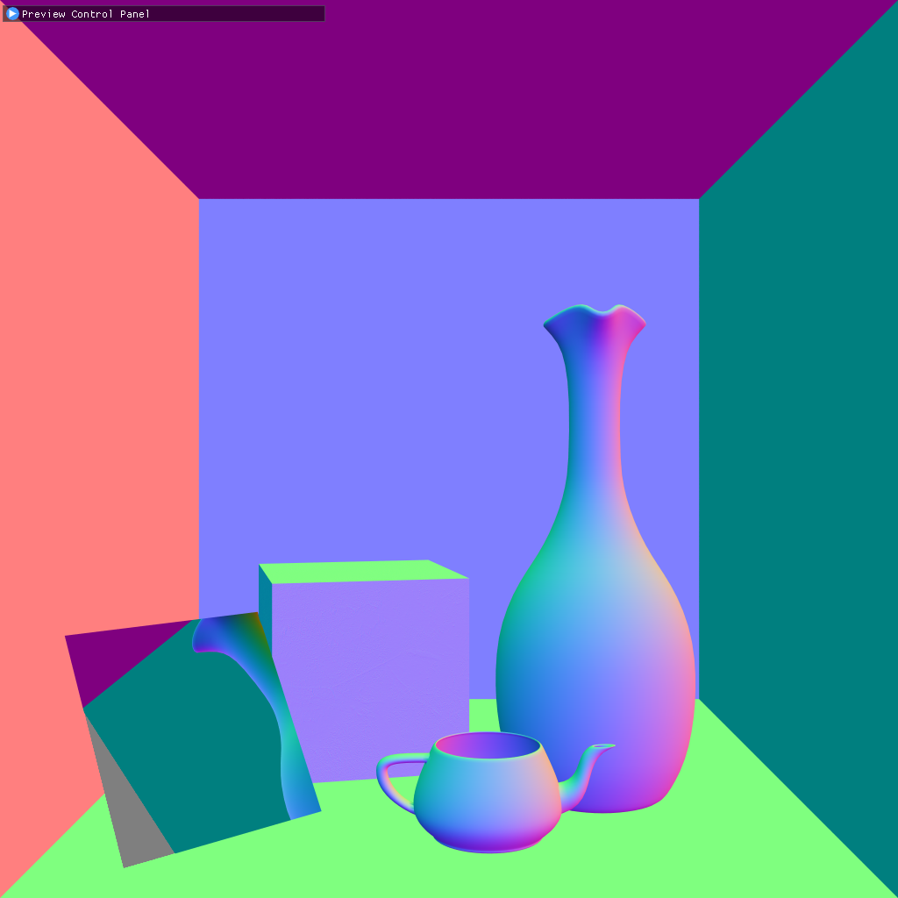
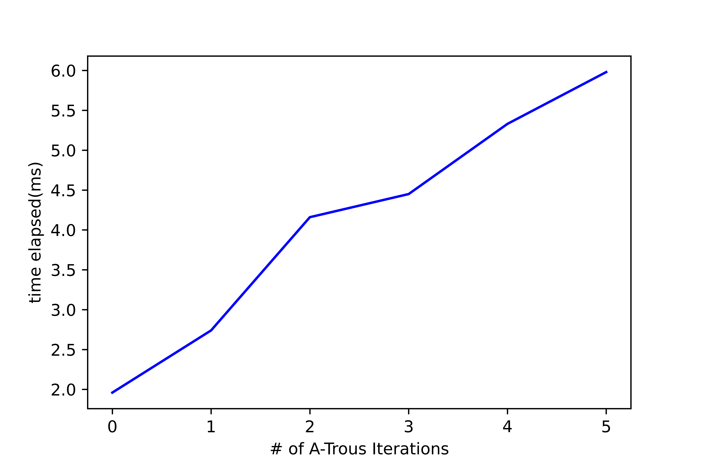

CUDA Denoiser For CUDA Path Tracer
==================================

**University of Pennsylvania, CIS 565: GPU Programming and Architecture, Project 3**

* Zhangkaiwen Chu
  * [LinkedIn](https://www.linkedin.com/in/zhangkaiwen-chu-b53060225/)
* Tested on: Windows 10, R7-5800H @ 3.20GHz 16GB, RTX 3070 Laptop GPU 16310MB (Personal Laptop)

This project implement a pathtracing denoiser that uses geometry buffers to guide a smoothing filter, which is based on the paper ["Edge-Avoiding A-Trous Wavelet Transform for fast Global Illumination Filtering"](https://jo.dreggn.org/home/2010_atrous.pdf). This paper use wavelet to approximmate Gaussion filter. By guiding the filter with edge-stopping function, the denoiser will not make the whole image blurry.

| raw pathtraced image | simple blur | blur guided by G-buffers |
|---|---|---|
|||
| SSIM = 0.5651 | SSIM = 0.8352 | SSIM = 0.9704 |

The G-buffer contains position and surface normal informations.
| scene | position | surface normal |
|---|---|---|
||||

## Performance Analysis

To measure the performance, a ground truth image is used to compare with denoised image. The ground truth image is generated by the pathtracer with 5000 iterations, and the metric is Structural Similarity Index (SSIM).

### Runtime Analysis

**Runtime with Different Resolutions**

The denoiser is using a 80*80 filter size. As expected, the runtime of both the pathtracer and the denoiser scale linearly with the number of pixels. 

**Runtime with Different Filter Size**

The number of A-Trous iterations determines the actual filter size. The runtime scales linearly with the number of A-Trous iterations. This is because each iteration the work load of the A-Trous algorithm is the same.

### Image Quality Analysis

**Denoising with Different # of Iterations**

| 1 iteration | position | surface normal |
|---|---|---|
||||
| SSIM = 0.4597 | SSIM = 0.9668 | SSIM = 0.9704 |

With a denoiser, the pathtracer can reach 0.97 SSIM with only 7 iterations, which needs about 1500 iterations without denoiser, so the denoiser can greatly reduce the number of iterations needed to get an acceptly smooth result. 

**Denoising with Different Filter Size**

| 0 A-Trous iteration |  1 A-Trous iteration |  2 A-Trous iteration |
|---|---|---|
||||
| SSIM = 0.4597 | SSIM = 0.7744 | SSIM = 0.9261 |

| 3 A-Trous iteration |  4 A-Trous iteration |  5 A-Trous iteration |
|---|---|---|
||||
| SSIM = 0.9653 | SSIM = 0.9704 | SSIM = 0.9704 |

The number of A-Trous iterations determines the actual filter size. The image quality didn't scale uniformly with the filter size. This is because when the filter size is small, increase the filter size will increase the number of pixels having similar color, position and normal greatly, while when the filter size is large, continue increasing the filter size will only add pixels far from the center to the filter, and these newly added pixels are likely to have different position, color anr surface norm, thus contribute little to the result.

**Denoising with Different Scene**

| cornell box with ceiling light | cornell box |
|---|---|
||

The denoising performance also greatly depend on scene. The result of denoising the original cornell box is apperantly worse than denoising the cornell box with ceiling light. With a smaller light, fewer number of rays can finally pass the light, so the image is much noisier with the same number of iterations. 

**Denoising with Different Material**

| Denoised Result|
|---|
|

The denoiser is effective on difussive materials, and less effective on reflective materials, especially on reflective sphere. On difussive materials, the color is likely to be uniform, so the denoiser can work well. But on reflective materials, the color likely vary a lot among pixels. Also, the surface normal changes a lot among the pixels on sphere, so the weight on neighboring pixels will be low, thus the denoising will be less effective.