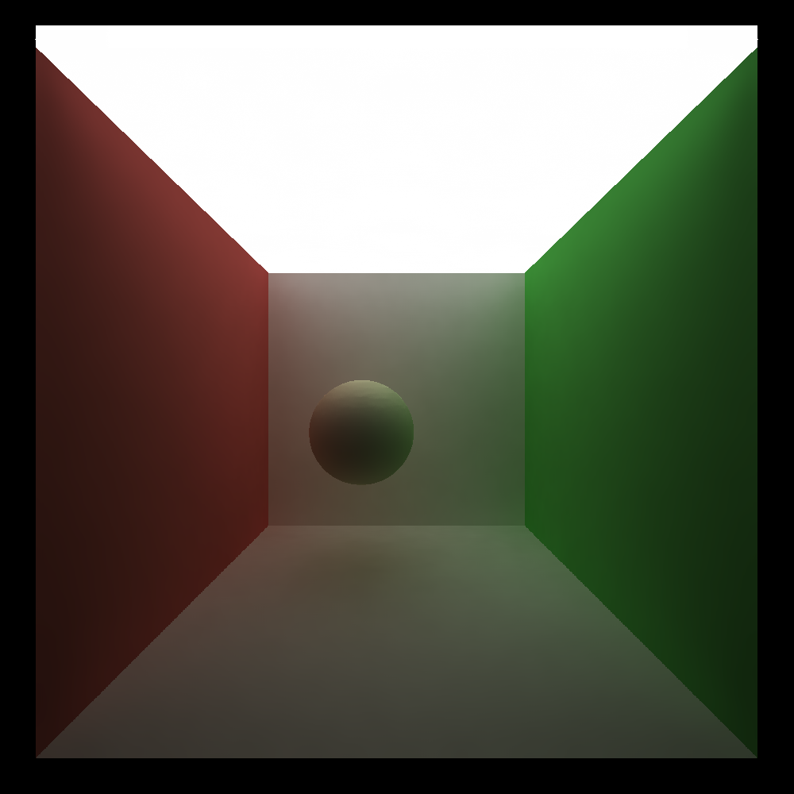

CUDA Denoiser For CUDA Path Tracer
==================================

**University of Pennsylvania, CIS 565: GPU Programming and Architecture, Project 4**

* XiaoyuDu
* Tested on: Windows 10, i9-11900KF @ 3.50GHz, RTX 3080 (Personal PC)

  
### Description  
This project built a denoiser based on an GPU-based path tracer. The algorithm of the denoiser follows the mthods proposed in the paper "Edge-Avoiding À-Trous Wavelet Transform for fast Global Illumination Filtering" by Holger Dammertz, Daniel Sewtz, Johannes Hanika, Hendrik P.A. Lensch. 
  
  
### Feature  
* I implemented all the features for part 1.  

### Analysis  
* Runtime for Denoiser  
I tested the denoiser with 10 iterations of the cornell box scene. Averagely speaking, after adding the denoiser, the runtime for each iteration increased for about 1.11242ms.  
* Influence on the number of iterations  
I tested the influence of denoiser with filter size of 20, color weight of 12, normal weight of 0.02, and position weight of 0.34. The results are shown below. As you can see, originally, we need around 500 iterations to get an "acceptably smooth" result. With this denoiser, only around 60 iterations are needed to get an "acceptably smooth" result.  

|  Denoiser on | Denoiser off |
| ----------------- | ----------------- |
| 1 iteration | 30 iterations |
|  |   |
| 6 iterations | 100 iterations |
|  |   |
| 60 iterations | 500 iterations |
|  |   |
  
* Impact of Different Resolutions on Runtime  
Below is a chart that compare the runtime with different resolutions. The runtime are counted in millisecond for 50 iterations. The resolution are tested from 1000x1000 to 2500x2500. Note, the increase in resolutions is not linear, so the increase in the difference of runtime is also not linear. However, we can notice from the overall trends that the runtime increase should be linear with respect to number pixels.  
  

* Impact of filter sizes on Runtime  
The impact of filter sizes on runtime are tested with a resolution of 1000x1000 and iterations of 50. The runtime are counted in millisecond for 50 iterations. The filter size are tested from 10x10 to 80x80. I am expecting the runtime increase as filter size increase. The result generally shows this trends and also a linear relationship with respect to the filter size.  
  

* Impact of filter sizes on Image  
Generally speaking, the image quality will increase as the filter size increase. In the example below, I tested the impact of different filter sizes with 10 iterations, color weight of 3.9, normal weight of 0.01, position weight of 0.025. As shown in the result, the quality of image looks better with higher filter size. When the filter size is above 40, I can't see the difference between the images I got anymore.

|  FilterSize = 10 | FilterSize = 20 | FilterSize = 40 |
| ----------------- | ----------------- | --- |
|  |  |  |

* Effectiveness of this method on different materials  
I tested the effectiveness of this method on lambert, ideal reflective and idea refractive materials. I tested each scene with 50 iterations, filter size of 20, color weight of 3.9, normal weight of 0.01, position weight of 0.025. The results are shown below. Based on the result, I think the method works well on all these three materials.

|  |  Denoiser on | Denoiser off |
| --- | ----------------- | ----------------- |
| lambert |  |   |
| Ideal reflective |   |   |
| Ideal refractive |  |  |

* Results across Different Scenes  
I tested the result between the "cornell.txt" scene which is the standard cornell box scene and the "cornell_ceiling_light.txt" scene which is the standard cornell box scene with a much larger ceiling light. I tested the two scenes with 50 iterations, filter size of 20, color weight of 10, normal weight of 0.01, position weight of 0.025. Note here I choose color weight of 10 because a higher color weight is needed for generating a good results for the "cornell.txt" scene. The result are shown below. From the results, we can see that the scene with a larger light converge to a much better result than the scene with standard light. The reason behind is that with a larger light, each ray is more likely to hit the light source and thus are more likely to provide useful and correct color information for this pixel. With standard cornell box scene, many rays may not hit the light source for many iterations and thus still give only black color for a pixel, and thus won't provide good result when we try to average the image with denoiser. One better solution is to switch our integrator to full-light integrator which will actively gather information from light sources instead of the naive integrator we currently have.  

| standard cornell box scene | cornell box scene with larger light |
| ------ | -- |
|  |  |

