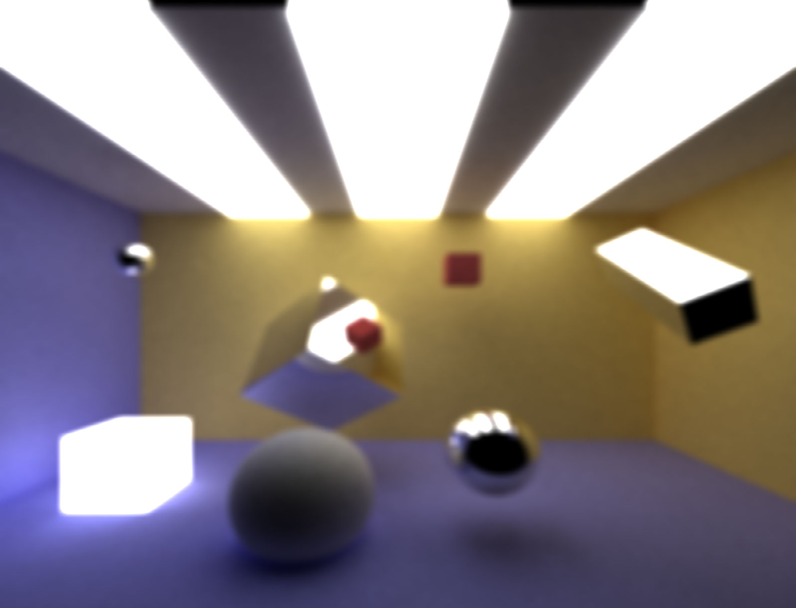

CUDA Denoiser
================

**University of Pennsylvania, CIS 565: GPU Programming and Architecture, Project 4**

* Di Lu
  * [LinkedIn](https://www.linkedin.com/in/di-lu-0503251a2/)
  * [personal website](https://www.dluisnothere.com/)
* Tested on: Windows 11, i7-12700H @ 2.30GHz 32GB, NVIDIA GeForce RTX 3050 Ti

## Introduction

One major problem with Path tracing is that the completed image can often be noisy or grainy. This issue is amplified with scenes where rays are unlikely to hit the light: scenes with small lights, with a lot of geometry, etc. On top of that, the number of path trace iterations reaches a point of diminishing returns. The difference betweeen 500 and 1000 samples per pixel is not always obvious. 

In this project, I implemented an Edge-avoiding A-Trous Wavelet Transform filter for noisy path-traced images. **The goal here is to reduce the number of samples-per-pixel/pathtracing iterations needed to obtain an acceptably smooth image.** The input to this function is a complete path-traced image, and the output is a denoised version of the image where large blocks of the same color will see less black specks. The following is a sample of the output when there is only 1 iteration on Pathtrace vs. when there are 100 Iterations. It can be seen that the denoised version of the first set of images is still noisy compared to the denoised version of a more converged image.

| Original 1 Iteration   | Denoised 1 Iteration |
| ----------- | ----------- | 
|   |      |

| Original 100 Iteration | Denoise 100 Iterations | 
| ----------- | ----------- |
|   |    |

For the above images, I used the following settings:
- Filter Size: 80
- Color Weight: 200
- Normal Weight: 0.05
- Position Weight: 4
- Kernel Size: 5x5 

## Core Features

#### Simple Blurring

The first step in implementing Edge Avoiding ATrous Denoising is to average each pixel's neighboring color without taking any weights into consideration. (This is very similar to implementing Gaussian blur, except there is no kernel of weights). We simply divide the sum of all neighboring colors by the number of neighbors. In my case, I use a 5x5 area around the pixel as its neighbors.

| Original | Simple Blurring | Photo Editing Software Blur
| ----------- | ----------- | ----------- |
|   |    | 

#### Geometry Buffers: Position, Normal, and Time To Intersect

For debugging purposes, we also have to implement a GBuffer which contains information about each pixel that we will use to calculate edge-avoidance later on. For the purposes of this project, I created a GBuffer struct that stores glm::vec3 for position and normal, and a float representing the time it took for the intersection to happen on that pixel.

| Position | Normal | Time to Intersect
| ----------- | ----------- | ----------- |
|   |    | 

#### Edge-Avoiding ATrous Denoising (As seen on a simple scene)

Now that we have information from blur and the GBuffer, I followed the implementation details suggested by the following paper: [Edge-Avoiding À-Trous Wavelet Transform for fast Global Illumination Filtering](https://jo.dreggn.org/home/2010_atrous.pdf). 

Like Gaussian blur, we will use a kernel of weights to average out each neighboring pixel's contribution. However, we will also "expand" the kernel by applying these kernel values to gradually further and further apart neighbors, as shown in the diagram below:

I added a new function that would denoise the output image rather than show the original image. This function only gets called when the number of pathtrace calls has reached its limit. This function will take as an input the final rendered result of the scene. Each pixel will expand its kernel over a set size (filter size) to add and average these neighboring pixels based on weights from the kernel. 

| Original (50 Iterations) | Denoised (50 Iterations) |
| ----------- | ----------- |
|   |    |

## Performance Analysis

- how much time denoising adds to your renders
- how denoising influences the number of iterations needed to get an "acceptably smooth" result
- how denoising at different resolutions impacts runtime
- how varying filter sizes affect performance

In addition to the above, you should also analyze your denoiser on a qualitative level:

- how visual results vary with filter size -- does the visual quality scale uniformly with filter size?
- how effective/ineffective is this method with different material types
- how do results compare across different scenes - for example, between `cornell.txt` and `cornell_ceiling_light.txt`. Does one scene produce better denoised results? Why or why not?

Note that "acceptably smooth" is somewhat subjective - we will leave the means for image comparison up to you, but image diffing tools may be a good place to start, and can help visually convey differences between two images.

## Bloopers! :)

