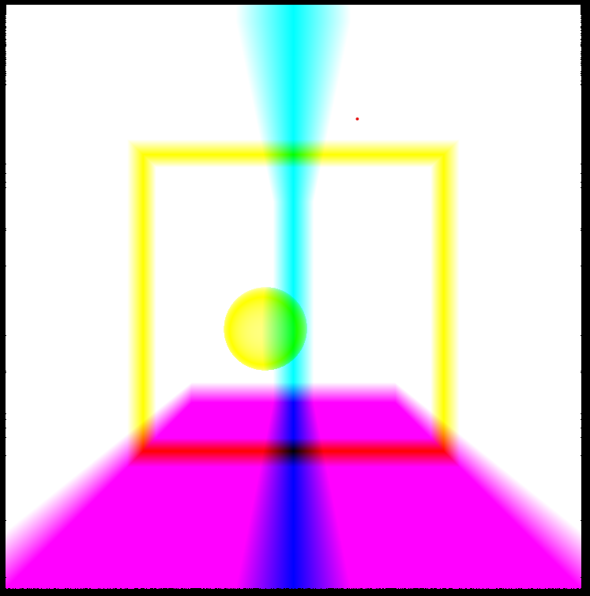

CUDA Denoiser For CUDA Path Tracer
==================================

**University of Pennsylvania, CIS 565: GPU Programming and Architecture, Project 4**

  
An implementation of a pathtracing denoiser that uses geometry buffers (G-buffers) to guide a smoothing filter, based on   "Edge-Avoiding A-Trous Wavelet Transform for fast Global Illumination Filtering," by Dammertz, Sewtz, Hanika, and Lensch. https://jo.dreggn.org/home/2010_atrous.pdf.  
Normal and position information is stored in a gBuffer generated on the first bounce of a raytrace, this information is then used detect edges and apply a B3 smoothing with weights to denoise an image.
* Tom Donnelly
  * [LinkedIn](https://www.linkedin.com/in/the-tom-donnelly/)
* Tested on: Windows 11, AMD Ryzen 9 5900X, NVIDIA GeForce RTX 3070 (Personal Desktop)

---
## Runtime
Denoising on a 800x800 image add around 5 μs to generate a gBuffer and ~1000 - ~5000 μs to denoise an image depending on filter size.

## Iterations for a Smooth Image
Taking a smooth image as one where the image is visable and there is little noise:  

|cornell\_ceiling\_light|        |cornell|        |dof|        |
|-----------------------|--------|-------|--------|---|--------|
|raw                    |denoised|raw    |denoised|raw|denoised|
||     |     |     ||     |

In general, images with lots of light like cornell_ceiling_light converge much faster and can have better denoising results. This is likely due to more image light information being available at lower iterations and less gradient colors which leads to easier blending. As dof and cornell are much darker than cornell_ceiling_light, more iterations are required to get a useful denoising. 

## Resolution Runtime
Testing done with a filtersize of 80.

Increasing resolution significantly increases denoising time, as a larger gBuffer must be used and more pixels need to be iterated over as resolution increases this makes sense.  

Increasing just the vertical resolution of an image gives worse performance than increasing just the horizontal resolution. This is due to memory and array access patters being row alined, a higher vertical resolution means accessing more non-sequential data in the gBuffer and image buffer.

## Filtersize Runtime
  
Increasing filter size increases denoiser runtime. This increase drops off for large filter sizes as for an 800 x 800 image, these pixels will be outside the bounds of the image and not processed. As a larger filter size means more iterations of denoising this makes sense.

## Filter Size
Filter sizes: cornell_ceiling_light 10 iterations  

| 20  | 40  | 80  | 160 | 320 |
| --- | --- | --- | --- | --- |
|  |  |  |  |  |  

Increasing filtersize helps with denoising to a point by smoothing surrounding colors, around filtersize 80. After this a larger filtersize caused the image to blur and creates normal and position artifacts from sampling much further pixels than those surrounding the original.

## Across Different Images
Lower Light Images have general worse denoising results than well lit images, leading to much more noise.

  
Denoising alos does not have much of an impact after many iterations leading to little change in images
500 Iterations:  
Raw:  
  
Denoised:  
  

## Debug
Visualtion of gBUffers:  

  
## Bloopers
   
Not clamping normals

