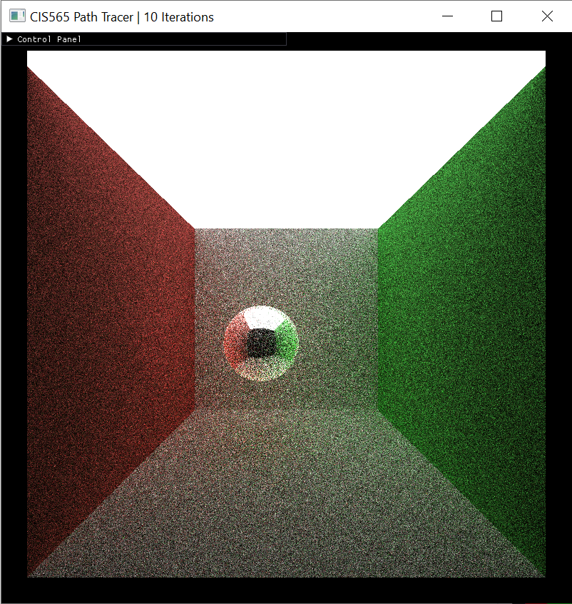

CUDA Denoiser For CUDA Path Tracer
================

**University of Pennsylvania, CIS 565: GPU Programming and Architecture, Project 4**

* Haoquan Liang
  * [LinkedIn](https://www.linkedin.com/in/leohaoquanliang/)
* Tested on: Windows 10, Ryzen 7 5800X 8 Core 3.80 GHz, NVIDIA GeForce RTX 3080 Ti 12 GB

# Overview
This project is a CUDA-based pathtracing denoiser that uses geometry buffers (G-buffers) to guide a smoothing filter. It is based on the paper "Edge-Avoiding A-Trous Wavelet Transform for fast Global Illumination Filtering" and it helps produce a smoother appearance in a pathtraced image with fewer samples-per-pixel. 

Denoiser Off | Denoiser On
:----------:|:-----------:
 |  

# Table of Contents  
* [Features](#features)   
* [Performance Analysis](#performance)   
* [Reference](#reference)

# <a name="features"> Features</a>
### Core features
* G-Buffer Visualization

We use normal/position/and time to intersect data (per pixel) as weight to avoid edges when applying blurs.   
These data can be visualized by clicking `Show GBuffer` on the GUI. And the user can switch between different data type by pressing 0 for time to intersect, 1 for position, and 2 for normal. 

|Normal | Position | Time to Intersect |
|:-----: | :-----: |:-----: |
| |  |  |

* A-Trous Filtering

A-Trous Filtering is the key to our high-performance denoiser. Instead of sampling all the neighboring pixels in the radius like Gaussian blur, A-Trous Filtering iteratively applying sparse blurs of increasing size. By doing so, it can achieve a comparable result to a big filter with a small filter. 

|No Filter | Filter Size = 16 | Filter Size = 64 |
|:-----: | :-----: |:-----: |
| |  |  |

* Edge-Avoiding Filtering

Although A-Trous Filtering clears the noise effectively, the details and focus of the image are also blurred. We want the image to be able to preserve key details. With the information from the G-buffer, we can do this by avoiding blurring the edges. When there is a sharp change in position/normal/depth, there is usually a change in edge. By decreasing the blurring weight on the edges, the denoiser satisfy its purpose effectively. 

|No Filter | A-Trous (64) | A-Trous with Edge-Avoiding (64) |
|:-----: | :-----: |:-----: |
| |  |  |

### Additional features
* Gaussian Filtering

As mentioned above, Gaussian Filter blurs an image by sampling all the neighboring pixels of each pixel, and compute its new color by taking the weighted average of them, with the closer pixels having a higher weight.    
According to my own result, Gaussian Filter seems to produce a blurrier image with edge-avoiding turned off, and it produce a slightly noisy image with edge-avoiding turned on.

|No Filter | A-Trous (64)  | Gaussian (64) |
|:-------: | :-----------: |:------------: |
| |  |  |
| Edge-Avoiding |  |  |

# <a name="performance">Performance Analysis</a>
* How much time denoising adds to the renders
* how denoising influences the number of iterations needed to get an "acceptably smooth" result
* how denoising at different resolutions impacts runtime
* how varying filter sizes affect performance
* how visual results vary with filter size -- does the visual quality scale uniformly with filter size?
* how effective/ineffective is this method with different material types
* how do results compare across different scenes - for example, between `cornell.txt` and `cornell_ceiling_light.txt`. Does one scene produce better denoised results? Why or why not?
* A-Trous vs. Gaussian Filtering

# <a name="reference">Refrence</a>
* [Edge-Avoiding A-Trous Wavelet Transform for fast Global Illumination Filtering](https://jo.dreggn.org/home/2010_atrous.pdf)
* [Spatiotemporal Variance-Guided Filtering](https://research.nvidia.com/publication/2017-07_Spatiotemporal-Variance-Guided-Filtering%3A)
* [A Survey of Efficient Representations for Independent Unit Vectors](http://jcgt.org/published/0003/02/01/paper.pdf)
* ocornut/imgui - https://github.com/ocornut/imgui
