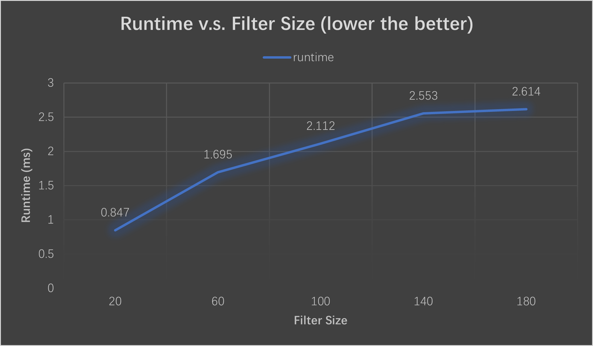

CUDA Denoiser For CUDA Path Tracer
==================================

**University of Pennsylvania, CIS 565: GPU Programming and Architecture, Project 4**

* Runshi Gu
  * [LinkedIn](https://www.linkedin.com/in/runshi-gu-445648194/)
* Tested on: Windows 10, AMD Ryzen 7 5800X 8-Core Processor @ 3.80 GHz 32GB, RTX3070 24538MB, Personal

PathTrace output with 2 iterations                |  Denoised output       
:------------------------------------:|:----------------------------------:
     |        

# Performance Analysis

### How much time denoising adds to your renders
According to the test analysis, the cost added by denoising is varying between 0.8 ms to 20 ms mainly depending on the resolution.

### How denoising influences the number of iterations needed to get an "acceptably smooth" result
The total number of iterations needed to get a visually smooth result is dramatically reduced.

Denoised image with 10 iterations     |  Path tracer with 1000 iterations       
:------------------------------------:|:-----------------------------------------:
   |    

### How denoising at different resolutions impacts runtime
The denoising time increases proportionally to the increase in render resolution.

 

### How varying filter sizes affect performance
The performance gets affected more obviously during the early increase in filter size than later: when the filter size gets big enough, the general runtime will relatively stay the same.
 

### How visual results vary with filter size -- does the visual quality scale uniformly with filter size?
When filter size is small (<80), inscrease in filter size would produce visually more smooth image. However, when the filter size gets bigger (>80), the visual quality doesn't scale that much. 

Filter Size 20                   |  Filter Size 40                  |Filter Size 60                    |  Filter Size 80                  | Filter Size 100                   |  Filter Size 120                  
:-------------------------------:|:--------------------------------:|:--------------------------------:|:--------------------------------:|:---------------------------------:|:--------------------------------: 
   |    |    |    |    |  

### How effective/ineffective is this method with different material types
As we can see in comparison below, diffuse walls are very effectively denoised; however, specular surface such as this sphere is blurred and ineffectively denoised. 

Denoised Image                        |  Path traced Image      
:------------------------------------:|:-----------------------------------------:
   |   

### How do results compare across different scenes - for example, between cornell.txt and cornell_ceiling_light.txt. Does one scene produce better denoised results? Why or why not?
The scene with better lighting is better denoised. I deduce that is beacuse with great lighting, the original 10-iteration image has less noise than the 10-iteration image from poor lighting, so that denoiser can interpolate pixels more accurately.

Good Lighting                         |  Poor Lighting     
:------------------------------------:|:-----------------------------------------:
   |   