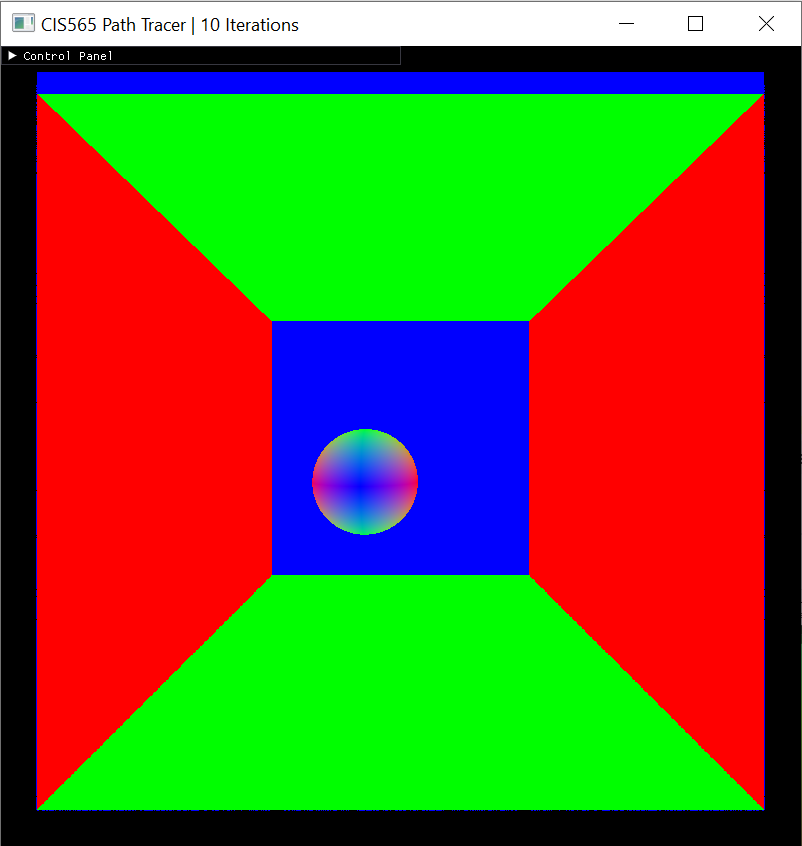

CUDA Denoiser For CUDA Path Tracer
================

**University of Pennsylvania, CIS 565: GPU Programming and Architecture, Project 4**

* Haoquan Liang
  * [LinkedIn](https://www.linkedin.com/in/leohaoquanliang/)
* Tested on: Windows 10, Ryzen 7 5800X 8 Core 3.80 GHz, NVIDIA GeForce RTX 3080 Ti 12 GB

# Overview
This project is a CUDA-based pathtracing denoiser that uses geometry buffers (G-buffers) to guide a smoothing filter. It is based on the paper "Edge-Avoiding A-Trous Wavelet Transform for fast Global Illumination Filtering" and it helps produce a smoother appearance in a pathtraced image with fewer samples-per-pixel. 

Denoiser Off | Denoiser On
:----------:|:-----------:
 |  

# Table of Contents  
* [Features](#features)   

* [Performance Analysis](#performance)   
* [Reference](#reference)

# <a name="features"> Features</a>
### Core features
* **G-Buffer Visualization**

We use normal/position/and time to intersect data (per pixel) as weight to avoid edges when applying blurs.   
These data can be visualized by clicking `Show GBuffer` on the GUI. And the user can switch between different data type by pressing 0 for time to intersect, 1 for position, and 2 for normal. 

|Normal | Position | Time to Intersect |
|:-----: | :-----: |:-----: |
| |  |  |

* **A-Trous Filtering**

A-Trous Filtering is the key to our high-performance denoiser. Instead of sampling all the neighboring pixels in the radius like Gaussian blur, A-Trous Filtering iteratively applying sparse blurs of increasing size. By doing so, it can achieve a comparable result to a big filter with a small filter. 

|No Filter | Filter Size = 16 | Filter Size = 64 |
|:-----: | :-----: |:-----: |
| |  |  |

* **Edge-Avoiding Filtering**

Although A-Trous Filtering clears the noise effectively, the details and focus of the image are also blurred. We want the image to be able to preserve key details. With the information from the G-buffer, we can do this by avoiding blurring the edges. When there is a sharp change in position/normal/depth, there is usually a change in edge. By decreasing the blurring weight on the edges, the denoiser satisfy its purpose effectively. 

|No Filter | A-Trous (64) | A-Trous with Edge-Avoiding (64) |
|:-----: | :-----: |:-----: |
| |  |  |

### Additional features
* **Gaussian Filtering**

As mentioned above, Gaussian Filter blurs an image by sampling all the neighboring pixels of each pixel, and compute its new color by taking the weighted average of them, with the closer pixels having a higher weight.    
According to my own result, Gaussian Filter seems to produce a blurrier image with edge-avoiding turned off, and it produce a slightly noisy image with edge-avoiding turned on.

|No Filter | A-Trous (64)  | Gaussian (64) |
|:-------: | :-----------: |:------------: |
| |  |  |
| Edge-Avoiding |  |  |

# <a name="performance">Performance Analysis</a>
* **How much time denoising adds to the renders**

The denoiser is ran after the path tracer has generated an image, hence its runtime should be irrelevant to the complexity of the scene. It will only be affected by the resolution of the image and the filter size.    
My data proves this. For a 800x800 image, with a 80x80 filter size, the addtional runtime added by denoising shows no relation to the number of iteration. It always adds a small additional time at about 3.55 ms. In the following analysis, it will further show that the image resolution and filter size will affect how much time denoising adds to the renders.       

* **How denoising influences the number of iterations needed to get an "acceptably smooth" result**

It is worth mentioning that "acceptably smooth" is a very subjective feeling. Different people have different tolerance on the image noise. Also, some scenes and images are less obvious on noise due to color contrast, geometry composition, and etc.          
Testing the `cornell_ceiling_light` scene, without denoising, the image looks very smooth at 300 iterations. With denoising on, the image starts looking smooth at 60 iterations. This means that denoiser is able to reduce the number of iterations needed by **70%**.   
However, in the below cow scene, the denoised image only looks comparable to the original image (400 iterations) at around 200 iterations. The reduction is only **50%**.   
My conclusion is that it varies greatly by the scene itself, but overall denoising does help reduce the number of iterations needed signicantly. 

No Denoising, 200 iterations | Denoised, 60 iterations
:----------:|:-----------:
 |  

No Denoising, 400 iterations | Denoised, 150 iterations
:----------:|:-----------:
 |  

* **How denoising at different resolutions impacts runtime**

Since denoising operates on the final image, and the input size is depending on the number of pixels on the image, as the resolution quadruple (for example, from 200x200 to 400x400), the additional runtime is expected to be 4 times longer.   
However, according to my result, when the image size doubles, the runtime only increases by about 50%, and when the image size increased by 36 times (from 200x200 to 1200x1200), the runtime only increased by 7 times. So the runtime is not directly linearly proportional to the resolution, but higher resolution does result in slower runtime.   

* **How varying filter sizes affect performance**

As expected, the greater the filter size, the more runtime denoising will add, as more neighboring pixels are sampled for computing the new color for each pixel.       
The following chart is generated with the `cornell_ceiling_light` scene at 800x800 resolution.The addtional time is proportional to the filter size but not linearly.  

* **How visual results vary with filter size -- does the visual quality scale uniformly with filter size?**

The visual results of denoising do not scale uniformly with filter size. The following images are generated with the `cornell_ceiling_light` scene at 1 iteration.    
The visual improvement from 0 to 20 is tremendous, the improvement from 20 to 40 is noticeable, but from this point on, the visual improvements are very small.    

Filter Size = 0 | Filter Size = 20 | Filter Size = 40 | Filter Size = 60 | Filter Size = 80 | Filter Size = 100 |
:----------:|:-----------:|:-----------:|:-----------:|:-----------:|:-----------:|
 |  |  |  |  |  |  

* **How effective/ineffective is this method with different material types**
* **how do results compare across different scenes - for example, between `cornell.txt` and `cornell_ceiling_light.txt`. Does one scene produce better denoised results? Why or why not?**
* **A-Trous vs. Gaussian Filtering**

# <a name="reference">Refrence</a>
* [Edge-Avoiding A-Trous Wavelet Transform for fast Global Illumination Filtering](https://jo.dreggn.org/home/2010_atrous.pdf)
* [Spatiotemporal Variance-Guided Filtering](https://research.nvidia.com/publication/2017-07_Spatiotemporal-Variance-Guided-Filtering%3A)
* [A Survey of Efficient Representations for Independent Unit Vectors](http://jcgt.org/published/0003/02/01/paper.pdf)
* ocornut/imgui - https://github.com/ocornut/imgui
