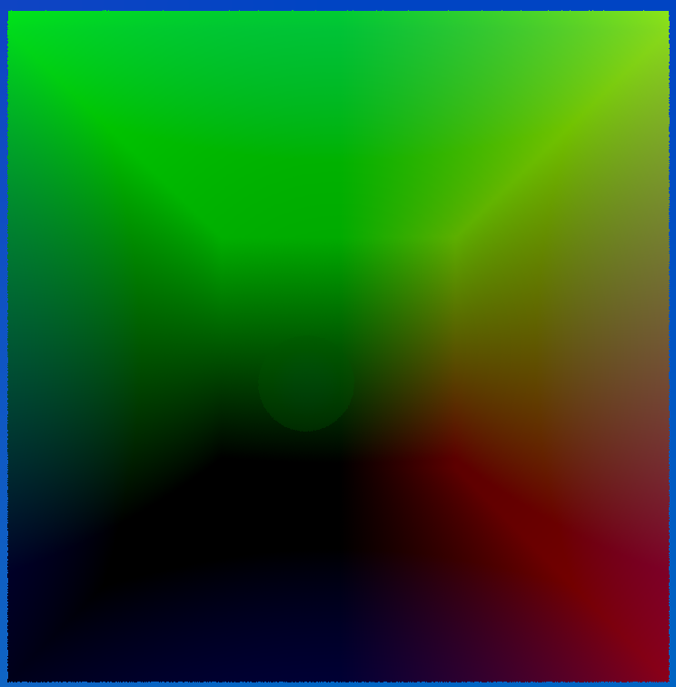
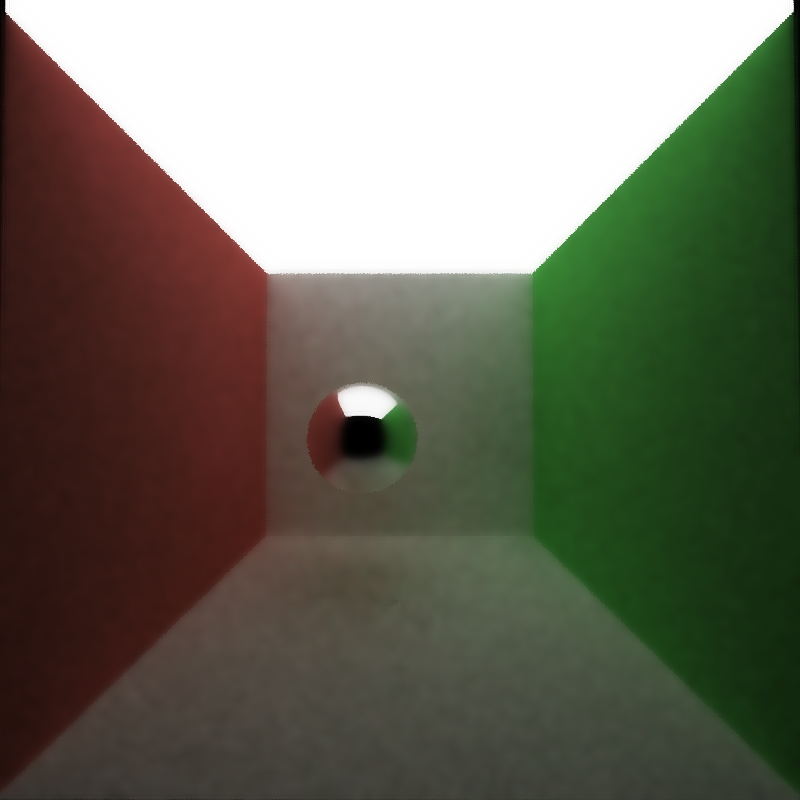

CUDA Denoiser For CUDA Path Tracer
==================================

**University of Pennsylvania, CIS 565: GPU Programming and Architecture, Project 4**

* Yiyang Chen
  * [LinkedIn](https://www.linkedin.com/in/yiyang-chen-6a7641210/), [personal website](https://cyy0915.github.io/)
* Tested on: Windows 10, i5-8700k @ 3.7GHz, GTX 1080, personal computer

### Gbuffer visualize

| normal | position | time-of-flight |
|---|---|---|
||||

### Denoise result

| no denoise | naive denoise | edge-avoiding denoise |
|---|---|---|
||||

P.S. the filter size of the 2 denoise images is 2, and color weight  0.45, normal weight 0.35, position weight 0.2

### Performance analysis

* how much time denoising adds to your renders

    * Rendering takes about 26000 microseconds and denoising takes only about 5 microseconds when the filter size is 10, which is very fast. 

* how denoising influences the number of iterations needed to get an "acceptably smooth" result

| no denoise (100 iterations) | denoise (20 iterations) |
|---|---|
|||

The above 2 images are a little different, but I think they are all smooth enough.

* how varying filter sizes affect performance
    * The time increases when filter size becomes larger.

* how visual results vary with filter size -- does the visual quality scale uniformly with filter size?

    * I found that filter size 1 is much more smooth than filter size 0 (no denoise), and when filter size is 1, 2, 4, 8, I can see the visual quality improves a little. However, when filter size is larger than 10, the visual quality seems almost the same. I think it's because the weight of the far pixel is very small.

* how effective/ineffective is this method with different material types

    * I think it's effective with the material that has no texture map or the color is almost the same. Because if the color change quickly in space with similar normal and position, the denoise function may blur the material a little.

* how do results compare across different scenes - for example, between cornell.txt and cornell_ceiling_light.txt. Does one scene produce better denoised results? Why or why not?
    
    * cornell_ceiling_light.txt produce better denoise results than cornell.txt in 10 iteration. I think it's because of the size of light, that is to say, a big light makes the rendering converge faster, so the denoise result is also better.

| cornell (10 iterations) | cornell_ceiling_light (10 iterations) |
|---|---|
|||