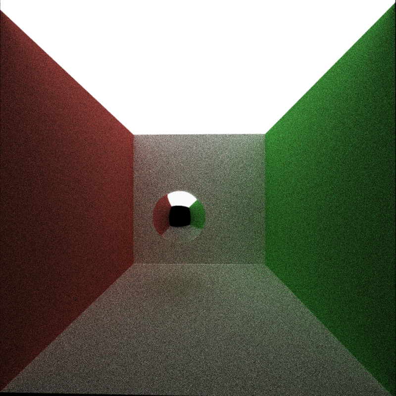
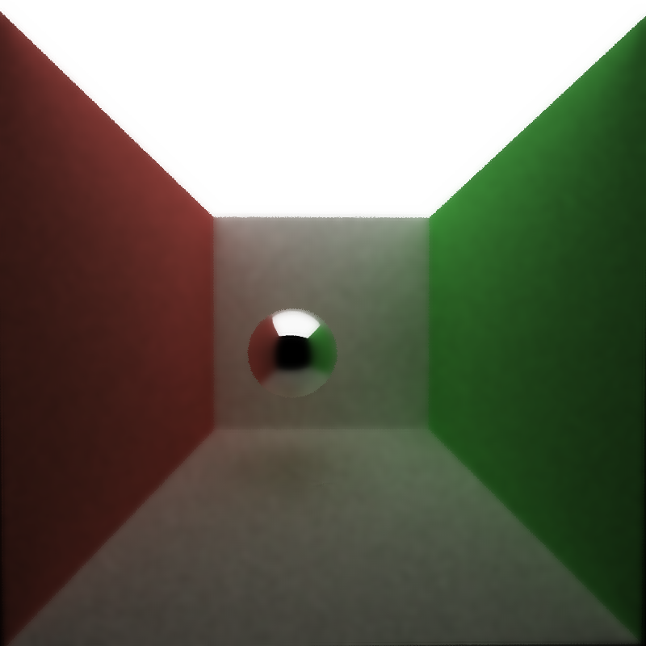
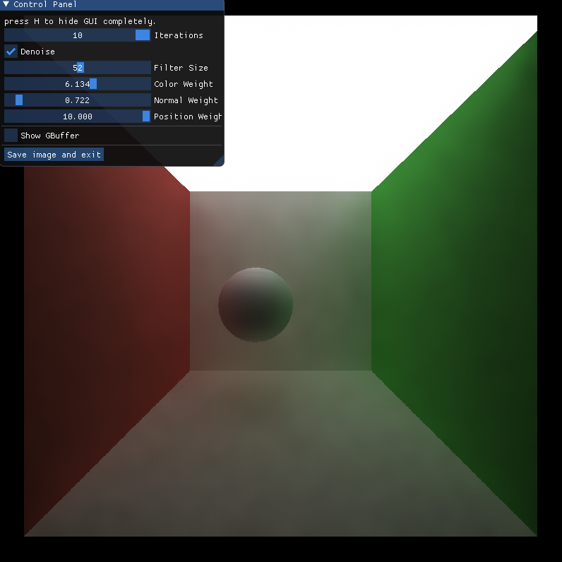

CUDA Denoiser For CUDA Path Tracer
==================================

**University of Pennsylvania, CIS 565: GPU Programming and Architecture, Project 4**

* Shineng Tang
  * [LinkedIn](https://www.linkedin.com/in/shineng-t-224192195/)
* Tested on: Windows 11, i9-10900k @3.7GHz 32GB, RTX 3090 24GB

# Proejct Description
This project is an edge-avoiding A-Trous Wavelet denoiser for the CUDA path tracer. It is an efficient approach for filtering a noisy sample.

## Features

### **G-Buffer visualization**

| Normal | Position | Time of Flight |
|---|---|---|
||||

These images include geometry information of the scene such as normals, intersection positions, and mapped them to RGB values.

### **Denoised Result (10 iterations)** 
| Raw Pathtraced  | Gaussian Blur | Denoised |
|---|---|---|
||||

## Performance Analysis
### **how much time denoising adds to your renders**
  
  For an 800 x 800 image, the denoiser adds approximately 1.2 ms per iteration to get to a visually acceptable image.
 
  
### **how denoising influences the number of iterations needed to get an "acceptably smooth" result**

| Raw Pathtraced at 200 iteration | Denoised at 20 iteraion|
|---|---|
|||

The denoiser can achieve a relatively acceptable image with a lot less iterations than a raw image. 
The example above shows that under the same resolution, the denoiser can get a decent result with only 20 iterations compared to 200 iterations for the raw pathtraced one. This is ten times less iterations needed to retrieve a nice looking result. This is very subjective.
### **how denoising at different resolutions impacts runtime**

From the chart above, when I quadruple the resolution, the time needed to denoise through one iteration is around to be tripled. Thus, I think this is a linear variation.

### **how varying filter sizes affect performance**

With the increase of the size of the filter, the amount of time to denoise also increases, but it is not linear. When the filter size reaches a certain threshold, the amount of time to denoise will not increase too much any more.

### **how visual results vary with filter size -- does the visual quality scale uniformly with filter size?**

| filter size 1  | filter size 10 | filter size 100 |
|---|---|---|
||||

With all the other weights set to the same, the image becomes more vague when I increase the size of the filter.

### **how effective/ineffective is this method with different material types**

| diffuse  | reflective | refractive |
|---|---|---|
||||

The denoiser works well on diffuse and reflective material, but for the refractive material, it blurs the inside of the material so it looks unclear.

### **how do results compare across different scenes - for example, between cornell.txt and cornell_ceiling_light.txt. Does one scene produce better denoised results? Why or why not?**

| cornell | cornell_ceiling_light |
|---|---|
|||

These two images are both rendered within 24 iterations and denoised with the same parameter. However, the result is very clear. From the comparison, I think the scene with a much bigger light will be better for the denoiser for it will converge the image faster. For the smaller light on the left, it looks like the denoiser does not work at all.