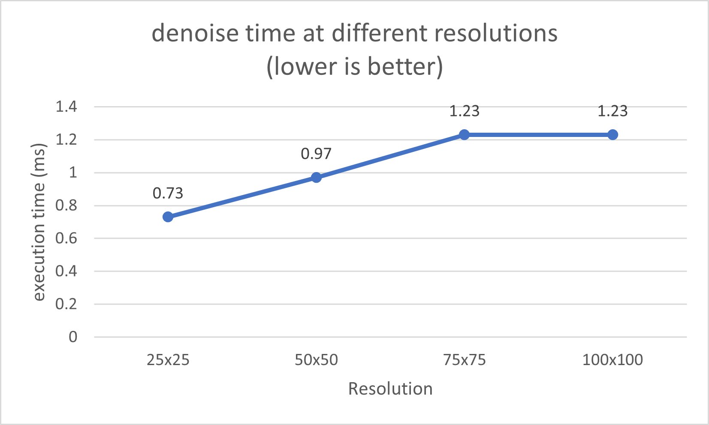
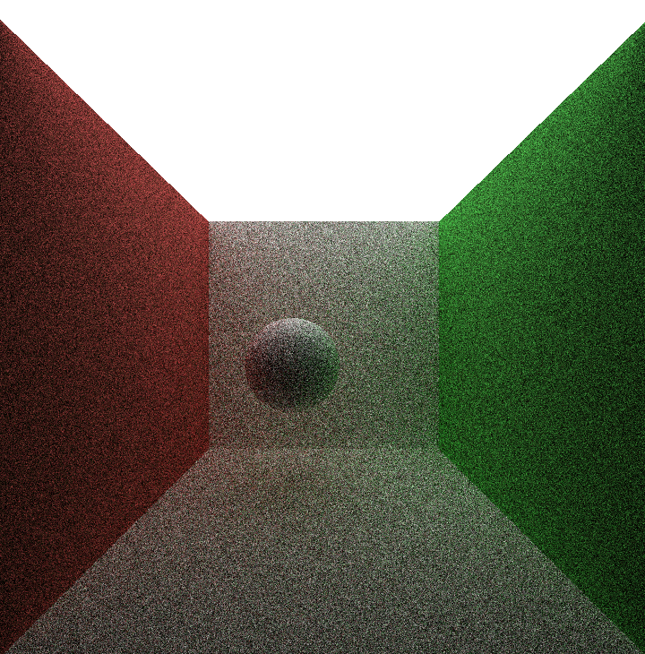

CUDA Path Tracer
================

**University of Pennsylvania, CIS 565: GPU Programming and Architecture, Project 3**

* Guanlin Huang
  * [LinkedIn](https://www.linkedin.com/in/guanlin-huang-4406668502/), [personal website](virulentkid.github.io/personal_web/index.html)
* Tested on: Windows 11, i9-10900KF CPU @ 5.0GHz 32GB RAM, RTX3080 10GB; Compute Capability: 8.6

## Result

### Denoised image
By include the weights' influence in the convolution, we should see a "denoised" image.
A desirable result is produced by tuning the settings.
Original                       | Blur with Edge-Avoiding (Final Result)
:-------------------------:|:-----------:
     |  

### G-buffer
The normal and position data per-pixel are kept in the G-buffer for edge-avoiding weights.
Normal                     |  Position                    | Z-Depth 
:-------------------------:|:-------------------------:|:-----------:
          |        |     

## Performance Analysis

### How much time denoising adds to your renders
The additional time from denoising is independent of the number of path tracing iterations as the denoising kernel is only executed once during the final iteration. Roughly, the denoising procedure adds **0.81ms** to the path tracer in release mode.
 

### How denoising influences the number of iterations needed to get an "acceptably smooth" result
With only 10 iterations and denoising, we can get a decently "smooth" result comparing to the 5000 iteration "ground truth"
10 iterations                     |  denoised                    | 5000 iterations (ground truth) 
:-------------------------:|:-------------------------:|:-----------:
          |        |     

### How denoising at different resolutions impacts runtime
The denoising time increases in a approximately linear fashion as image resolution increases. 
  

### How varying filter sizes affect performance
With bigger filters, it takes longer to denoise. Expanding the kernel to encompass the filter/blur size requires additional passes and iterations as the filter size grows.

 

### Z-depth and oct-encoding normal VS original implementation
The z-depth doesn't display a significant performance upgrade, and the oct-encoding normal actually worsen the performance. It might be the fact that the encoding process actually takes more time than leaving the original normal. A much more complicated scene might make use of this feature.
 

## Visual Analysis
### How visual results vary with filter size -- does the visual quality scale uniformly with filter size?

We can observe from the images below that the visual quality gets better as the filter size increases.
They do not, however, scale consistently. The transition from 5x5 to 30x30 is obvious. From 30x30 to 60x60, the difference is more negligible, and from 60x60 to 100x100, it is scarcely perceptible.

5x5    |30x30                      |  60x60                     | 100x100
:-----:|:-------------------------:|:-------------------------:|:-----------:
|   |        |  

### How effective/ineffective is this method with different material types

The approach works well with diffuse materials but less well with reflecting ones.
The denoised result for the diffuse scene is more alike as the actual version, as seen below.
However, there are observable blurring in the reflected surface in the specular scene.

Material Type | Original             |  Denoised                 
:------------:|:------------------:|:-------------------------:
Diffuse       |   |       
Specular      |   |  

### How do results compare across different scenes? Does one scene produce better denoised results? Why or why not?

The path traced output after 10 iterations for the basic Cornell scenario with a lower light volume will make the denoise artifact more conspicuous, but generally good enough.
10 iterations                     |  denoised                    | 5000 iterations (ground truth) 
:-------------------------:|:-------------------------:|:-----------:
          |        |     