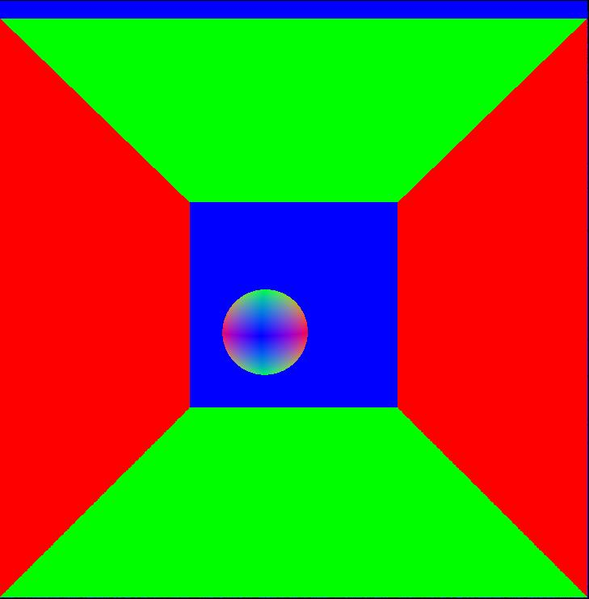

CUDA Denoiser For CUDA Path Tracer
==================================

**University of Pennsylvania, CIS 565: GPU Programming and Architecture, Project 4**

* Shixuan Fang
* Tested on: Windows 11, i7-12700kf, RTX 3080Ti

# Project Overview

| Original      | Denoised      |
| ------------- |:-------------:|
|||

In this project, I implemented a pathtracing denoiser using A-trous wavelet filter.

A-trous is an approximation of gaussian blur by iteratively applying sparse blurs of increasing size, which significantly reduce the number of pixel read.

## G-Buffer
 
In order to use A-trous filter to denoise the result while preseving edges, we need extra information other than the path traced image. 
 
|Normal|Position|
|------|:-------:|
| | |

## Performance Analysis

- how much time denoising adds to renders

As seen in this figure, denoising only adds 2-3ms to the render, which is considered good enough for real-time rendering.

- how denoising influences the number of iterations needed to get an "acceptably smooth" result

|2spp|10spp|Ground Truth|
|------|:-------:|:-------------:|
| | | |

As seen in this table, 10spp with denoising is acceptably smooth compared to the ground truth(5000spp).

- how denoising at different resolutions impacts runtime

As seen in this chart, with the increasement of screen resolution, the runtime of denoising also increases. This makes sense as there are more pixels to be considered, and A-trous filter needs more iterations to finish the whole picture, therefore denoising takes more time.

- how varying filter sizes affect performance

As seen in this chart, when filter size increases the runtime of denoising also increases. This also caused by the same reason, which is with filter size increases, the A-trous filter needs more iterations, therefore increases denoising time.

- how visual results vary with filter size

|1|16|32|100|
|------|:-------:|:--------:|:--------:|
| | | | |

This table shows how the denoised image looks with 1/16/32/80 filter size. The visual quality does increase from 1 to 16 and 16 to 32, but from 32 to 100 there aren't too much difference.

- how effective/ineffective is this method with different material types

|diffuse|specular|
|------|:-------:|
| ||

As seen in this table, A-trous works better with diffuse object in my opinion, as with specular objects it will blur the reflection face, which will result in a very blury surface. This is because position buffer and normal buffer can't really help split the edges on the same surface.

- how do results compare across different scenes 

|cornell|cornell_ceiling|
|------|:-------:|
| ||

As seen in this table, with same parameters, cornell_ceiling scene looks better and smoother than the cornell scene. This is because it has a larger light source, therefore making path tracing converge faster than small light source. Better path traced image will definitely makes denoised image better.
