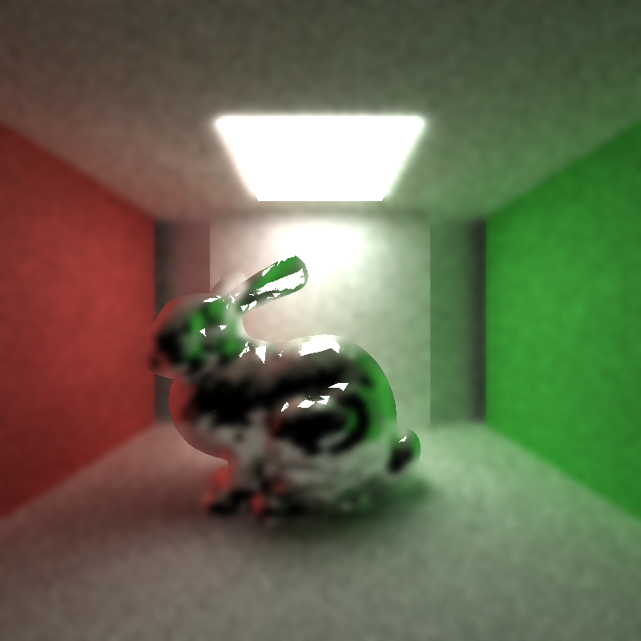

CUDA Path Tracer Denoiser
================

**University of Pennsylvania, CIS 565: GPU Programming and Architecture, Project 4**

* Yilin Liu
  * [LinkedIn](https://www.linkedin.com/in/yilin-liu-9538ba1a5/)
  * [Personal website](https://www.yilin.games)
* Tested on personal laptop:
  - Windows 10, Intel(R) Core(TM), i7-10750H CPU @ 2.60GHz 2.59 GHz, RTX 2070 Max-Q 8GB

Overview
=============

In this project I implemented a pathtracing denoiser that runs on CUDA and directs a smoothing filter using geometry buffers (G-buffers). It helps provide a smoother appearance in a pathtraced image with fewer samples per pixel and is based on the study "Edge-Avoiding A-Trous Wavelet Transform for rapid Global Illumination Filtering."

Features
=============
* A-Trous denoiser
* G Buffer visualization

Performance Analysis
============
**Additional Time for Each Frame**

The additional time varies from 1ms to ~10ms depending on the resolution. In a typical frame of 800x800, the average denoising time is 3ms.

**How denoising influences the number of iterations needed to get an "acceptably smooth" result**

A denoised image with 30 iteratiions could qualify the naive path traced image with 1000 iterations!

| 30 samples denoised image | 1000 samples naive image |
:-------:|:-------:
|| |

**How denoising at different resolutions impacts runtime**

From the table below, we could see that the time for denoising increases linearly as the resolution increases. However, when the filter size reaches 80, the time becomes almost constant. 

  | Denoising time vs Resolution |
|:--:|  
 ||
 
**How varying filter sizes affect performance**

The effect of filter size increases initially and goes down later. 

  | Denoising time vs Resolution |
|:--:|  
 ||

**how visual results vary with filter size -- does the visual quality scale uniformly with filter size?**

We can see from the table below that while the filter size is below 30, the denoise effect is not significant enough. When the filter size goes large, the background is blurred. Therefore, the ideal range of an efficient filter size should be between 30 to 60.

| Filter Size | Image |
:-------:|:-------:
|5| |
|10| |
|20| |
|30| |
|40| |
|50| |
|60| |
|70| |
|80| |
|90| |
|100| |

**how effective/ineffective is this method with different material types**

We can see that the denoiser works fine on alll types of materials except that the refractiion could be blurred a little bit. 

| Materials | Orignial Image| Denoised Image |
:-------:|:-------:|:-------:
|Diffuse| | |
|Specular| | |
|Refractive| | |

**How do results compare across different scenes - for example, between cornell.txt and cornell_ceiling_light.txt. Does one scene produce better denoised results? Why or why not?**

In my case, the denoiser works better in brighter scene. The reason is, with a light that has a larger areas, more paths fall onto the light source within a limited number of iterations and the scene converges faster. As a result, there are less noises inherently in the scene and leave less work for the denoiser whose performance could significantly be influenced by the initial conditions.  

**Other scenes**

We can see from the table below that the denoiser fails to work to render a bunny with ~50 samples. The reason could be that too many triangles with different information are concentreted in a small range. The problem can be mitigated when we switch to a small size filter.

 
| Bunny with 50 samples | Denosied Bunny with Filter Size 60 | Denosied Bunny with Filter Size 25 |
:-------:|:-------:|:-------:
|| | |

**G Buffers**

| World Normal | Position |
:-------:|:-------:
|| |

Bloopers
===============
  | *G-Buffer Position Fail* |
|:--:|  
 ||
 

  | *G-Buffer Position Fail2* |
  |:--:|
  ||
   
Reference
===============
* [Edge-Avoiding A-Trous Wavelet Transform for fast Global Illumination Filtering](https://jo.dreggn.org/home/2010_atrous.pdf)

* [imgui]( https://github.com/ocornut/imgui)