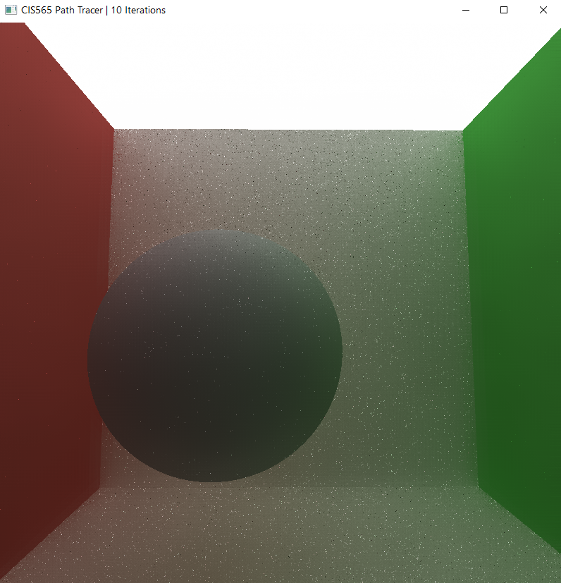

CUDA Denoiser For CUDA Path Tracer
==================================

**University of Pennsylvania, CIS 565: GPU Programming and Architecture, Project 4**

Jiajun Li

Linkedin: [link](https://www.linkedin.com/in/jiajun-li-5063a4217/)

Tested on: Windows 10, i7-12700 @ 2.10GHz, 32GB, RTX3080 12GB

CUDA Compute Capability: 8.6

## **Overview**
This project implements a CUDA denoiser using ATrous filter. 

ATrous denoising is a denoise method that can identify edge by pixel colors, normals and positions.

The implementation is based on [this paper](https://jo.dreggn.org/home/2010_atrous.pdf).

## **Result**

Overall, ATrous filter produces a noticeably less noisy iamge than the raw path tracer output. I also included a basic Gaussian filter that runs the same iteration times as the ATrous filter for comparison purpose.

### **Basic Diffuse Scene**

| Original Image | Gaussian Blur | Denoised Image |     
| ---------------------------------| ----------------------------------| ----------------------------------
|    | |   |

### **Basic Specular Scene**

| Original Image | Gaussian Blur | Denoised Image |     
| ---------------------------------| ----------------------------------| ----------------------------------
|    | |   |

### **Basic Refraction Scene**

| Original Image | Gaussian Blur | Denoised Image |     
| ---------------------------------| ----------------------------------| ----------------------------------
|    | |   |

### **GBuffer of Base Specular Scene**

| GBuffer t | Normal | Position(scale down to 0.05) |     
| ---------------------------------| ----------------------------------| ----------------------------------
|    | |   |

## **Visual Analysis**

### **How filter size influences the result**

| Raw Image | Size 5 | Size 9 | Size 17 | Size 33 | Size 65 | Size 129 |     
| -- | -- | -- | -- | -- | -- | -- |
|    |  |  |  |  |  |  |

We can see that image looks more smooth with the increase of filter size. However, when filter size reaches certain degree, the image starts to look like oil painting and lost the sense of reality. This shows that we should carefully tunning the filter size for a best result rather than simply increasing the filter size to maximum. 

### **How denoising influences the number of iterations needed to get an "acceptably smooth" result**

| Path trace 16 iterations | After 5 denoise iteration | Path trace 1000 iterations |     
| ---------------------------------| ----------------------------------| ----------------------------------
|    | |   |

From the above chart we can see that even if we just apply 5 times of denoise for a 16 path trace result, the result image can be as acceptably smooth as path trace of 1000 iterations.

### **How denosing works with different material types**

- <b>For diffuse:</b> As we can see from the basic diffuse scene, denoiser can remove noise from a diffuse surface efficiently.

- <b>For perfect specular:</b> Since perfect specular preserve 100% of the surrounding information, denoising the specular surface will produce good result as denosing the surrounding.

- <b>For refraction:</b> After denosing, some of the detail (such as the bright part of the yellow bar in the Basic Refraction Scene) is missing.

### **How denosing works in different scenes**

While we can see that the denoiser works well in <I>cornell_ceiling_light</I> previously, there are situations that the denoiser will cause detail loss. For instance, in the gif above, we can see that some of the darker part (less light energy) will lose detail after denosing. This shows the denoiser might not work well for the secne of many detail and the lights are not bright enough.

## **Performance Analysis**

In this project, the relation of ATours filter iteration and filter size have the following relationship:

    iter = floor((filterSize - 1) * 0.5f)

This means iteration dose not scale with filter size uniformly. For simplisity, the follwing chart shows the filter size and the coresponding iteration which will be used in the analysis later.

|filterSize | iteration|
|--|--|
| 0 - 4  |   0|
| 5 - 8  |   1|
| 9 - 16 |   2|
| 17 - 32|   3|
| 33 - 64|   4|
| 65 - 128|  5|
| 129 - 256|  6|

Belows are the denoiser time consuming result for the basic diffuse scene in different resoltions: 

- <b>Time added:</b> For 800x800 resolution, the average time for 10 path trace iterations is 127 ms; for 1920x1080 resolution, the average time is 352 ms. So we can see that in both situations, the time added to denoise is approximately 1/3 to 1/2 of the time of 10 path trace iterations, and the denoiser can produce a much more smooth image. This shows denoising is a powerful tool to increase path tracer image quality at an acceptable low cost.

- <b>Impact of different filter sizes:</b> In both resolution situations, we can see that time increase in a relatively constant speed with the increase of filter iterations. For 800x800 resolution, the time added for increasing a iteration is around 3.2 ms; for 1920x1080 resolution, the time added is 

- <b>Impact of different resolutions:</b> We can see from the 2 graphs that the time to denoise will increase relatively proportional with the increase of resolution. This adheres to our intuitions since denoiser will process more pixels with higher resolutions.

---

CUDA Path Tracer
================

**University of Pennsylvania, CIS 565: GPU Programming and Architecture, Project 3**

Jiajun Li

Linkedin: [link](https://www.linkedin.com/in/jiajun-li-5063a4217/)

Tested on: Windows 10, i7-12700 @ 2.10GHz, 32GB, RTX3080 12GB

CUDA Compute Capability: 8.6

## **Overview**

This is a CUDA based Path Tracer project. It differs from traditional CPU based Path Tracer in applying  parallism for each ray and thus can coverging results in a much faster manner. 

## **Features**

The following features have been implemented for this project:

- Path Tracer Core Algorithm
- Refrection
- Metallic property control
- Stochastic Anti-Aliasing
- Obj Loading
- Texture Mapping with base color and normal map
- Bounding Volume Hierarchy to accelerate object rendering
- Spherical Skybox using raycast method

## **Path Tracer Core**

The core to utilize CUDA is to perform the same actions for all rays at the same time so we can devide path trace procedures into different CUDA kernels:

1. GenerateRayKernel: Shooting rays for each pixel from screen. 

2. IntersectionKernel: Perform rays intersection tests.

3. ShadeKernel: Accumulate ray color results along the way and add it to the final output.

Two of the basic diffuse and specular properties are implemented in this project. For diffuse property, spawned ray direction is randomly picked in the hemisphere. For specular, the ray direction is generated by perfect reflection.

## **Refraction**

Implemented using [Schlick's approximation](https://en.wikipedia.org/wiki/Schlick%27s_approximation#:~:text=In%203D%20computer%20graphics%2C%20Schlick's,(surface)%20between%20two%20media.). Since only one ray is traced for each pixel in one iteration, picking between reflection ray or refraction ray is achieved by comparing coefficients to a ramdon number. If the coefficent R for reflection is greater than the random number, then the program will trace reflection. Otherwise it will trace refraction ray.

### **Metallic and Specular Control**

Metallic property is implemented by coloring the reflection ray with material color. The metallilc coefficient measures the probability of the reflection ray colored by material color. The same idea applies to controling the amount of specular property. 

| Specular 0.2 | Specular 0.5 | Specular 1.0 |      
| ---------------------------------| ----------------------------------|----------------------------------|
|    |    | |

| Metallic 0.0 | Metallic 0.3 | Metallic 1.0 |      
| ---------------------------------| ----------------------------------|----------------------------------|
|    |    | |

### **Anti-Aliasing**

Anti-Aliasing is achieved by jittering the generated rays from camera so that each pixel can get more scene information from a larger scale.

| No Anti-Aliasing                 | Anti-Aliasing                     |                 
| ---------------------------------| ----------------------------------|
|    |    |

## **Obj Loading and Texture Mapping**

Load obj files with [tiny_obj_loader](https://github.com/tinyobjloader/tinyobjloader). The loaded obj will be assembled into triangles for intersection and shading later.

For textures, [stb_image](https://github.com/nothings/stb) are used to load base color textures and normal maps. Note that for normal maps, RGB values need to be converted into normal values first:

    normal = rgb * 2.0 - 1.0 

Another thing to be aware is that the read normal is in tangent space. A TBN matrix is then used to convert it to model space.

## **Bounding Volume Hierarchy**

This project mostly adapts the recursive Bounding Volume Hierarchy build method from [PBRT](https://www.pbr-book.org/3ed-2018/Primitives_and_Intersection_Acceleration/Bounding_Volume_Hierarchies#fragment-BVHAccelLocalDeclarations-1). The difference is that this program will construct a BVH for each obj insead of the whole scene. Algorithm can be described as the following:

1. Construct a BVH tree structure by dividing and assigning triangles to BVH nodes by Surface Area Heuristic method.

2. Convert the tree structure into a compact array by copying tree nodes into lienar BVH nodes.

3. Once the first two steps are done in CPU side, pass the linar BVH nodes array to device before iteration begins.

4. During intersection tests, the tests will only proceed when the rays hit the linear node bouding volume.

By skipping the unecessary intersection tests with out-of-bound trianlges, this method makes a great improvement in rendering speed. Belows are the performance analysis of BVH vs. no BVH:

### **Skybox**

This project implements a spherical skybox using raycast method. Ray hits skybox when it has no intersection with any of the objects in scene. Ray direction will then be converted into 2D UV coordinate by angular displacement. Finally the project uses the same sample methods from obj texturing to sample skybox texure. Note that this requires the skybox texture be spherically mapped beforehand. 

## **Future Improvements**

- HDR texture support. Currently the program does not support HDR image.

- G buffer. Currently the program renders objects in their loading orders and we need to manage their orders carefully for now.

- More texture mapping such as roughness and specular texture.

- More material properties. 

## **Bloppers**

Mistaken useage of n1, n2 in Schlick's approximation

Forgotting to transform barycentric coordinate into normal coordinate in ray triangle intersection tests

## **Additional Reference**

Bary Position: https://www.scratchapixel.com/lessons/3d-basic-rendering/ray-tracing-rendering-a-triangle/barycentric-coordinates

Normal Mapping: https://learnopengl.com/Advanced-Lighting/Normal-Mapping

