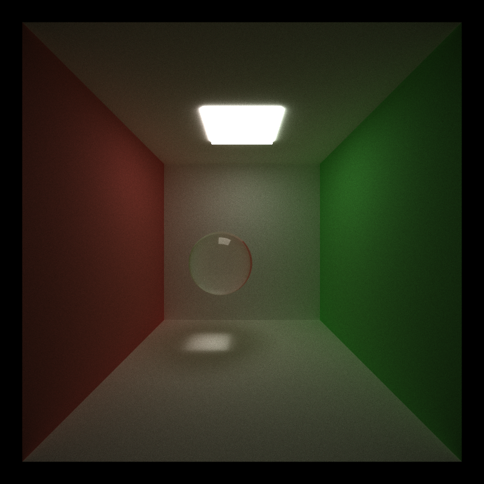

## 
 University of Pennsylvania, CIS 565: GPU Programming and Architecture 

# 
 CUDA Path Tracer 

* Shutong Wu
  * [LinkedIn](https://www.linkedin.com/in/shutong-wu-214043172/)
  * [Email](shutong@seas.uepnn.edu)
* Tested on: Windows 10, i7-10700K CPU @ 3.80GHz, RTX3080, SM8.6, Personal Computer 

## Overview

- In this project, I implemented GPU Path Tracer with multiple features using C++ and CUDA framework.

## Table of Contents
### Core Features 
- [Shading kernel with BSDF Evaluation for Diffuse and Specular](#shading-kernel-with-bsdf-evaluation-for-diffusespecularrefraction)
- [Path continuation/termination using Stream Compaction](#stream-compaction--ray-sorting--first-bounce-caching)
- [Toggleable ray sorting/first-bounce caching](#stream-compaction--ray-sorting--first-bounce-caching)
- [CUDA Denoiser](#denoising-showcase)

### Visual and Performance Features
- [Refraction](#shading-kernel-with-bsdf-evaluation-for-diffusespecularrefraction)
- [Physically-based Depth of Field](#depth-of-field)
- [Stochastic Sampled Antialiasing](#stochastic-anti-aliasing)
- [glTF mesh loading with AABB Bounding Box](#mesh-loading-and-texture-mapping)
- [Texture Mapping and Bump Mapping](#mesh-loading-and-texture-mapping)
- [Direct Lighting](#direct-lighting)
- [Naive Post Processing](#naive-post-processing)

### Shading Kernel With BSDF Evaluation for Diffuse/Specular/Refraction
The first part I did was to implement the basic BSDF evaluation, where reflection/refraction/diffusion are distributed based on every object's material, and refraction is distributed based on Fresnel's computation and Schlick's approximation. Here is a picture with three different kinds of material in it.

- Left: Diffuse Material Colored with Klein Blue 
- Middle: Perfect Specular 
- Right: Refractive with an index of refraction of 1.52(Glass)

Another Refraction: 

### Stream Compaction & Ray Sorting & First Bounce Caching
To make the path tracer more efficient, we did three optimizations: Stream Compaction, Ray Sorting, and First Bounce Caching.

Stream Compaction removes the unnecessary ray paths every iteration until every ray finishes its bounce. This saves a lot of computation from kernel and brings up the performance. I use thrust::partition to fulfill this step.

Ray sorting helps us sort the intersections based on materialId for memory coalescing. I use thrust::sort_by_key to do key-value sorting. The performance is significantly slowed down by the sorting process when the scene is comparatively simple(No mesh/texture loading), and is similar to the performance without sorting when the scene is very complex(multiple shapes, multiple meshes, and 100K+ Triangles)

First Bounce Caching let us cache the intersection data at the first bounce. Because in our method every ray starts at the same spot at the same pixel, the first bounce will save the first round computation for the later rays. I did not notice a significant improvement in performance with First Bounce Caching, but it still makes the performance better by 1 or 2 iterations per minute. 

### Depth of Field
Depth of Field is a technology we use to achieve the vision we want with a selected aperture radius and focal length. Objects located at the focal length within the aperture radius stay in focus, while others are blurred. (Tested with focal length 10, aperture radius 0.2)
DoF Off      |  Dof On | Another Dof
:-------------------------:|:-------------------------:|:---------------------:|
   |    | 

### Stochastic Anti-aliasing
To achieve anti-aliasing I jiggle the ray's direction with a small amount of value to smooth the sharp edge of every object. This only takes very little effort but ends in a huge visual improvement. 
Anti-aliasing Off      |  Anti-aliasing On
:-------------------------:|:-------------------------:
   |  

### Mesh Loading and Texture Mapping
- To include better scenes and objects in this project, I use tinyglTF to load glTF files. 
- This framework is really hard for first-time users(like me), So I put a lot of time into learning the framework and seeing how to import the mesh/texture. The hardest part probably is how to parse the data into GPU, since GPU does not support tinygltf classes. I construct similar classes in sceneStruct.cpp, so when we load the glTF file, we can copy and generate a GPU-compactible class in the program.
- The advantage of glTF over Obj is that it contains multiple materials/textures within an object, so you do not need to specify them in your program; with a correct implementation just specifying a file will give you the right model. Of course, there is more to glTF like animation/scene/node, but in this project we are only introduced to model loading.
- I use an AABB Intersection test to implement the culling and smooth the triangles on meshes with barycentric interpolation.

Before I fully understand how to use glTF and use cudaTextureObj to load textures, I also implement a method for a loaded mesh to use specified material.
This CesiumLogoTexture is manually specified as a material, then pointed to the box. Textures are loaded as vectors of floats in this scenario. Also here is a comparison of a procedural checkboard and a textured checkboard. The difference on the side I think is caused by implementation, and you can see procedural generated checkboard has more aliasing effect, while the textured one(after the anti-aliasing process) is smoother.
Textured       |  Procedural
:-------------------------:|:-------------------------:
   |  

### Direct Lighting
I implemented a basic version of direct lighting, where at the second last bounce every ray will change its direction, going towards a random position that consists of the light. To do this I will first do an iteration that will save the light's position to an array. This will cause performance to go down, but the visual effects are significantly different from normal path tracing.
Without Direct Lighting       |  With Direct Lighting
:-------------------------:|:-------------------------:
   |  

### Naive Post Processing
An RGB color tinting is also implemented using an extra shader.

## 
 University of Pennsylvania, CIS 565: GPU Programming and Architecture 

# 
 Path Tracer Denoiser 

* Shutong Wu
  * [LinkedIn](https://www.linkedin.com/in/shutong-wu-214043172/)
  * [Email](shutong@seas.uepnn.edu)
* Tested on: Windows 10, i7-10700K CPU @ 3.80GHz, RTX3080, SM8.6, Personal Computer 

In this Project, We Implement the Edge-Avoiding À-Trous Wavelet Denoiser for our previous Path-Tracer on Project 3.
- [ShowCase](#denoising-showcase)
- [Performance Analysis](#performance-analysis)

## Denoising Showcase
Denoise On      |  Denoise Off
:-------------------------:|:-------------------------:
   |  

## Performance Analysis
### Denoising Time Taken
We use cornell_ceiling_light/Basic/Penn as the scenes for testing denoise time. They represent different scene complexity. The filter sizes are all set to 100. The following results are the time taken for denoising.
Cornell_ceiling_light       |  Basic    |     DoF
:-------------------------:|:-------------------------:|:-------------------------:
   |    |  
1.98ms    |  4.49ms  |  5.35ms

- Complex scenes will take more time to do denoise since the three buffers needed for denoising are less consistent in value in complex scenes. And this is considered normal because complex scenes will always take more time to render than simple scenes. 
- Without denoising the Cornell_ceiling_light will take 40ms to do one sampling, so adding denoising does not add significant overhead to the whole rendering process especially when we need to render many iterations(and only one last-step denoising).

### Denoising Iterations Taken
Denoise On      |  Denoise Off
:-------------------------:|:-------------------------:
   |  
- The left image takes 150 ssp to look smooth on the edge, while the right image takes 250ssp to look smooth enough, even though it still has some noises that will only disappear after 500 iterations or more.
- A noticeable find is that when iterations are large enough for the image without denoising to become smooth, then turning on denoising will not improve visual performance too much. With this find, I think denoising is most useful when dealing with significant complex scenes like Sponza, where every iteration will take comparatively more time to render.

### Denoising at Different Resolutions
Still used Cornell_ceiling_light for this test; 
.png)
.png) 
In these two images we can see denoise time increases linearly as resolution increases since with more pixels to render on screen, both the main rendering and denoising will handle more work than before.

### Denoising with Different Filter Sizes
#### Visual Results
FilterSize15       |  FilterSize125    |     FilterSize300
:-------------------------:|:-------------------------:|:-------------------------
   |    |  

- For Small-Scale scenes like this one, filterSize below 100 and above 15 might be the best solution
- Big filterSize often smoothes too much and results in pixels getting smoothed out(a noticeable difference in the corners of the image)

#### Performance
.png)
- The time increases as filterSize increases, but in a log(n) pattern. It is simply because our iteration loop in the Atrous filter is a for loop with an iteration time of log2(filterSize).

### Denoising with different material types
Denoise On 100 SPP     |  Denoise Off 100 SPP   | Denoise On But With Big ColorWeight
:-------------------------:|:-------------------------:|:--------------------------:|
   |   | 

- From previous performance analysis, Specular Material works well with denoising;
- Perfectly diffuse material also works nicely as the wall in Cornell scene showed;
- For refractive material, it is not smoothed out nicely. At earlier iteration, its visual performance is somehow worse than the refractive sphere without denoising. It is also dependent on the color weights that we set; with inappropriate color weigh, the denoising effect will look less realistic.

### Denoising with different scenes
- During my experiment, I found scenes with more emissive/reflective materials will generate better denoising results, while scenes with refractive materials might not look that good or realistic with denoising. My assumptions are without refractive or rough materials rays will scatter less randomly, and with these materials, denoising might smooth out too many refracted nuanced rays.
- Complex scenes will take more time to denoise due to their variance in terms of object and material.

### Bloopers

 
This one is defined as a cube, but there is a space after cube("cube "), so it got generated as a sphere(Undefined behavior I assume)
 
Wrong Color Weight for denoising :)

