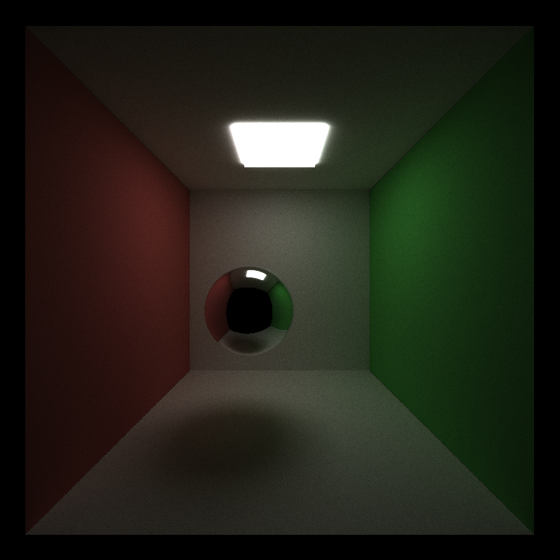

CUDA Denoiser For CUDA Path Tracer
================

**University of Pennsylvania, CIS 565: GPU Programming and Architecture, Project 3**

* Evan S
* Tested on: Strix G15: Windows 10, Ryzen 7 4800H @ 2.9 GHz, GTX 3050 (Laptop)

## Overview
This is introduces a denoiser for the [previous project, the CUDA Path Tracer](https://github.com/esiaero/CIS_565-Project3-CUDA-Path-Tracer). Denoising is intended to be used since running numerous iterations is often prohibitively slow. 

The denoiser implemented here is a very simple edge-avoiding blur-based algorithm, lifted from the paper [Edge-Avoiding À-Trous Wavelet Transform for fast Global
Illumination Filtering by Dammertz, et al.](https://jo.dreggn.org/home/2010_atrous.pdf).

The name À-Trous means "with holes" in French; our denoised image is produced by convoluting the base image with larger and larger blur kernels with larger and larger holes (0-value indices). See paper for in-depth explanation and refer to the previous project link for the base path tracer functionality.

## Denoiser Analysis

### Denoiser Visuals
The section uses a [rudimentary python program](./diff.py) to determine the difference between two images. This difference is output as a "diff" image, which demonstrates per-pixel difference between ground truth and the denoised version. The brighter/whiter a pixel in the "diff", the more correct it is.

#### Visual influence of material type on denoising output
Below, denoising is tested with a few different material types. Denoising is run on 100 iterations.

| Material | Diffuse | Specular | Dielectric(IOR = 1.52) | 
| :------- | :-------: | :-------: | :-------: |
| Truth |  |  |  |
| Denoised |  |  |  |
| Diff |  |  |  |

The results are all somewhat acceptable, but evidently diffuse suffers greatly in terms of pure pixel difference, from the dark spot. Visually, dielectric (reflective + refractive) seems to suffer greatly as well, as the smooth, shiny surface starts to look glossy due to the blurring. Nonetheless, all the results generally fare well.

#### Visual influence of number of iterations on denoising output
Comparing a basic Cornell scene, we look to try and roughly judge how many iterations are necessary for a result similar to "ground truth" (many iterations).

| Image | Ground truth | Denoised(20 iters) | Denoised(100 iters) |
| :----: | :----------: | :-----------------: | :-------------------: |
| Scene |  |  |  |
| Diff |  |  |  |

Note that at just 100 iterations, the number of pixels that are clearly not white are spread around or relatively bright, and by inspecting the image the difference between it and ground truth is not significant.  
Much of the ability for a denoised image to resemble ground truth is determined by the tunable weights(color, position, normal) and filter size.

#### Visual influence of filter size on denoising output
The size of the filter determines how "far" the denoising blur reaches. In the chart below the number in the parentheses indicates the log of the filter size. For example, "Denoised(4)" means a filter size of `2^4 = 16`. 

The below is denoised on 50 iterations of the Cornell scene.

| Image | No denoising | Denoised(1) | Denoised(5) |
| :----: | :--------: | :---------: | :------------: |
| Scene |  |  |  |

As expected, a greater filter size correlates with a "stronger" blur.

#### Visual influence of scenes on denoising output
Scenes that have a smaller wealth of light sources find it harder to converge in a short number of iterations. Here we compare denoising a Cornell box with a small vs big light at 100 iterations.

| Scene | Small light | Big light |
| :----: | :--------: | :---------: |
| Truth |  |  |
| Denoised |  |  |
| Diff |  |  |

As expected, with a smaller light at 100 iterations, less of the scene is developed, giving the denoiser less to work with. The worse denoised output for the smaller light source as shown above is the consequence.

### Denoiser Performance
The denoiser is run on the noisy output image, so it is independent of things like number of iterations run by the path tracer prior to denoising. As demonstrated by the below sections, the denoiser runs in a matter of microseconds; the time added by denoising is negligible. All benchmarks are made on the same Cornell scene (see above visual analysis for visual).

#### Time added by denoising with respect to filter sizes

To the left is a chart to roughly show the linear relation between runtime and log of the stride/filter size (the log of stride/filter size determines the number of denoising CUDA kernel launches). Note the trivial runtime. 

 

#### Time added by denoising with respect to resolution
With greater resolutions comes greater number of pixels to traverse. As expected, increases in resolution mean an increased runtime for the denoiser to work. Still, the overall times are very low.

### Misc. Debugging Images
| Normal | Position |
| :----: | :--------: |
|  |  |

Below is a weird image output that occurred due to a mixup of buffers and some strange wrapping.
