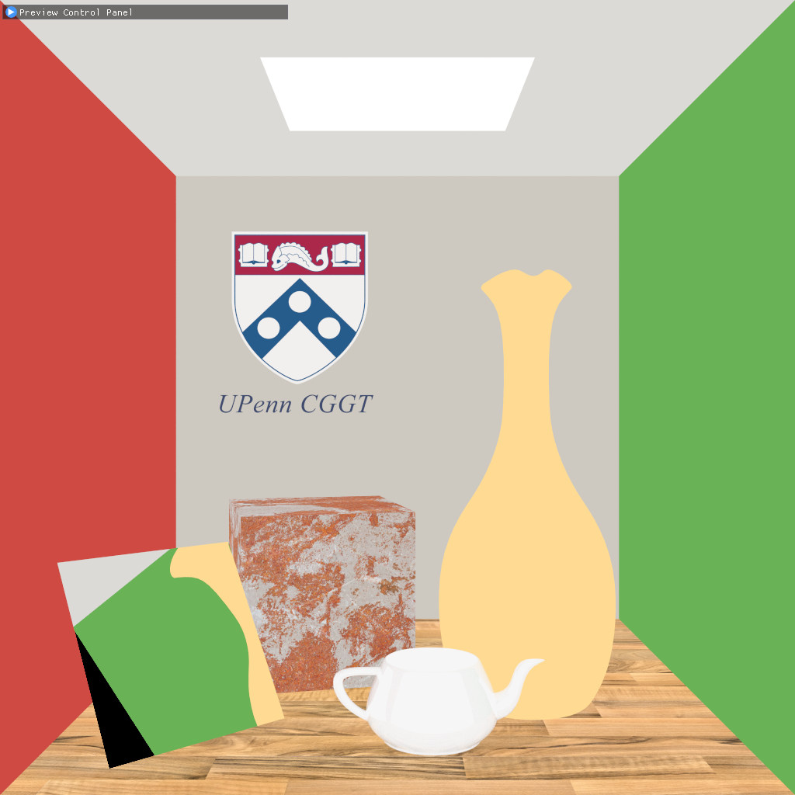

CUDA Denoiser
================

**University of Pennsylvania, CIS 565: GPU Programming and Architecture, Project 4**

* Chang Liu
  * [LinkedIn](https://www.linkedin.com/in/chang-liu-0451a6208/)
  * [Personal website](https://hummawhite.github.io/)
* Tested on personal laptop:
  - i7-12700 @ 4.90GHz with 16GB RAM
  - RTX 3070 Ti Laptop 8GB

    

        
         
        
Stable denoised result by SVGF
 
    

## Features

### Edge Avoiding A-Trous Wavelet Denoiser (EAW Denoiser)

#### Pipeline Overview

This denoiser is based on project three's path tracer, which supports a variety of surface appearances including texture and glossy reflection. In order to support these features and improve overall denoising quality, inspired by SVGF, the denoiser generates demodulated direct and indirect illumination components separately.

Here, demodulation means dividing path traced color by albedo, which composes of materials' base color and texture color. In actual implementation, we simply set the surface color to 1 to avoid dividing zero if the material's color is black. By demodulation, the input to denoise filter remains only light transportation terms. This can effectively prevent blurring texture details.

<table>
    <tr>
        <th>Path Traced</th>
        <th>Albedo</th>
        <th>Demodulated</th>
    </tr>
    <tr>
        <th></th>
        <th></th>
        <th></th>
    </tr>
</table>

Then, we send direct and indirect components to reconstruction filters guided by G-Buffer. The reconstruction filter is made up of five levels of Edge-Avoiding A-Trous Wavelet Filters, with each level's filter radius increasing. After filtering, we add direct and indirect components together and modulate albedo back to get the denoised illumination image, then do some post processing to get the final denoised image.

#### Reconstruction Filter

##### A-Trous Wavelet Filter

The filter we use in this filter is base on A-Trous Wavelet Filter, an approximation of Gaussian filter whose basic form is a 5x5 Gaussian kernel as well. But unlike Gaussian, A-Trous filter is a multi-pass algorithm. In each iteration we keep the size of base kernel 5x5 but double the stride between sampled pixels. Here is its 1D illustration.

Assume the filter radius is $n=2^k$. For an ordinary Gaussian kernel, the time complexity is $O(n^2)$ (one pass) or $O(n)$ (two passes filtering X and Y independently). By contrast, the A-Trous wavelet approximation has time complexity of $O(\log{n})=O(k)$, which is much more efficient.

<table>
    <tr>
        <th>Gaussian</th>
        <th>A-Trous Wavelet</th>
    </tr>
    <tr>
        <th></th>
        <th></th>
    </tr>
</table>
In the graph above, A-Trous wavelet filter produces similar result to Gaussian (created with GIMP).

This denoiser's reconstruction filter includes five levels of A-Trous wavelet filters. The filters' radius increase from 1 to 16, covering an area of 31x31 pixels.

##### G-Buffer Guided Edge Avoiding

To avoid blending some high frequency details like the boundary between two objects with different colors, additional geometry information is needed to adjust the weight of kernel. For example, the farther the sampled pixel's position from the pixel to be filtered, they are less likely to come from the same part of an object, so the weight of sampled pixel is supposed to be smaller.

For EAW filter, the required geometry information includes:

- Linear depth of view space, also objects' distance to eye. This can be used to reconstruct world positions
  - Or, raw position data, which takes 3 times space than recording depth
- Normal, either raw data or oct encoded
- Albedo, for modulation after filtering
- Mesh ID or object IDs, used to check if two pixels belong to a same object so that they can probably be blended

### Spatiotemporal Variance Guided Denoiser (SVGF Denoiser)

This part is implementation of the paper [SVGF].

In Edge Avoiding A-Trous Filtering, our reconstruction kernel is only driven by spatial information of the scene at a certain frame. However, usually among several consecutive frames, if there isn't drastic change in camera's perspective or objects' position, we can still find rendered part of objects in the current frame to be appearing in previous frames. It turns out, these pixels can be taken into consideration for determining the weight of reconstruction filter.

Here are three critical ideas of SVGF in my opinion, which will be discussed later:

- Temporal color and moment accumulation
- Variance estimation
  - Temportal variance
  - Spatial variance
- Variance guided filtering

#### Pipeline

Since SVGF makes use of temporal accumulation, in each frame we need to generate additional temporal information with G-buffer -- motion vector. That is, the index of pixel matching the current pixel in mesh ID, color and normal in the last frame. Usually motion vector is stored as `float2`, either absolute coordinate or relative coordinate to the current pixel. In this denoiser, the motion vector is stored as `int`, directly pointing to the address of target pixel. The process finding the target pixel is called reprojection. It requires us to store last frame's position/depth and last frame's camera information with current frame's G-buffer.

Another change made to EAW denoiser's pipeline is that tone mapping and inversed tone mapping is added before and after filtering. This wasn't shown in the paper, but concluded by my own observation that raw radiance image from path tracer usually contains some isolated bright dots, which are hundreds of times brighter than surrounding pixels. They are likely to leave large bright areas after blurring thus make the image not smooth enough. To reduce this artifact, it'd be better to compress them to a low dynamic range.

I applied Reinhard because it's simple to inverse. It worked well but introduced some bias that would make what is supposed to be very bright look a bit darker. There may exist better curving approaches that preserve more highlight.

#### Reconstruction Filter

SVGF's reconstruction filter is more complicated than EAW. 

### 1 SPP Input

### 5 Level Edge-Avoiding A-Trous Filter

### Spatiotemporal Variance-Guided Filter

### Ground Truth (3000 SPP)

### EAW (Converged)

### SVGF (Converged)

